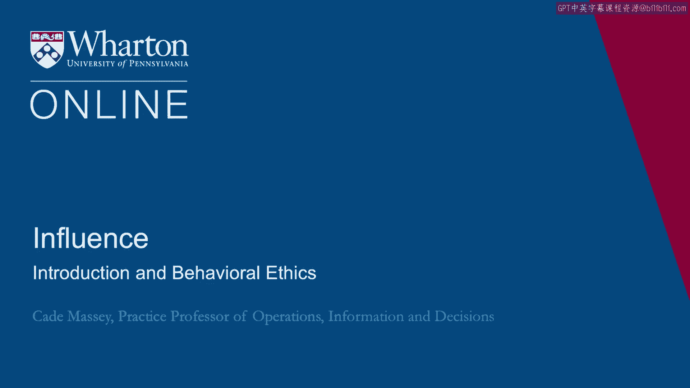
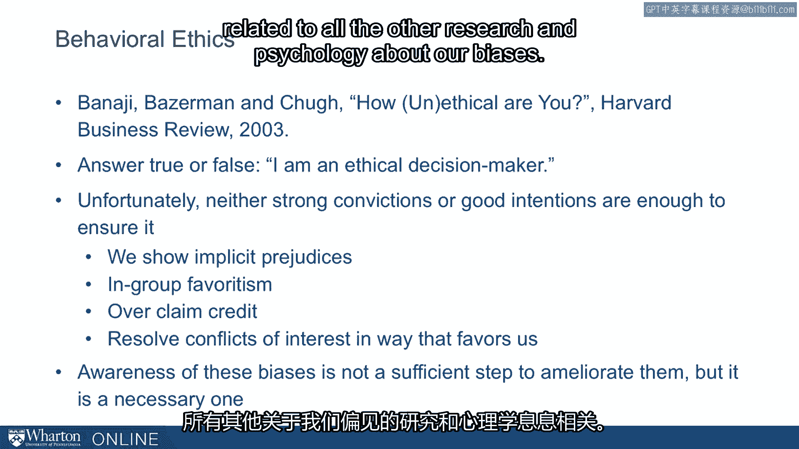

# 课程41：行为伦理学简介 🧠

在本节课中，我们将学习行为伦理学的基础概念。我们将探讨心理学研究如何揭示，即使我们自认为是道德的决策者，一些无意识的偏见也可能影响我们的判断和行为。理解这些偏见是提升自我认知、做出更符合伦理决策的第一步。

---

我们想以心理学界的一些近期研究来开启关于伦理学的讨论。这些研究为我们提供了一个重要的基础。

心理学家们数十年来一直在广泛领域讨论行为，但直到最近才开始思考行为伦理学。我们提供了一篇由巴纳吉等人撰写的、发表于《哈佛商业评论》的有趣文章。他们颇具挑衅性地将其标题为“你有多不道德？”，并提出了一些引人深思的问题。

我认为他们的动机是提高人们的意识，而我们希望达到那种意识水平，因此我想从这篇文章开始。

他们在文章开头提出了一个问题：“请回答对或错：我是一个道德的决策者。” 我想我们大多数人都会不假思索地倾向于回答“对”。我们自认为是道德的决策者，而他们想对此提出挑战。

他们并非因为认为我们是坏人而挑战我们。他们挑战我们，是因为从众多心理学研究中得知，我们存在一些偏见，这些偏见会导致我们的行为不如自认为的那样道德。

因此，让我们快速总结一下他们的发现和论点。

他们基本上指出，无论是坚信自己是道德的，还是拥有成为道德之人的良好意愿，都不足以确保行为的道德性。问题尤其出现在以下几个方面：

以下是文章中指出的四个主要偏见来源：

1.  **内隐偏见**：我们拥有跨越社会类别的联想。例如，我们可能会将“好”或“坏”与某些人口统计学特征或社会类别联系起来。这已通过内隐联想测试在数百万人中得到研究。虽然对这些分数的含义存在一些争议，但似乎达成共识的是，许多人拥有这种强烈的联想，导致我们在无意识中形成对不同社会类别的内隐态度（好或坏），这会影响决策和信念。这是他们认为意愿和信念不足的原因之一。

2.  **群体内偏爱**：我们倾向于以不同的方式对待和思考我们群体内的成员，这会导致偏见，在某些情况下降低道德性。最近有人认为，我们面临的一些被归为刻板印象或种族主义的最大挑战，实际上可归结为群体内偏爱，即这种“内群体”与“外群体”的区分，以及我们天生倾向于偏爱内群体的挑战。无论解释如何，这似乎是根源之一。我们倾向于对我们内群体（无论是家庭、组织还是像工程这样的职能部门）的成员进行更有利的推理，而对群体外成员则不那么有利。

3.  **过度邀功**：在我们认为自己做了什么和贡献了什么方面，我们是利己的。这在各类研究中都有发现。最著名的研究之一是关于婚姻的。研究人员询问夫妻双方：“你承担了百分之多少的家务？” 当然，两人的百分比加起来应该是100%。但调查发现，大约85%的情况下，两人自报的百分比总和超过100%。人们过度邀功。在工作团队和学术论文的共同作者中也发现了这种现象。我们似乎天生就存在这种偏见。部分原因仅仅是我们更了解自己做了什么，而不是别人做了什么。这最终导致我们过度邀功。再次强调，这不是因为信念薄弱或渴望不道德，而是我们视角和利己偏见的结果。

4.  **以利己方式解决利益冲突**：许多人相信我们能够以中立的方式处理可能存在的利益冲突。文章中以医生为例：近年来医疗行业发生了巨大变化，因为最终监管机构甚至医生自己意识到，一些试图说服你开其药品的公司确实会产生影响，即使医生不希望如此，即使医生相信自己能保持中立、不受公司策略的影响。这导致他们基本上禁止了该行业的任何此类影响。这几乎是必要的，因为我们不可能完全客观地解决自身面临的利益冲突。同样，尽管我们有这样做的意愿和信念。

他们的总结是：**我们比自认为的更有偏见**。我非常赞同这一点，因为它与心理学中所有关于我们偏见的研究密切相关。

这是一个非常重要的起点。只有当我们诚实地面对自己有偏见的起点，我们才会更愿意做出改变，更愿意在施加影响力时，更诚实地进行必要的权衡。

所以我想从这里开始。

---

本节课中，我们一起学习了行为伦理学的基本框架。我们了解到，强烈的道德信念和良好意愿并不足以保证道德行为，因为存在内隐偏见、群体内偏爱、过度邀功和利己的利益冲突解决方式这四种无意识偏见。认识到这些偏见的存在，是进行更清醒、更符合伦理的决策和沟通的第一步。