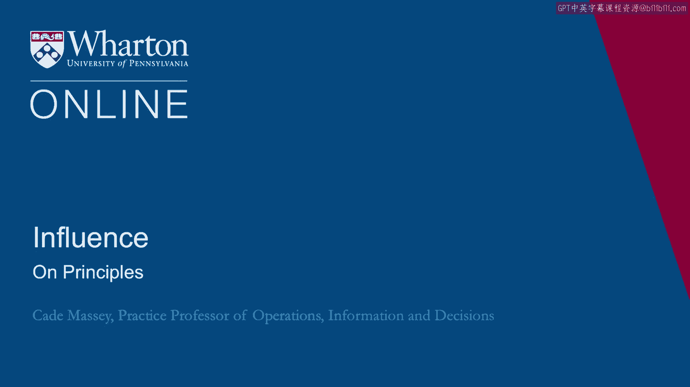
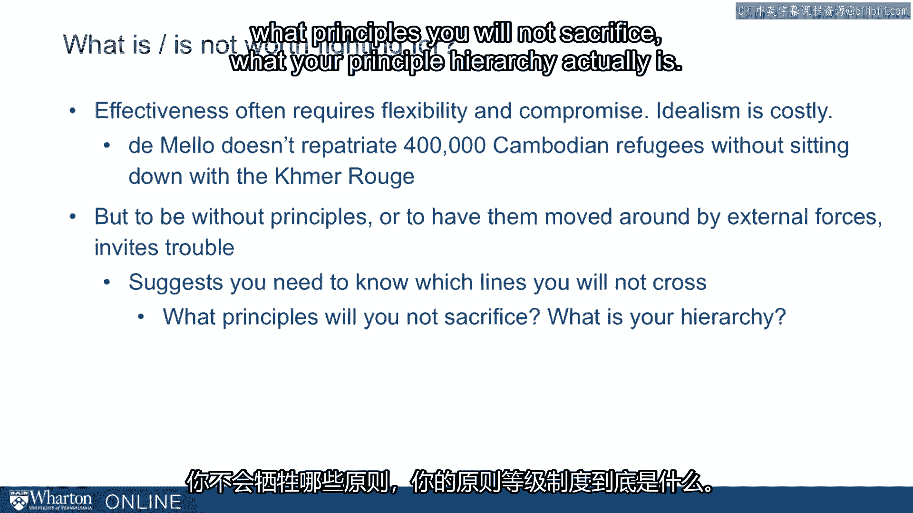

# 沃顿商学院《实现个人和职业成功（成功、沟通能力、影响力）｜Achieving Personal and Professional Success》中英字幕 - P107：43_关于原则.zh_en - GPT中英字幕课程资源 - BV1VH4y1J7Zk

In the last lecture， we pushed you to think about the principles that were guiding your。

decisions as we went through the hard question survey。

Let's take a moment and talk a little bit more about principles before we push into the final。

section on some frameworks and some prescriptions for ethics。

So principles are abstract ideas that govern behavior across situations。

They are useful in providing direction and guidance in your decision making。

They can be a source of utility in and of themselves。 They can be a source of respect from others。

But they also constrain your choices。 And this is the trade-off that we really want to push on here for a little bit。

And again， this is something that we've been talking about often on directly and indirectly。

since the beginning of the course。 So we're just kind of laying things out a little more explicitly this time around。

I want to begin with a quote from Otto von Bismarck from Chris Clark's book on the Iron， Kingdom。

The History of Germany。 Bismarck gets credit for unifying Germany。

This is a little bit of an exaggeration， but he was the most important politician there。

in the late 19th century and was hugely influential in bringing it together as a country。

Bismarck disparaged theory in principle as yardsticks for political life。

The result was the freedom from ideological constraints that made his behavior unpredictable。

One could call it realism， pragmatism or opportunism and ability to spring from one。

camp to another wrong footing his opponents。 He said。

"If I am to proceed through life on the basis of principles， it is as if I。

were to walk down a narrow path in the woods with a long pole in my mouth。"。

This is how Bismarck felt about principles。 He clearly didn't have much room for them and he believed he gained some political advantage。

by kind of putting him on the back burner。 So we're asking you to think a little bit about what role principles play in your life。

and what principles are guiding your behavior。 We've had this discussion with classrooms over the last couple of years and we end up with。

interesting collections。 So consider the question， "What principles would you like to live by？

What principles do you want to guide your behavior？"。

This is what one board looked like after one discussion。

These are full-time MBAs and if you can work through my chicken scratch you see they came。

up with things like honesty， integrity， reliability， equality， loyalty， respect， optimism。

development， modesty， kindness， balance， fun， authenticity。 This is a big list。

This is something like 20， 25 principles。 Any one of which would be hard to argue with and you might be reaffirmed in your faith in。

MBAs to see such a list。 But I'll ask you， what would happen if you tried to live by all those principles？

Any one of them would be defendable but if you tried to live by all of them at the same， time。

could you act at all？ Did you make any decisions？ This is the constraining aspect of principles as well。

If you really want to honor a principle， it constrains you in some way。 In fact。

it's just cheap talk until it constrains you。 So let's acknowledge that you're not going to be able to live by all your principles all。

the time and I think by this point in the course you've seen that to exercise influence。

in big challenging situations you probably will have to compromise in principles。

And precisely because you have to compromise in principles we want you to be thoughtful。

about those principles you don't want to compromise。

To know what your fundamental principles are that you want to prioritize above all else。

so that when the pressure comes you don't compromise those。

That's what we're pushing you to think about right now。 So what is worth fighting for？

What is not worth fighting for？ Let's just be a little bit more explicit about it than we usually are。

Let's acknowledge the tradeoff and be a little bit more explicit about it。 Effectiveness。

political effectiveness， influence often requires flexibility and compromise。 Idealism is costly。

So DeMello for example would never have repatriated 400，000 Cambodian refugees if he hadn't been。

willing to sit down with the Khmer Rouge。 Some of the worst people in the history of the world but he was able to sit down with。

him， was willing to sit down with him， was not too idealistic to sit down with him。

And as a result was able to bring hundreds of thousands of Cambodians back home。 On the other hand。

to be without principles or to have them moved around by external forces。

too easily invites trouble。 The suggestion is you need to know which lines you will not cross。

what principles you will， not sacrifice， what your principle hierarchy actually is。

So we're pushing you right now to think some about that to articulate it and in the next。

lecture we'll move toward a framework for ethical use of these influence tactics。 [ Silence ]。

