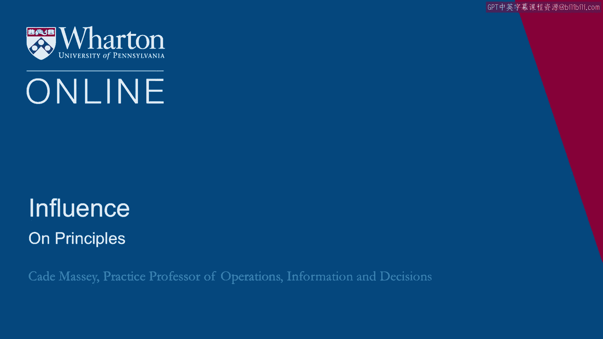
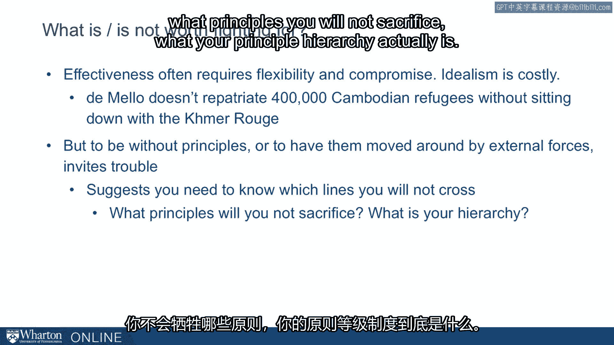

# 课程名称：沃顿商学院《实现个人和职业成功》第43讲：关于原则 🧭

在本节课中，我们将深入探讨“原则”这一核心概念。我们将了解原则的定义、作用，以及它在个人决策和职业行为中的重要性。同时，我们也会审视坚守原则所带来的权衡与挑战。

---

在上一讲中，我们通过艰难的问卷调查，促使大家思考指导自身决策的原则。

在进入关于道德框架和准则的最后章节之前，让我们花些时间更深入地讨论一下原则。

原则是**指导跨情境行为的抽象理念**。它们在决策中提供方向和指引，本身可以成为效用的来源，也能赢得他人的尊重。但原则同样会限制你的选择。这正是我们在此要探讨的核心权衡。

实际上，从课程开始至今，我们一直在直接或间接地讨论这个话题。本次我们将更明确地展开阐述。

---

我想以奥托·冯·俾斯麦的一句话作为开场，这句话出自克里斯·克拉克的著作《钢铁王国：德国史》。俾斯麦因统一德国而备受赞誉。这或许有些夸张，但作为19世纪末最重要的政治家，他在德国统一进程中极具影响力。

俾斯麦轻视将理论和原则作为政治生活的准绳。其结果是他摆脱了意识形态的束缚，使其行为难以预测。你可以称之为现实主义、实用主义或机会主义，即一种能够突然转换阵营、令对手措手不及的能力。他曾说：

> “如果我依据原则生活，就如同口含一根长杆在森林小径上行走。”

这就是俾斯麦对原则的看法。他显然不认为原则有多少空间，并相信将它们置于次要地位能带来政治优势。

因此，我们请大家思考原则在你生活中扮演的角色，以及哪些原则在指导你的行为。过去几年，我们在课堂上就此进行讨论，并收集到一些有趣的答案。

---

以下是关于“你希望遵循哪些原则？你希望哪些原则指导你的行为？”这一问题的讨论结果。

这是一次讨论后白板上的内容。这些是全日制MBA学生的答案。如果你能辨认出我的潦草字迹，你会看到他们提出了诸如：诚实、正直、可靠、平等、忠诚、尊重、乐观、发展、谦逊、善良、平衡、乐趣、真实等原则。这是一个很长的列表，大约有20到25条原则。

其中任何一条都很难反驳，看到这样的列表或许会让你对MBA学生重拾信心。但我要问：如果你试图同时遵循所有这些原则，会发生什么？任何单一原则都值得捍卫，但若你试图同时践行所有原则，你还能采取行动吗？你还能做出任何决定吗？这正体现了原则的约束性。

如果你真心想尊重一项原则，它就会在某些方面约束你。事实上，只有当原则对你产生约束时，谈论它才有意义，否则只是空谈。

---

因此，我们必须承认，你无法始终遵循所有原则。我想，通过课程学习至此，你已经明白，要在重大挑战性情境中施加影响力，很可能需要在原则上做出妥协。

正因为你必须在原则上妥协，我们才希望你审慎思考那些你不愿妥协的原则。明确你最根本、愿意优先于一切的原则，这样当压力来临时，你才不会妥协这些底线。这正是我们现在促使大家思考的问题。

那么，什么是值得为之奋斗的？什么是不值得的？让我们比往常更明确地探讨这一点，承认其中的权衡并更清晰地审视它。

---

以下是关于原则权衡的核心要点：

**有效性、政治影响力和说服力通常需要灵活性与妥协。理想主义是有代价的。**

例如，德梅洛（联合国官员）如果当初不愿与红色高棉（世界上历史最恶劣的群体之一）坐下来谈判，就永远无法让40万柬埔寨难民重返家园。他能够且愿意与之谈判，没有因过于理想主义而拒绝接触，最终成功让数十万柬埔寨人回家。

**另一方面，毫无原则或原则轻易被外部力量动摇，则会招致麻烦。**

我们的建议是：你需要清楚自己不会跨越的底线、不会牺牲的原则，以及你真正的**原则优先级体系**。

---

因此，我们现在促使大家对此进行思考并清晰阐述。在下一讲中，我们将转向一个框架，探讨如何合乎道德地运用这些影响力策略。

---

本节课中，我们一起学习了原则作为抽象行为指南的定义与双重性。我们探讨了坚守原则带来的尊重与约束，并通过实例分析了在现实挑战中，原则的坚守与妥协之间的必要权衡。核心在于，我们需要明确自己不可妥协的根本原则，以在复杂情境中做出清醒而有效的决策。