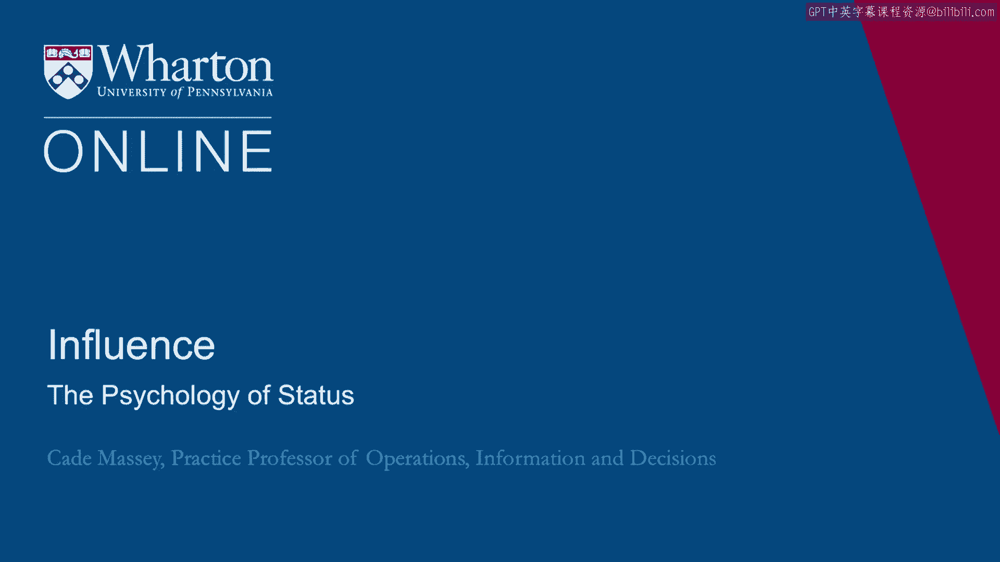
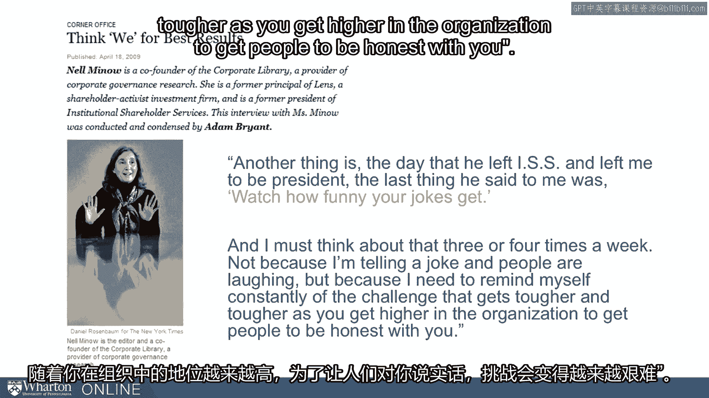
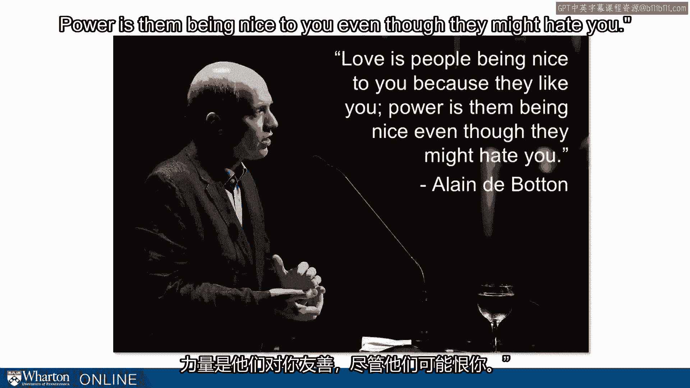
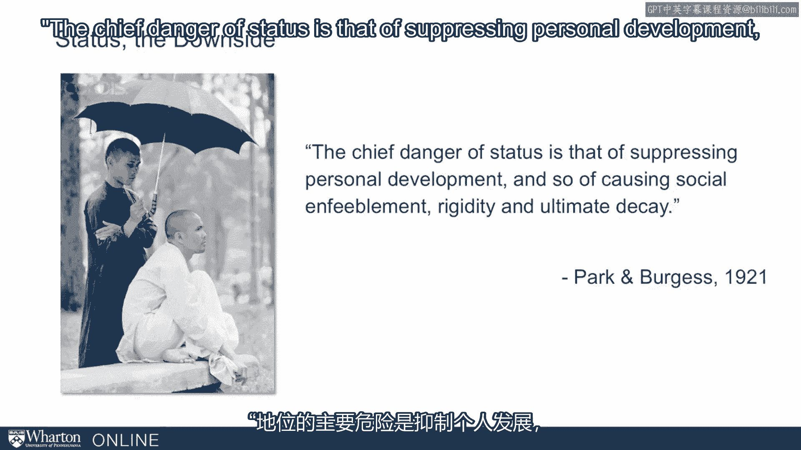
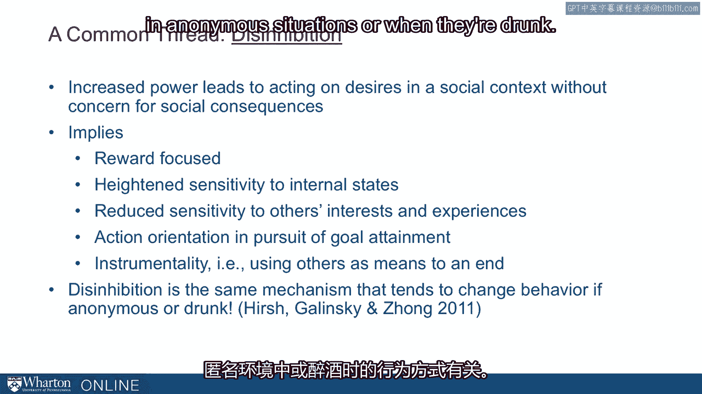
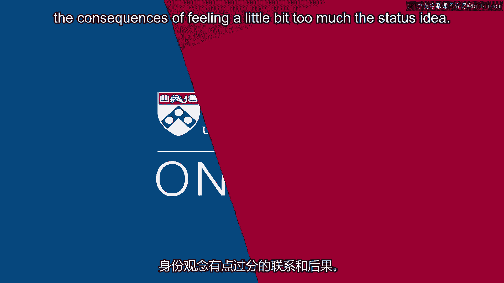

# 沃顿商学院《实现个人和职业成功（成功、沟通能力、影响力）｜Achieving Personal and Professional Success》中英字幕 - P109：45_地位心理学.zh_en - GPT中英字幕课程资源 - BV1VH4y1J7Zk

Most of this course has been about how to build your power and influence。

And we want to give you the tools to do that， to equip you to accomplish whatever goals。

you're trying to accomplish。 But we would be remissed in the course without talking about the downside of having power。

At this point we've seen a lot of research， especially recently in psychology， on the， downside。

the interpersonal consequences of having power and status。

And so for the next few lectures we want to talk a little bit about those downsides。

One of the beginning with an anecdote from Nell Minow for a period of time was the head。

of institutional shareholder services。 And when she took that over from the previous CEO on the day he left。

she said the president， told her， "Watch how funny your jokes get。"， And she says。

"I must think about that three or four times a week， not because I'm telling。

a joke and people are laughing， but because I need to remind myself constantly of the。

challenge that gets tougher and tougher as you get higher in the organization to get。

people to be honest with you。"， This is the reality of status that people respond differently to you。

And it's not even necessarily a strategic choice。 It's an automatic。

intrinsic change in our behavior in the presence of status。 And as we'll see。

there are automatic and intrinsic changes in our own behavior as we， achieve status。

So that's the reason I want to start with this example because it's jokes and humor as something。

as basic as that is influenced by whether a person has status or not。

Another quote that gets at it from Elaine DeBittan who says， "Love is people being nice。

to you because they like you。 Power is then being nice to you even though they might hate you。

This is what you're facing。 And on one level， maybe this is a good thing， right？

You'd rather have people who even if they hate you or are nice to you， on the other hand。

you're going to change if this is the way you interact with the world。

And you're also going to be closed off to important sources of information and relationships。

if this is how people treat you。 So it's hard to navigate that。

We want to give you some more tools for navigating it。

Some sociologists note that the chief danger of status is that of suppressing personal development。

and so of causing social infibrillment， rigidity and ultimate decay， this sounds awful。 I mean。

we've been trying to get you status the entire course。 And here at the end we're saying， "Well。

you're welcome。 This is what you're going to have， personal， social and fibrillment。

So we want to avoid that。 And it's hard to avoid。 So we're going to hit it pretty hard here and talk about what we've learned from social。

psychology。 We're going to use a review paper in 2003 by Doc Keltner and a couple of his colleagues。

on the determinants of power。 But really we want to jump to the end。

We want to talk about the social consequences of power。 So let me just unpack those for you。

This research has been done in the lab and outside of the lab。

Very often they are running experiments。 Just Keltner is just one of the researchers in this area。

but one of the most prominent。 But the people working in this field。

they run experiments where they manipulate whether。

a person is in a high power situation or a low power situation so they can really isolate。

the impact of power directly。 Some of the studies are field studies where they just assess。

They determine independently whether someone is in a high power or low power situation。

So what they have found， let's run through a quick summary here， elevated power increases。

and reduced power increases。 The experience and expression of positive affect whereas reduced power increases the。

experience and expression of negative affect。 So power is making people happier and facilitates the expression of that happiness and vice。

versa for reduced power。 Elevated power increases sensitivity to rewards where reduced power increases sensitivity。

to threat and punishment。 So you can imagine this has direct consequences for how people act。

If one is only focused on the upside that might lead for example to more risk taking。

If one is disproportionately focused on the downside， the threats and the punishment， that's。

going to lead to a great deal of risk aversion。 For example。

elevated power increases the tendency to construe others as a means to。

an end where reduced power increases the tendency to see yourself as means of somebody else's， end。

So kind of profound psychological shifts as we increase power or have our power reduced。

Elevated power increases automatic social cognition。 This is for example the use of stereotypes。

It's reasoning about people kind of top down from our schemas， from our stereotypes， from。

our categories， reasoning down to the individuals whereas reduced power increases controlled。

social cognition。 So it's reasoning up from the details of the situation。

So for example they have studied this and looking at applicants to a school or to a committee。

and they've coded how people reason about those applicants and when they're induced to。

be in a high power situation they're more apt to use these social categories and stereotypes。

as a reason about the applicants。 Power increases approach related behavior whereas reduced power increases behavioral。

inhibition。 So what is approach related behavior？ This can be attitudes and behavior on food。

physical space， verbal and nonverbal sex。 Sex in these studies is usually some kind of flirtatious behavior。

But for example people use physical space very differently when they are in high power situations。

than when they're in low。 In the classroom we ask people， okay give us a little demonstration。

But as people would sit if they had low power and you see a whole classroom of kids they。

get all scrum stuff like this and they bend over and then you say okay alternatively sit。

as you would if you're really feeling powerful。 And people start leaning back and spreading out and invariably somebody would put their。

feet up on the desk。 There'll be knocking other people stuff out of the way。

And this is what's been， this is what's been observed in field settings and in experimental。

settings people take up space very differently when they're feeling high power or they're。

feeling low power and this is connected to this idea of approach related behavior versus。

behavioral inhibition。 When you have， when you're in a high power situation you're more approach related。

People when they have higher power the experience of power increases consistent and coherent。

social behavior whereas reduced power increases situationally contingent behavior。

That means when you're feeling more powerful you're more the same across a wide range of。

situations than when you're not feeling powerful。 When you're not feeling powerful you're completely pushed around by the situation。

Your situation， your behavior is situationally contingent。

So as we get to this point on the slide you begin to realize these consequences aren't。

all bad right。 Because who do you want to be？ Do you want to be the person who is the same in every situation or do you want to be the。

person who gets pushed around by all these various situations。

Love truthfully you probably need to be somewhere in the middle。

We've all had friends or colleagues or bosses who were a little bit too much the same person。

in all situations。 They probably could have tailored it a little bit better to the situation。

On the other hand you don't want to be someone who is completely malleable by the situation。

So it begins giving us a sense that some of this power leads to behavior that is good。

and probably advantageous to us。 Too much of it leads to behavior that can be damaging to us。

Finally， the elevated power increases the likelihood of socially inappropriate behavior。

So for example interrupting， speaking out of turn， impolite eating。

So in the lab they've gone as far as coding the code things like how often people talk， over people。

They code things like how much they chew with their mouth open， how many crumbs fall when， they eat。

They've gotten very precise and the results are always in the same direction that increased。

power leads to these socially inappropriate behaviors。

So more recently Keltoner in his book The Power Paradox finds four themes in this literature。

Four consequences of power。 One is what he calls empathy deficits。

We have a harder time empathizing with other people。

We have a harder time even understanding the emotions they are experiencing when we're。

in high power situations。 We have more self-serving impulsivity。

You've just seen examples of that in some of the experiments I cited。

We have more incivility and disrespect the talking over， the demands， the bad language。

the criticism。 And we have what he calls narratives of exceptionalism。

We are amazingly resourceful in rationalizing why we deserve。

After all we've accomplished and all the work we've put in to act impossibly unethical。

In fact it's not even unethical because we deserve it。 We're entitled。 We are exceptional。

These are the themes that Keltoner has seen given another 12 or 13 years on his research。

There's even a simpler theme and that is the common thread of disinhibition。

This is one way of making sense of all the behaviors that we've just talked about。

Increased power leads to acting on desires in a social context without concern for social。

consequences。 So again some of this is probably a good thing right？

It's the problem of having too much。 It's the problem of a little power is good but a lot of power feeling the status becomes。

a bad thing。 I would probably wish for most of my friends and students a little less inhibition。

A little more disinhibition until they have too much。

So what we see is power leads people to be more reward focused， more sensitive to their。

internal states， reduce sensitivity to other people's needs， more action orientation in。

general being more instrumental。 All of this comes from being more disinhibited。

To be even a little bit more provocative and underscore this disinhibition idea some colleagues。

Hirsch， Kielinski and Jean studied disinhibition in a few different ways and they found that。

the way people act when they are in powerful situations is related to the way they act when。

they're in anonymous situations or when they're drunk。

Power， alcohol， anonymity all lead to disinhibition and it starts helping us understand the connections。

and the consequences of feeling a little bit too much this status idea。 [BLANK_AUDIO]。

