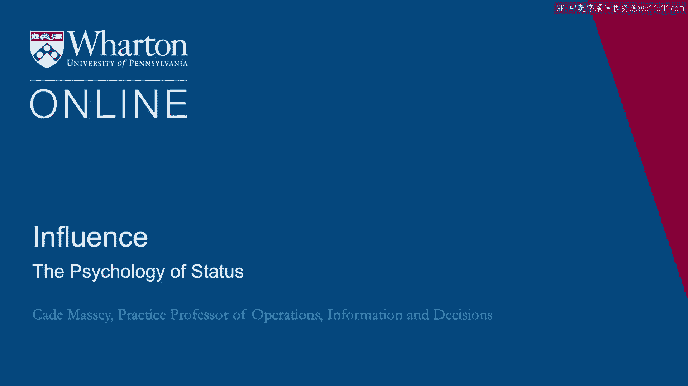
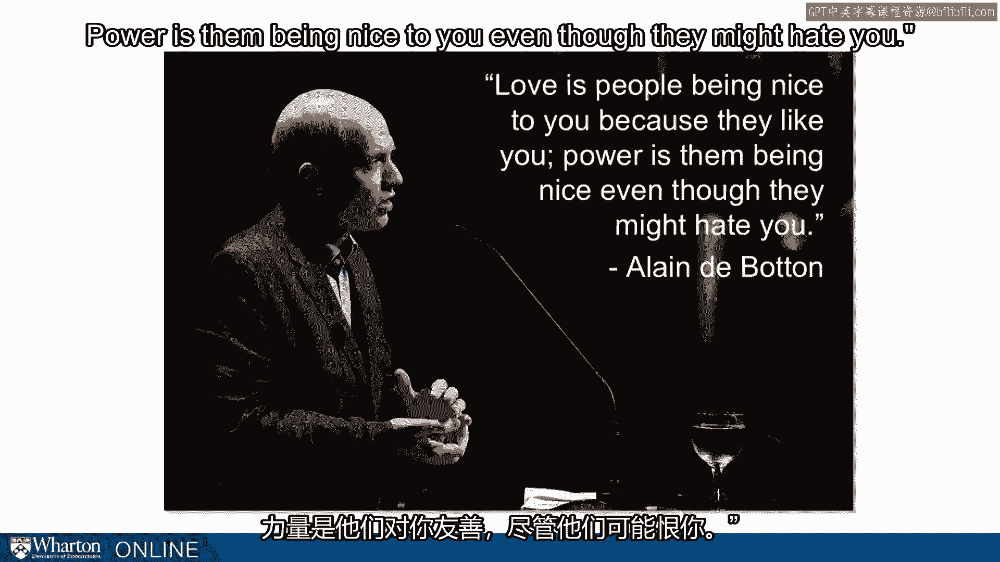

# 课程 45：地位心理学 🧠

在本节课中，我们将探讨权力与地位带来的心理与行为影响。课程前半部分主要关注如何建立权力与影响力，而本节将转向讨论拥有权力可能产生的负面人际后果。

---

## 概述

本节课我们将分析高地位如何自动且内在地改变他人对我们的行为，以及改变我们自身的行为模式。核心在于理解“地位”如何导致“去抑制”状态，进而引发一系列社会行为变化。

---

## 地位如何改变人际互动

上一节我们介绍了建立影响力的工具，本节中我们来看看拥有地位后，你与他人的互动会发生何种根本性变化。

内尔·米诺曾担任机构股东服务公司的负责人。她在接任时，前任CEO在离职当天对她说：“注意观察你的笑话会变得多么有趣。”她后来表示，自己每周都会想起这句话三四次，并非因为她在讲笑话时人们发笑，而是因为她需要不断提醒自己：随着你在组织中的地位越高，让人们对你保持诚实就变得越具挑战。

这就是地位的现实：人们会根据你的地位不同而区别对待你。这甚至不一定是他人的策略性选择，而是在地位面前，我们行为中一种自动、内在的改变。同时，我们自身在获得地位后，行为也会发生自动且内在的变化。

这个以幽默为例的开场，说明了即便是讲笑话这样基本的行为，也会受到一个人是否拥有地位的影响。

另一段来自伊莱恩·德博坦的引述则更直接地指出了这一点：“爱是因为别人喜欢你而对你友善。权力则是即使别人可能讨厌你，也会对你友善。”这就是你将面对的情况。在某种程度上，这或许是件好事。你宁愿人们即使讨厌你，也对你保持友善。但另一方面，如果这就是你与世界互动的方式，你自身也会发生改变。如果人们都这样对待你，你也会对重要的信息来源和人际关系关闭大门。因此， navigating 这种情况非常困难。

---

## 地位的主要危险

一些社会学家指出，地位的主要危险在于它会抑制个人发展，从而导致社会僵化、缺乏活力并最终走向衰败。这听起来很糟糕。我们整个课程都在试图帮助你获得地位，而最后我们却说：“不客气，这就是你将得到的东西：个人与社会活力的丧失。”

因此，我们希望避免这种情况。但这很难避免。所以，我们将深入探讨我们从社会心理学中学到的东西。

我们将引用多克·凯尔特纳及其同事在2003年发表的一篇关于权力决定因素的综述论文。但我们真正想讨论的是权力的社会后果。让我为你解读这些发现。

---

## 权力研究的实验方法

这项研究在实验室内外都有进行。研究者经常通过实验来操纵一个人是处于高权力情境还是低权力情境，从而直接分离出权力的影响。有些研究是实地研究，他们独立评估某人是否处于高权力或低权力情境。

以下是研究发现的一个快速总结：

*   **情绪体验与表达**：**提升的权力**会增加积极情感的体验与表达，而**降低的权力**则会增加消极情感的体验与表达。公式表示为：`高权力 → ↑积极情感`；`低权力 → ↑消极情感`。
*   **关注焦点**：**提升的权力**增加对奖赏的敏感性，而**降低的权力**增加对威胁和惩罚的敏感性。这直接影响人们的行为方式。例如，只关注好处可能导致更多的冒险行为，而过度关注坏处则会导致高度的风险规避。
*   **看待他人的方式**：**提升的权力**增加将他人视为达成目的之手段的倾向，而**降低的权力**增加将自己视为他人目的之手段的倾向。随着权力增减，会发生深刻的心理转变。
*   **社会认知方式**：**提升的权力**增加自动化的社会认知，例如使用刻板印象，从我们的图式、刻板印象和分类出发进行自上而下的推理。而**降低的权力**增加受控的社会认知，即从情境细节出发进行自下而上的推理。例如，在研究学校或委员会申请者时，当人们被诱导处于高权力情境时，他们更倾向于使用社会类别和刻板印象来推理申请者。
*   **行为倾向**：权力增加与趋近相关的行为，而降低的权力增加行为抑制。**趋近相关行为**可以体现在对食物、物理空间、言语和非言语性行为（在这些研究中通常指某种调情行为）的态度和行为上。例如，人们在高权力和低权力情境下使用物理空间的方式非常不同。在课堂上，当我们让学生演示低权力状态下的坐姿时，他们会蜷缩起来；而演示高权力状态时，人们会向后靠、伸展开，甚至有人把脚放到桌子上。这在实地和实验环境中都被观察到：人们在感到高权力或低权力时，占据空间的方式截然不同。
*   **行为一致性**：当人们拥有更高权力时，权力体验会增加一致且连贯的社会行为，而降低的权力会增加情境依赖行为。这意味着当你感到更有权力时，你在各种情境下的行为更加一致；当你感到权力不足时，你的行为完全受情境支配。

---

## 权力后果的双面性

看到这里，你开始意识到这些后果并非全是坏事。因为你想成为什么样的人？是想成为在每个情境中都一样的人，还是想成为被各种情境推来推去的人？说实话，你可能需要处于中间状态。我们都认识一些在所有情境中都过于“一致”的朋友、同事或老板，他们本可以更好地适应情境。另一方面，你也不想成为完全被情境塑造的人。

这让我们开始意识到，权力导致的某些行为是好的，可能对我们有利。但过多权力会导致可能对我们有害的行为。

最后，**提升的权力会增加社会失当行为的可能性**。例如，打断别人、在不该说话时发言、不礼貌的进食行为。在实验室中，研究者甚至编码记录了人们打断别人的频率、张嘴咀嚼的程度、吃东西时掉多少碎屑等。结果总是指向同一方向：增加的权力会导致这些社会失当行为。

---

## 权力悖论：四大主题

近年来，凯尔特纳在其著作《权力悖论》中总结了文献中的四大主题，即权力的四个后果：

以下是凯尔特纳总结的权力带来的四个主要负面后果：

1.  **共情缺陷**：在高权力情境下，我们更难与他人共情，甚至更难理解他们正在经历的情绪。
2.  **自我服务的冲动性**：你在我刚才引用的实验中已经看到了一些例子。
3.  **不文明与不尊重**：包括打断别人、提出要求、使用不良语言、批评等。
4.  **例外主义叙事**：我们非常善于合理化为什么我们“配得上”某些东西。毕竟，考虑到我们所取得的成就和付出的努力，即使行为极不道德，我们也觉得这甚至不算不道德，因为我们应得的，我们有特权，我们是例外。

这些是凯尔特纳在其研究又进行了12到13年后看到的主题。

---

## 核心线索：去抑制

还有一个更简单的主题，那就是**去抑制**这一共同主线。这是理解我们刚才讨论的所有行为的一种方式。

**增加权力会导致在社会情境中按照欲望行事，而不顾及社会后果。** 同样，其中一些可能也是好事。问题在于“过度”。一点点权力是好的，但拥有太多权力、感受到太多地位则可能变成坏事。我可能希望我的大多数朋友和学生能少一点抑制，多一点去抑制——直到他们拥有太多为止。

因此，我们看到权力导致人们：
*   更关注奖赏
*   对自身内部状态更敏感
*   降低对他人需求的敏感度
*   总体上更具行动导向，更工具化

所有这些都源于变得更加**去抑制**。

为了更 provocative 地强调这个“去抑制”的概念，一些同事（赫什、基林斯基和吉恩）从几种不同方式研究了去抑制，他们发现：**人们在权力情境下的行为方式，与他们处于匿名情境或醉酒时的行为方式相关。**

`权力`、`酒精`、`匿名性`都导致**去抑制**。这开始帮助我们理解“地位”感过强所带来的联系与后果。

---

## 总结

本节课中，我们一起学习了地位与权力如何从心理和行为上改变个人。核心在于理解**去抑制**是权力产生诸多影响的关键机制，它既可能带来积极的行为解放，也可能导致共情缺陷、冲动行为和社会失当。关键在于认识到权力的双刃剑效应，并在追求影响力的同时，保持对自身行为及他人反馈的觉察，避免陷入地位带来的认知与行为陷阱。