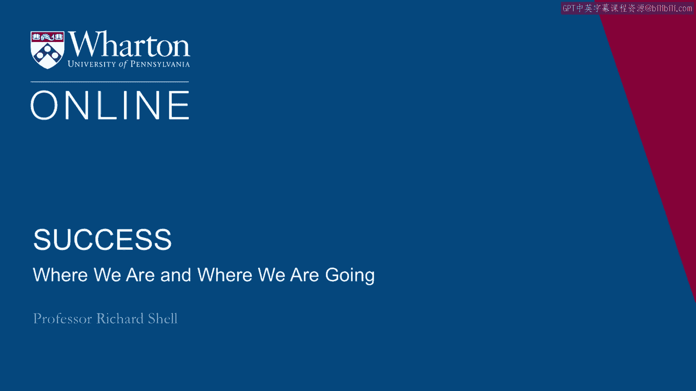
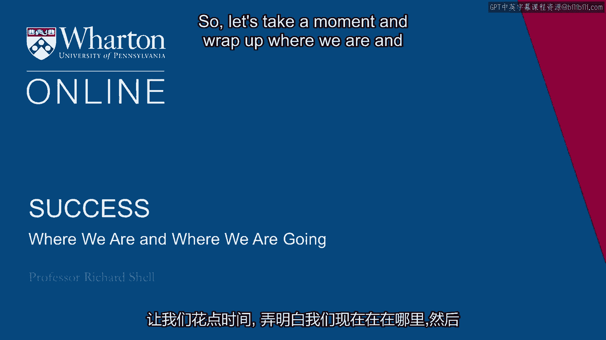
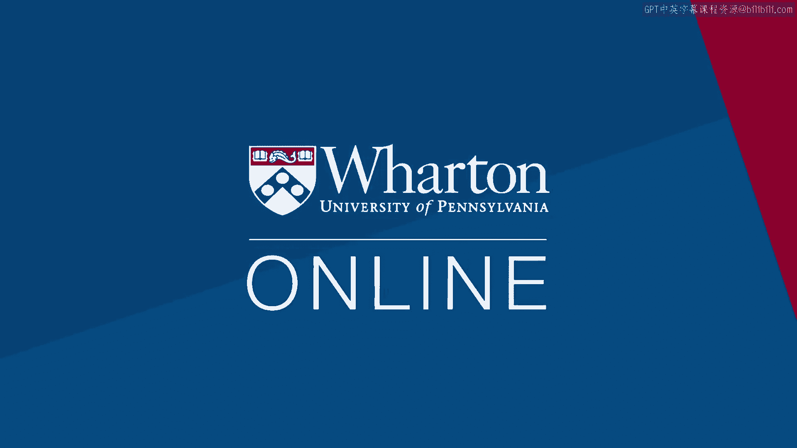

# 沃顿商学院《实现个人和职业成功》课程 P11：定位与展望 🧭

在本节课中，我们将回顾已学内容，并展望接下来的学习方向，帮助你从内部视角构建对成功的理解。

---

## 回顾：探索个人成功价值观

上一节我们介绍了如何探索个人的成功价值观。

你已经开始审视自己对成功的定义。你观察了“六种人生”，并尝试判断哪些人生在你看来最为成功。你开始认识到，在每一种人生中，都存在外部生活与内部生活的平衡。

*   **外部生活**：涉及地位、成就与事业。
*   **内部生活**：关乎幸福、满足、爱与家庭。

你分析了这些价值观的起源，它们可能来自你成长的文化背景、家庭观念，或是继承的某种精神或宗教信仰。你意识到，现在正是一个关键时刻，可以停下来审视这些价值观。

你需要决定自己的立场：是全盘接受，需要修改，还是为了在个人旅程中取得进步而必须摒弃其中的某些部分？

---

## 展望：构建内在成功框架

在回顾了价值观的探索之后，本节中我们来看看接下来的学习路径。我们将更详细地探讨，如何从个体角度将自己视为一个有能力获得成功的人。

关键转变在于，不再向外看、与他人比较，并产生“和那个人比我是个失败者”或“我不如我的榜样，所以我很失败”的想法。相反，我们要向内审视，问自己：“我今天处于什么位置？为了明天的进步，我应该在哪些方面投入？如何在我现有的能力和兴趣的坚实基础上继续发展？”

以下是接下来的核心学习方向：

1.  **评估现状**：客观分析你当前的能力、资源与所处阶段。
2.  **设定内在目标**：基于个人兴趣与核心能力，规划希望取得进步的具体领域。
3.  **构建发展路径**：制定可执行的步骤，在现有基础上持续积累与成长。

---

## 总结

本节课中，我们一起回顾了对个人成功价值观的探索过程，并展望了如何转向内在视角来定义和追求成功。核心在于停止无效的外部比较，转而关注自身的现状、潜力与发展路径，从而在个人能力与兴趣的坚实基础上，稳步向前。

我们下节课再见。