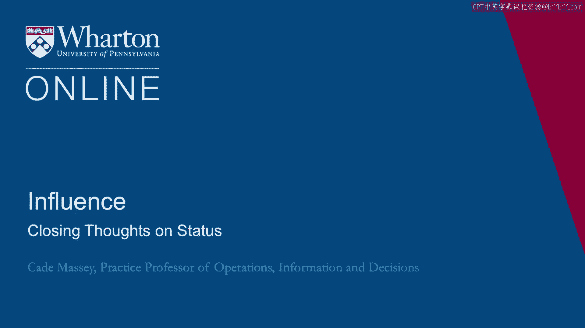
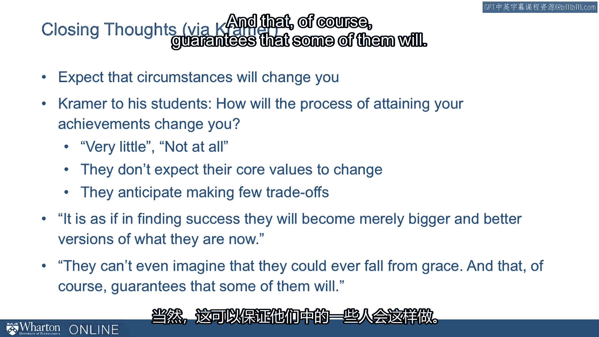

# 沃顿商学院《实现个人和职业成功（成功、沟通能力、影响力）｜Achieving Personal and Professional Success》中英字幕 - P112：48_关于地位的总结.zh_en - GPT中英字幕课程资源 - BV1VH4y1J7Zk

We're going to close with a bit more from Rod Kramer and his article on avoiding genius。

to follow Syndrome。 So his bottom line is to expect that circumstances will change you。

And in talking about this， he tells a story of an exercise he does with his MBA students。

where he first asks them to write basically like the accolades they receive when they， retire。

What is it you're going to accomplish over the course of your career？

And these being MBAs at a very high profile school， they expect to accomplish great deals。

and so they write these very elaborate lists of accomplishments。 And then he says， "Okay， fine。

great。 Hope you do do that。 But how will attaining all that change you？"。

And he says that they report things like very little or not at all。

They don't expect their core values to change。 They anticipate having to make very few trade-offs to accomplish those things。

And he finds this surprising。 Based on his career of observing people who do accomplish those things。

he thinks this， is naive to say the least。 He says。

"It is as if in finding success they believe they'll become merely bigger and better。

versions of what they are now。"， Kramer includes a line that is probably as good a place to end a lecture on the downside。

of status as I know。 He says， "They can't even imagine that they could ever fall from grace。"。

And that， of course， guarantees that some of them will。

[BLANK_AUDIO]。

