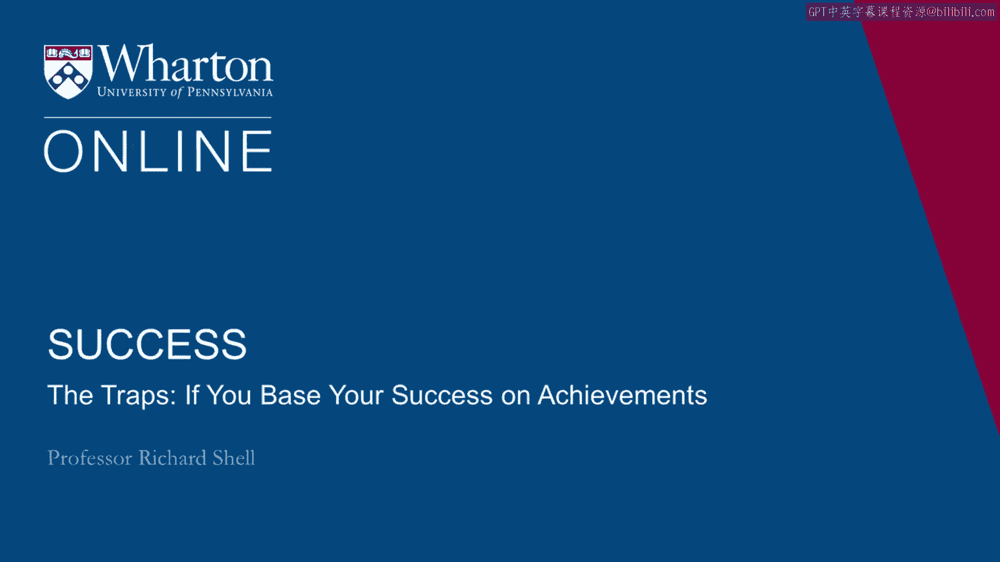
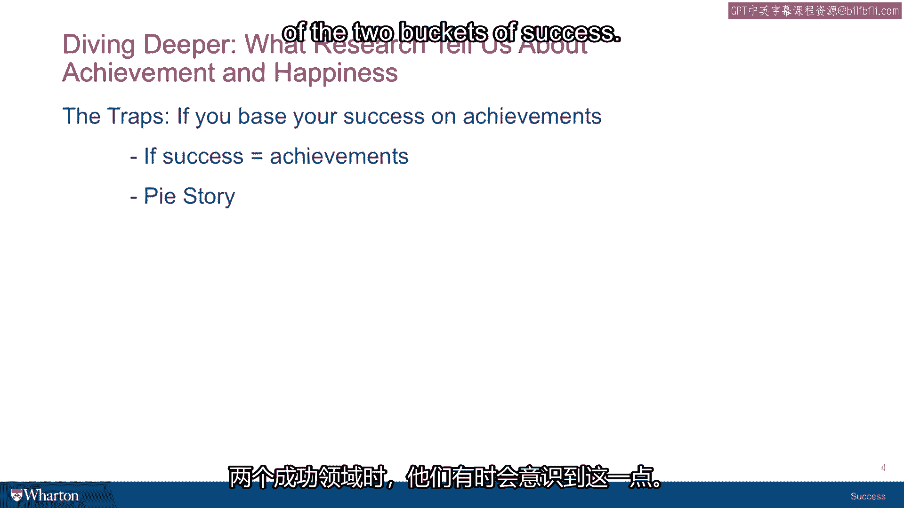

# 沃顿商学院《实现个人和职业成功（成功、沟通能力、影响力）｜Achieving Personal and Professional Success》中英字幕 - P19：18_如果你把成功建立在成就上的话会陷入的陷阱.zh_en - GPT中英字幕课程资源 - BV1VH4y1J7Zk

The science of success for the most part is about how to achieve success。

And usually it means how to achieve。 And in connection with this course。

we're going to give you an all time hit parade list， of books on how to succeed。

But that's not what this course is about。 This course is about what you mean by the word success。

And so what we're going to do in the next few sessions is talk about how if you base。

success on certain values， what the problems might be， the complications that come from。

hang your hat on one value and not another。 So we're going to start with achievement and then we'll move to happiness。

So what happens if you decide to place all your chips on the board and define success。

as what you achieve？ It seems like that's an obvious thing。

It seems like what most people strive for。 But if it's the case that success is basically equated with achievements。

here's a question， for you。 How come so many high performing people often feel so bad？

Turn out lost families， lost relationships， depression， drugs， people who are obsessively。

oriented toward achievement often end up in some very bad places。

And I think the reason is because they aren't actually combining these two inner and outer。

faces of success。 They've just put all their money on one side。

We had a speaker at the Wharton School some years ago who told a really interesting story。

about a guy who had actually figured this out and reoriented his life in order to achieve。

a new kind of success as he saw it。 And so I wanted to share it with you because I think it kind of summarizes the moment of。

realization that can sometimes come for people when they recognize that they've put too much。

emphasis on one of these buckets of the two buckets of success。

So this fellow was an entrepreneur and he ran a very big set of businesses in the American。

southeast down in Georgia and South Carolina。 And when his firm was small。

he had used a lawyer from Atlanta as an outside lawyer。

a lawyer that worked at a law firm to help him set up the business。 And as the firm grew。

he finally came to a point where he realized he needed a lawyer。

to come and work with him full time as an inside lawyer。

So he went to his friend at the Atlanta law firm and said， "Could you suggest someone。

that we can use to be our inside lawyer？"， And the guy said， "Well， let me give you some thought。

I'll get back to you。"， So a couple of days later。

the lawyer from Atlanta shows back up in the entrepreneur's， office and says。

"I found just the perfect person to be your inside lawyer。"， And the entrepreneur said， "Well。

who is it？"， And he said， "Me， I'm going to do it。"， And the entrepreneur said， "Well。

I can't possibly pay you what you're getting at the， law firm。 You know， just forget about it。"。

And the lawyer said， "I don't care what you pay me。 I'll take whatever you give me。

I want to work with you。"， And the entrepreneur said， "Well， why would you want to do that？"。

And he said， "Well， after you ask that question， I went back home and I started thinking， about it。

And here's what I concluded。 He said， "I worked my butt off in high school to get into a great college and I worked。

my butt off in college to get into a great law school。

And then I worked my butt off in law school to get into a great law firm。

And now I've worked my butt off at this law firm to get to be a partner。"。

And I suddenly realized that I've just been in this great big pie eating contest and I。

keep winning and every time I win， the prize is always the same and the prize is always， more pie。

And he said， "I'm tired of eating pie。 I want to join you。

build your company and have a little fun doing what I love to do。"。

And so the entrepreneur hired him and the first day of work， this guy shows up。

He's dressed in a Hawaiian shirt， ready to go。 Still the great lawyer he was before but with a whole new attitude about how he was working。

and why he was。 So achievements can have that circularity。 If you don't know what's going on。

you end up just repeating cycles like going around， a merry-go-round。

Just achieving whatever somebody said is the success that you're striving for， a degree。

a status job。 But at the end of the day， if that's all that's going on。

you're just going to end up eating， more pie and it's not going to be very satisfying。

[BLANK_AUDIO]。

