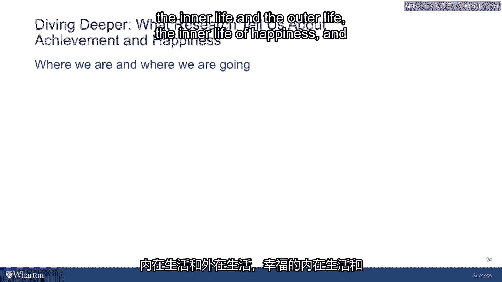

# 课程21：成功等于幸福吗？🤔

在本节课中，我们将探讨成功与幸福之间的关系。我们会分析将成功等同于外在成就可能带来的陷阱，并深入探讨“幸福”这一概念的复杂性。通过区分不同类型的幸福，我们可以更清晰地定义对自己而言真正重要的成功。

---

## 避免成就的陷阱

上一节我们讨论了将成功完全等同于外在成就（如财富、名声、地位）可能带来的问题。基于此，本节我们将看看如何重新设定目标，以追求更有意义、更可持续的成就。

以下是几个值得参考的调整方向：

*   **追求财务安全，而非无尽财富**：目标是积累足以保障你和家人生活安定、让你能追求充实生活的财富。
*   **追求尊重，而非名声**：名声意味着被许多不了解你的人知晓；尊重则来自了解你、并能客观评判你能力的核心圈层。寻求后者的认可能引导你走向更好的方向。
*   **关注有价值的角色，而非头衔地位**：不要只盯着“首席财务官”这样的头衔，应思考你在组织或他人生活中实际扮演的角色（如导师、领导者、父母），并努力最大化这些角色所能做出的贡献。
*   **结交真朋友，而非庞大的浅层社交网络**：与其追求社交媒体上大量的、基于碎片信息的浅层关系，不如培养更少但更深厚的真实友谊。这些能相互影响、成为彼此生活一部分的朋友，或许最终能成为亚里士多德所推崇的“美德之友”。

因此，值得追求的不是**财富**，而是**财务安全**；不是**名声**，而是**尊重**；不是**地位**，而是**在他人生活中扮演的有价值的角色**；不是**浅薄而众多的关系**，而是**深厚而真挚的友谊**。

---

## 剖析幸福的复杂性

现在，让我们暂时放下“成就”这一边，锚定在成功的另一面——内在生活，即幸福。我们来看看，“幸福”是否真的包含了所有答案，或者它本身是否也有些复杂。

我提出这些复杂性，并非为了让你的生活变难，而是因为如果错误理解了幸福或成就的含义，你就会追逐错误的目标，最终对所获得的成功感到不满。我们在此寻找的是真正能带来深度满足感的成功。

那么，幸福究竟是什么？研究表明，幸福不止一种。这就像因纽特人（阿拉斯加原住民）生活在冰天雪地中，他们用许多不同的词来指代我们统称的“冰”，因为不同的冰在他们的世界里有不同的意义和作用。在西方社会，我们过度使用“幸福”这一个词，这常常造成混淆。人们以为自己追求的是同一样东西，当得不到时，便觉得出了问题。

因此，我们至少需要思考三种不同的幸福，相关研究能帮助我们理解这一点。

以下是三种主要的幸福类型：

### 1. 瞬间幸福 😊

这是大多数人想到“幸福”一词时首先联想到的。它是一种情绪、一种心境、一种转瞬即逝的积极感受。

*   **例子**：在炎热的海滩日，你买到最喜欢的软冰淇淋，第一口咬下去的美妙感觉。
*   **特点**：这种幸福很棒，拥有越多，日子越好过。
*   **作为成功衡量标准的问题**：
    *   **基因设定点**：研究表明，人们的情绪构成有遗传设定点。有些人天生更积极，有些人则相反。你的情绪状态会围绕这个设定点上下波动（例如，吃冰淇淋时高于设定点，之后感到燥热时又低于设定点）。每个人的波动范围不同。
    *   **公式表示**：`个人幸福基线 ≈ 遗传设定点 + 短期环境波动`
    *   如果这类幸福（积极心境的总和）很大程度上由基因设定，那么说某人因为拥有更多积极情绪而“更成功”似乎有失公平，因为这更像是一种天赋，而非个人选择的结果。
    *   **深度思考**：阿尔伯特·爱因斯坦曾评论，建立在瞬间情绪状态上的成功理论，更像是牛的幸福，而非人类应推崇的。牧场上一头吃得好、喝得好的牛可能是“幸福”的，但这是你希望在生命尽头回顾时所满足的成功人生吗？值得怀疑。

### 2. 整体幸福 📊

整体幸福不是一种情绪，而是一种**思考、评价和批判**。它是在生命某个阶段或展望未来时，对一段经历（如大学生活）的整体评估。

*   **例子**：有人问你大学时是否幸福，你可能不记得所有积极瞬间，但基于一些重要事件（如遇见伴侣、顺利毕业），你会觉得“整体上我是幸福的”。
*   **特点**：这种评估能帮助激励我们，并构建人生故事。
*   **作为成功衡量标准的问题**：
    *   **选择性记忆**：记忆会过滤痛苦（如糟糕的大二学年），突出高峰（如遇见伴侣）和终点（如毕业典礼），导致评估不准确。
    *   **易于操纵**：研究发现，当前的情绪状态会影响对过去的回忆。给某人一块喜欢的饼干让他心情变好，他可能会对过去的整体幸福评价更高；反之，情绪低落时评价可能更低。
    *   **相对性**：评估总是相对于某个**基线期望**。如果你预期大学生活很糟糕而结果尚可，你会感到幸福；如果你预期它很精彩而结果只是尚可，你的评价就会更负面。
    *   因此，将生命意义的重担寄托在某个时间点对“整体幸福为X”的评价上，似乎是一个相当脆弱的基石。

### 3. 深度幸福 🌟

深度幸福与上述两种都不同。像瞬间幸福一样，它是一种情绪，但具有**更深厚的共鸣、意义和深度**。

*   **特点**：它难以刻意追求，更像是一种恩赐的瞬间，需要你静下心来才能感知到。
*   **不同文化中的表述**：
    *   **喜悦**：例如第一个孩子出生时的狂喜。
    *   **Eudaimonia（希腊语）**：亚里士多德提出的概念，意为“好的精神”。它不是一种静止的状态，而是一种**蓬勃焕发、欣欣向荣的活动**，在此活动中，你的卓越体现在能为周围人赋予意义的行动里，且这行动本身就是目的。`Eudaimonia ≈ 在体现卓越的活动中获得蓬勃感`
    *   **Simcha（希伯来语）**：一位拉比将其特别定义为“**当你正在做你应该做的事情时所产生的感觉**”。例如，在医院陪伴生病的亲友，你的存在减轻了他们的痛苦。
    *   **心流**：心理学家米哈里·契克森米哈赖提出的概念，指**完全沉浸于某项活动、忘记时间流逝的状态**。例如，写作或跑步时进入的“忘我”境界。`心流状态 ≈ 全神贯注 + 时间感扭曲 + 内在奖励`
*   **核心挑战**：深度幸福的时刻更像是“恩典的时刻”，无法被简单地设计或追求。美国作家纳撒尼尔·霍桑有一个美妙的比喻：如果你想用手去抓蝴蝶，很难抓到；但如果你安静地坐着，有时蝴蝶会飞来落在你的肩上。深度幸福也是如此。

---

## 关于幸福的已知结论

让我们基于研究，总结一下关于幸福及其重要性的几点认知（丹尼尔·卡尼曼在《思考，快与慢》中对此有强力阐述）：

以下是四项关键发现：

*   **与所爱之人共度时光**：对你的幸福最重要的，是与爱你且你爱的人在一起。被最关心你、你也最关心的社群包围，更可能带给你上述所有三种幸福。这并非总是充满玫瑰，但这些时刻包含你最幸福瞬间的几率极高。
*   **体验优于物质**：幸福更多来自**经历**，尤其是与他人共享的经历，而非物质商品。有时，与爱人一起购物、挑选、决策的过程本身，比最终买回家的物品更能带来快乐。物品的意义和快乐源于其背后的故事。
*   **接纳过程中的不幸福**：幸福常常源于你**愿意为了长期或艰难的目标而忍受不幸福**。想想奥运运动员或攻读学位的学生，许多过程需要牺牲、努力，并非总是快乐的。但正是愿意承受这些，才能在最终实现目标时获得更深层、更满足的幸福。如果只把“幸福”当朋友，“不幸福”当敌人，你很可能不愿付出必要的努力，从而错失深度的满足感。
*   **管理期望以重构情绪**：你可以通过**设定更现实的期望**来重构情绪，从而为生活带来更多幸福。如果对未来的某个事件期望过高，很容易感到失望。将期望设定得更准确，实际体验就更可能达到或超越期望，从而产生积极的情绪，而非“未达预期”的负面情绪。

---

## 本节总结

在本节课中，我们一起探讨了成功的两面——内在生活（幸福）与外在生活（成就），并仔细审视了将其中任何一面简单作为成功理论组成部分时所显现的复杂性。

我们发现，在成就方面，人们很容易陷入几种陷阱，最终追求了无法带来满足感的东西，或是追逐着他人的目标、一种永无餍足的成就。在幸福方面，“幸福”这个词包含了多种不同的形式，意义各异。明确自己所说的“想要更幸福的生活”究竟指的是**瞬间幸福**、**整体幸福**，还是那种神秘而重要的**深度幸福**，对你来说至关重要。

带着这些新的理解，在下一部分也是本课程的最终部分，我们将探讨如何应用这些知识，并结合你自己的经验和记忆，开始以一种非常具体、可操作的方式，为你自己思考成功的定义，并迈出实践的步伐。

---