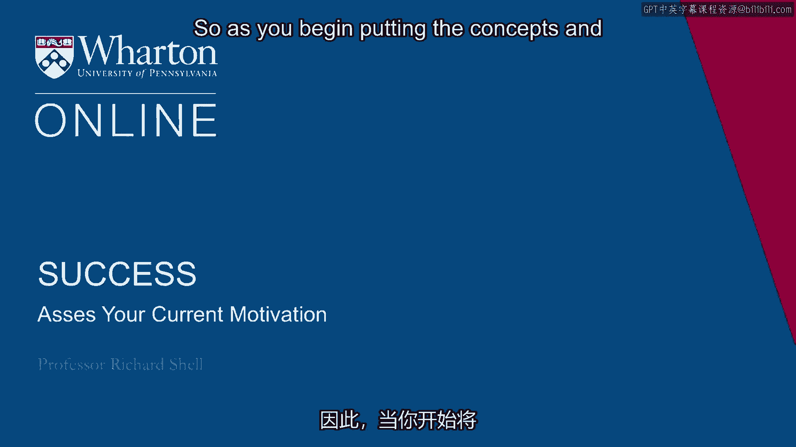
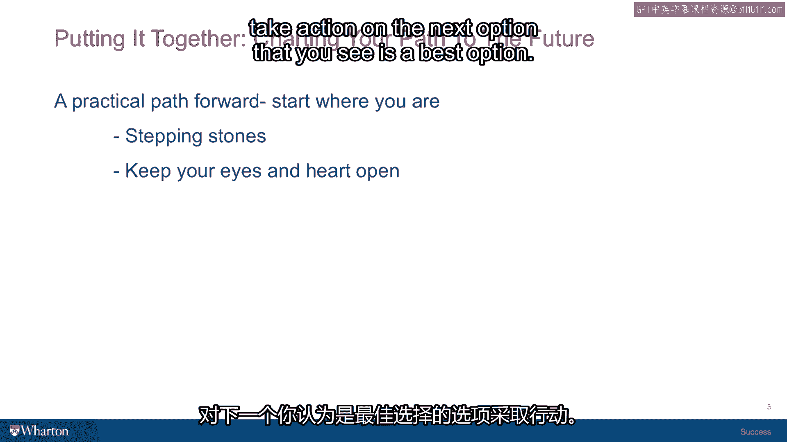

# 沃顿商学院《实现个人和职业成功》课程 P24：评估你当前的动机 🧭

在本节课中，我们将学习如何评估驱动你行动的核心动机，并探讨如何将动机从“逃避恐惧”转向“追求目标”，从而为实现真正的成功奠定基础。

---

## 动机的两种类型

上一节我们探讨了成功的不同维度，本节中我们来看看驱动我们行动的内在力量——动机。人们通常讨论两种动机：

*   **内在动机**：指纯粹因为热爱而做某事，不为了任何外部奖励。公式可表示为：`行动 = 热爱(事物)`。
*   **外在动机**：指主要为了获得奖励而做某事，个人喜好与否是次要的。公式可表示为：`行动 = 追求(奖励)`。

实际上，这两种动机常常混合出现。每个人在不同项目和生活中，都同时受到这两种动机的驱动。通常，幸福更与内在动机驱动的活动相关，如爱好、与家人共处；而工作则常与外在动机联系更紧密，如获取报酬。

---

## 核心问题：你在“奔向”还是“逃离”？

除了上述分类，我想提出一个与你的成功概念更密切相关的动机划分方式。请思考以下问题：

**结合你当前的状况（我们刚用矩阵评估过），你感觉自己在更多地向目标奔跑，还是在更多地从恐惧中逃离？**

人类心理的两大主要驱动力是**欲望**和**恐惧**。评估你当前为实现成功目标而行动时，这两种驱动力各占多少比例，至关重要。

如果恐惧占主导，即使你达成了目标（例如毕业），这种成功感也可能是不满足的、令人不安的。因为你只是在抵御恐惧，而非享受追求并实现目标的成就感。

因此，理清这一点非常重要。我们有许多恐惧：害怕孤独、害怕失败、害怕不被重视或不被尊重。如果这些恐惧主导了你的生活，你需要停下来，正视它们，识别并努力解决其根源。否则，你在追求任何重大成就时，很可能步履维艰，因为未被处理的恐惧会限制你发挥全部才能。

---

## 直面根本恐惧：对死亡的恐惧

在我看来，所有恐惧背后，都有一个全人类共同面对的根本恐惧——对死亡的恐惧。每个人都需要在某个时刻与这个重要的恐惧达成和解。

我曾计算过：如果你足够幸运活到90岁，且每天都充满清醒的意识，你一共将度过 **32,850天**。认识到生命的有限性，并接受它作为我们生活的约束条件之一，这很重要。

人们以不同方式面对这种恐惧。有些人因失去挚爱而深刻意识到自己终将面对死亡；有些人则因亲身经历生死边缘而顿悟。

我曾分享过一段个人经历：在斯里兰卡的一座佛教寺院修行时，通过一次在森林中的漫步，我顿悟到生与死相互联结、互为依存。那一刻，我为自己终将如森林万物一样死去而哭泣，但这也成为一种宣泄般的痛苦。从那以后，我对生命和成功的理解发生了根本转变。

我也有一位学生以截然不同的方式面对它。她童年时一次濒临溺亡的经历，让她感受到被充满爱的温暖存在所包围。这次亲密的濒死体验彻底消除了她对死亡的恐惧，因为她“知道”死亡将是与她预期完全不同、且无比积极的体验。此后，她对待生活、成功的方式发生了根本改变。

所以，你需要问问自己：你与这种根本恐惧的关系如何？如果你已经面对并克服了它，那么你已经战胜了生命中的一项重大挑战。如果你尚不确定，那么深入审视和理解它，可能是你成长、成熟以及未来帮助他人的重要一步。

---

## 从“逃离恐惧”转向“奔向目标”

一旦你完成了从“逃离恐惧”到“直面恐惧”的转变，你就有机会全身心地奔向未来和你想要达成的目标。

这里有一个简单的练习，或许能帮助你想象这种状态：

### “彩票练习”

这个练习的灵感来自一位名叫辛西娅·斯塔福德的女性。她曾反复想象自己中彩票的情景，包括穿着哪条裙子、手持中奖彩票的细节。后来，她真的中了加州彩票，且当天穿着的正是她想象中的裙子。

但辛西娅故事的重点并非“想象创造现实”的魔法思维（因为想象无法影响彩票机器）。我欣赏的是她中奖后的选择：她没有沉迷于此或四处宣扬“魔法”，而是审视内心，找到了自己真正的热情所在。在妥善安排家庭后，她 passionately 投身于戏剧事业，资助社区剧院，帮助残疾人和老年人走进剧场，并创办了自己的影视制作公司。

她将彩票带来的机遇，转化为了实现人生追求的动力。

以下是你的挑战：

**想象你赢得了彩票。** 假设你会照顾好家人，尽情旅行。但之后，你将面临如何利用这巨大机遇的问题。

花一点时间梦想并写下：如果金钱不再是问题，**你真正想做什么？**

你会发现这能给你一些方向性的信号：也许你想投身教育、媒体，为社区提供教育机会，去发展中国家工作，或参与政治。这个思考能帮你勾勒出那些真正能激励你“奔向”它的美好目标。

---

## 实践练习：明确你的首要目标与行动

作为本系列的最后一个练习，请你认真完成以下几个步骤：

**第一步：写下目标**

请写下你当前生活中的四到五个目标。可以是短期或长期目标，涉及关系、职业等任何方面。写下后，请暂停视频。

**第二步：圈出首要前提目标**

在写下的四五个目标中，**圈出那个你必须先实现，才能实现其他目标的那一个**。这个目标是实现其他目标的前提条件。

例如：
*   如果你的目标是“成为大学教师”或“编写教材”，那么“获得博士学位”可能就是那个首要前提目标。
*   如果你的目标涉及“组建家庭、养育子女”，那么“找到人生伴侣”可能就是那个首要前提目标。

**第三步：制定本周行动计划**

在纸张的下半部分，针对你圈出的那个首要前提目标，写下**两件你可以在本周内采取的具体行动**，来推动你向该目标前进。

这两件事应该是具体的、你可以在今天、明天或本周五之前采取的行动。这种承诺和脚踏实地的态度，是让你的生活朝着你的成功理论所指方向前进所必需的谦逊和起点。

---

## 总结：成功如涉水过河

本节课中，我们一起学习了如何评估驱动你的核心动机，区分了“奔向目标”与“逃离恐惧”的不同动力。我们探讨了直面根本恐惧（如对死亡的恐惧）的重要性，并通过“彩票练习”引导你发现内心真正的渴望。最后，我们通过一个三步练习，帮助你锁定实现其他目标的首要前提，并立即制定具体的行动计划。

我想用一个比喻来结束：设定人生目标就像在一条河流的石头上过河。河水时涨时落（如同环境变化），你必须采取行动跳到下一块石头上（实现下一个目标）。到达后，观察形势，再决定下一步的最佳跳跃点，以保持前进且不弄湿双脚（避免重大挫折）。如此反复，一步步向前。

我们这门课的目的，不仅是给你一个成功的理论，更是给你一些工具和动力，让你采取行动，将那个理论变为现实。