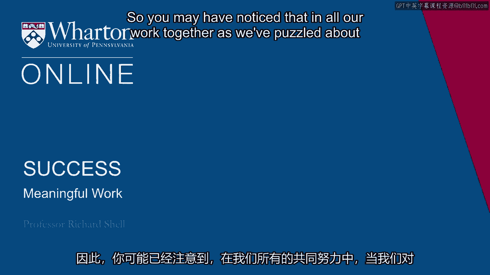
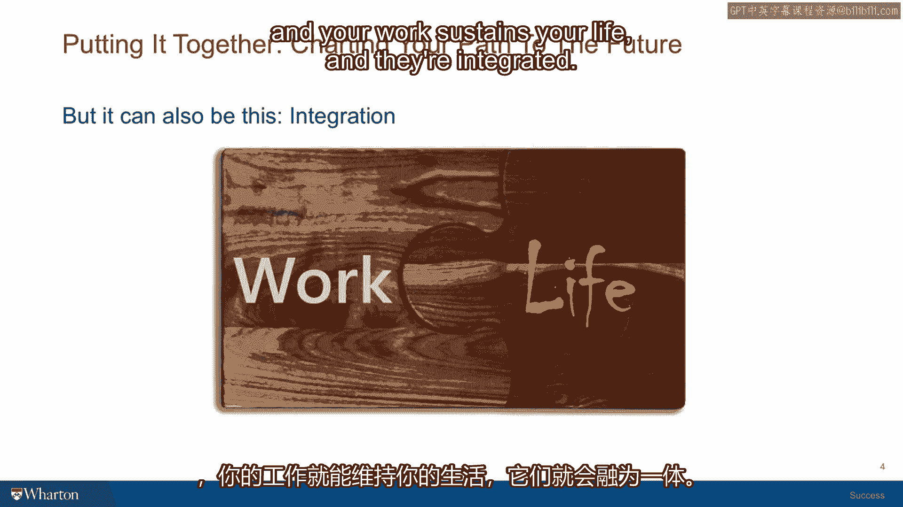
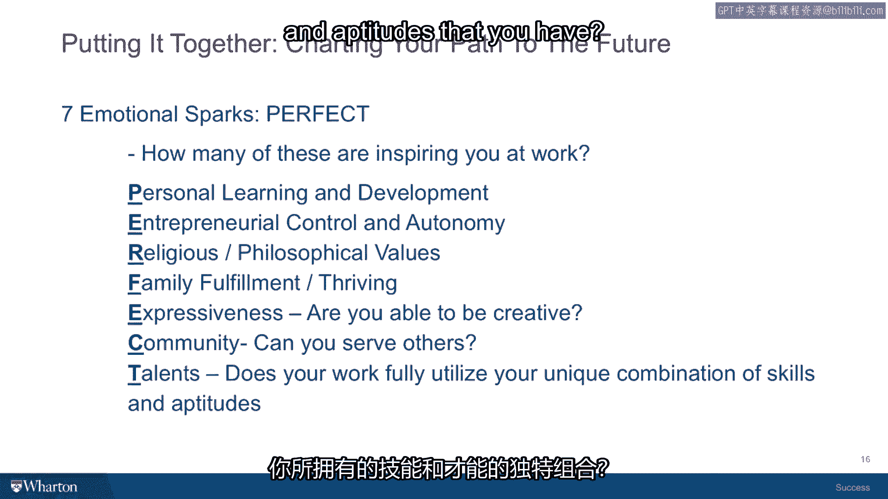

# 沃顿商学院《实现个人和职业成功（成功、沟通能力、影响力）｜Achieving Personal and Professional Success》中英字幕 - P25：24_有意义的工作.zh_en - GPT中英字幕课程资源 - BV1VH4y1J7Zk

So you may have noticed that in all our work together， as we've puzzled about the meaning。

of success， I've been trying to find different ways to help you think about integrating or。

combining the inner life and the outer life to find the happiness and satisfaction that。

there may be available in certain kinds of achievement that would be well suited for， you。

you're doing things that you do well， you're doing things that excite you。 And on the other side。

noticing the energy and the sustenance that comes from happiness。

and being able to sustain your motivation across longer periods of time to do things。

so that you do things exceptionally well。 So I want to zero in in this discussion about happiness。

the inner life， the outer life， and come to some thoughts about actually careers， work， jobs。

So the usual way that people talk about work life issues now is as a balance。

So it's sort of like a seesaw with work on one side and life on the other and every time。

you work a little more， your life takes a sacrifice and every time you pay more attention。

to your family， then you have to give up some opportunities for promotion at work。

And so there's this trade-off going on。 Now that could be the case。

but it's not necessarily the case because you can always think of different。

ways that you can put your work and life into a more harmonious relationship where they。

really are two parts of a puzzle and when they fit together well， your life sustains。

your work and your work sustains your life and they're integrated。

So if this goal appeals to you， I think it's important to give some thought to what work。

really is and how it comes to pass that some people seem to have these puzzle-like solutions。

to the work and the life part that allowed them to have the inner life and the outer life。

working in tandem。 So some wonderful research by Swarthmore College is Barry Schwartz。

He's a psychologist， part of the community that I interact with at the Penn Positive Psychology。

Center。 He and colleagues basically defined different forms of work with three different definitions。

and then they went out and did research and asked people what they thought they had and。

the three categories were a job which is simply things you do for money to allow you to do。

other things that aren't the things you do for money。

So this is what people do when they're supporting their family and getting paid nine to five。

on an hourly basis to do some work that they don't much enjoy but they do find dignity in。

it and they are able to support their families so they have a job。

A second way to think about work is to have a career。

Now career is different than a job because a career suggests that you have a sort of， ladder。

we talked about the metaphor of the ladder， that you go through stages， you advance。

with different promotions and salary increases along a track。

A career for a lawyer might be in a start as a young associate and then become a senior。

associate than a partner in a law firm or a senior lawyer in a company or at an institution。

And so you have a career certainly that's part of my approach to work as I started at。

work as an assistant professor。 I got tenure which was promoted to associate professor。

I wrote some articles and books and I became a full professor。 So that's what a career looks like。

But there's a third way to thinking about work that Barry Schwartz and his colleagues。

identified and they called it a calling。 That's a sort of semi religious term。

The Catholic Church calls it a vocation and that's work that you do because it gives。

your life a sense of purpose and meaning。 And it's funny but different careers lend themselves or different jobs lend themselves。

to being callings。 Certainly religious work is often thought of as a calling。

But oddly enough people who are artists often think of themselves as having a calling。

People who are chefs often think of themselves as doing work that amounts to a calling。

That they are called to do something that they feel really gives their life enormous meaning。

and enormous interest。 I've kind of changed the vocabulary a little bit and taken the religious piece out of it。

I think of this third thing as something I call meaningful work。

But here's an interesting finding of this research。

They actually went into a place like a hospital and they gave questionnaires to the janitorial。

staff。 Even people at the same job level in the same institution thought of their jobs in all three。

of these ways。 So some people had the job of janitor and it was a job and they were simply supporting。

their family。 They had no interest in it beyond the paycheck。 Some people thought of it as a career。

They were in the janitorial work force but they were also in the union and they were hoping。

to become a shop steward and become a union official and said they were looking at the。

job as a stepping stone along a track that would take them to more responsibility。

And some people thought even of a janitorial job in a hospital which you might not think。

is a calling。 Some people for religious reasons， for reasons that had to do with their own personal story。

they had a child who had had cancer that had been cured on the very ward that they were。

now working on to keep the ward in tidy order。 And they considered their jobs colleagues。

They considered them very meaningful and they approached it that way。

So the interesting insight is that it isn't the job that gives work meaning。

It's the people who do the work who give the work meaning。

So essentially any work can have meaning for the right person。

And a lot of it has to do with how that work fits into your life story， how that work fits。

into the context of your beliefs and values。 Now a very important part of what we talked about are your success values and the more。

you can integrate your own authentic success values into the kind of work you do that allows。

you to make a living。 The more your work life and your personal feelings of happiness and fulfillment will。

begin to coexist and overlap and feed each other in a very positive way。

So important to ask yourself is this sort of current diagnostic which kind of work do。

you have right now？ Well， I think that's a great thing。 I think that's a great thing。

I think that's a great thing。 I think that's a great thing。 I think that's a great thing。

I think that's a great thing。 I think that's a great thing。 I think that's a great thing。

I think that's a great thing。 I think that's a great thing。 I think that's a great thing。

I think that's a great thing。 I think that's a great thing。 I think that's a great thing。

I think that's a great thing。 I think that's a great thing。 I think that's a great thing。

I think that's a great thing。 I think that's a great thing。 I think that's a great thing。

I think that's a great thing。 I think that's a great thing。 I think that's a great thing。

I think that's a great thing。 I think that's a great thing。 I think that's a great thing。

I think that's a great thing。 I think that's a great thing。 I think that's a great thing。

I think that's a great thing。 I think that's a great thing。 I think that's a great thing。

I think that's a great thing。 I think that's a great thing。 I think that's a great thing。

I think that's a great thing。 I think that's a great thing。 I think that's a great thing。

I think that's a great thing。 I think that's a great thing。 I think that's a great thing。

I think that's a great thing。 I think that's a great thing。

I try to present my students with a model that I hope is useful。 I'm going to present it to you。

There are three circles that can intersect。 Circle number one is all those types of work that someone might pay you to do。

Then circle number two， overlapping with circle number one a little bit。

is work that you're good at doing。 Then circle number three is work that actually cites you and inspires you。

Where those three circles overlap， the circle that is work that people will pay you for。

the circle that is work that you're good at and have talents for and the circle that。

gets you excited and inspires you， that's a sweet spot right in the middle。

To the extent that on a given day or during a day of a given week。

you find yourself in that sweet spot。 I think you'll find that the energy you get from doing the work not only is energy。

well spent， but you often feel at the end of a work day that you have more energy。

than you did at the beginning because the work itself gives you energy。 When I'm teaching。

sometimes I'll teach a three-hour class and it'll be about a。

subject that I'm really passionate about and we have a great class discussion。

and the students have all prepared and they're alive and awake and engaged。

At the end of three hours， I have more energy at the end of that class than I do。

or did at the beginning of the class。 I know that in those moments I have some meaningful work of my own。

So in the part of the research that I've done in success， I've tried to tease out。

different ways that you can derive this sense of energy and excitement and。

meaning from the work that you are doing or could do。 By the way。

the search for meaningful work doesn't have to be a search for a new job。

The search for meaningful work can be the search for the meaning in the work you do。

and the highlighting of that， the crafting of it， the small adjustments you might be。

able to make to bring more excitement to the work that you're doing。

And that can be every bit as productive as thinking that you're in some crisis。

and you have to throw everything out the window and go on a quest to find the perfect job。

Believe me， there are no perfect jobs。 There are no perfect bosses。

There's no perfect way to earn a living that I've found。

So it's always a matter of making the best of the situation to the extent that you've。

crafted it yourself and make it work for you。 So there's an acronym that I've found。 Perfect。

P-E-R-F-E-C-T。 And each of these letters in the word perfect stands for some dimension of meaning。

that can enrich your working life and add purpose and excitement to it。

P-E stands for personal learning and development。 Does your work allow you to engage in learning that enrich your understanding of yourself。

promote your leadership skills， for example， or give you exposure to a more diverse set of people。

and learn about their cultures？ Do you get to go to some classes？ Are you ever in training？

Things that allow you to expand your knowledge set。 So that's basis number one。 Basis number two， E。

and perfect。 Do you have any kind of entrepreneurial control。

any kind of autonomy over the tasks that you do？ Do you get to see a beginning， a middle。

and an end to projects that you have some choice over？ To the extent that people have that autonomy。

they often feel much more energized by their work。

than if they're simply stirring a pot and somebody else is the cook and someone else is the cook。

and someone else is adding ingredients and you don't even know what the final dish is going to be。

You're just a cog in a machine。 So bringing more autonomy， bringing more control。

asking for more decisions that you can make along the way。

can add a lot of a sense of excitement to any job。

P-E-R stands for religious or philosophical values。 Maybe the work you're doing furthers。

a value set that you're excited and motivated by。 You're working in a corporation。

but you find that you're able to assist with some environmental initiative。

that the company is involved in or some community development work they're doing with the local school system。

or some sort of project that has to do with education。

and allows you to take some time and work as a tutor。

So the philosophical and religious values that you hold dear。

if your work gives you a chance to embody those， and to express those。

that can be a very important source of meaning in the word meaningful work。

P-E-R-F stands for family。 The fulfillment that comes from family。

the sense of dignity that comes from providing for a family。

the thriving that happens if you're able to have work that allows you to spend enough time with your family。

and enjoying the children as they grow up and the resources that you're able to bring to create their futures。

So relating your work to your family can help provide an important source of meaning to what you're doing。

P-E-R-F-E， or almost to the end of the word perfect， E stands for expressiveness。

Does your job give you a chance to be self-expressive， to be creative？

It could be even computer coding。 It could be decorating。

It could be control over social events that you're able to create that enlivenes everyone's life in the organization。

or the unit that you work for。 That personal expressiveness and the opportunity to engage in it can be a very deep source of meaning for people。

C， in the last two letters are C and T， perfect。 C stands for community。

Do you have a chance to exercise service in the process of the work you do？ Even in my job。

which is not especially community-oriented， I see my work with students as a service to others。

To the extent that I can counsel them or give them advice on job choices or sometimes they call me or email me。

after they graduate and I can give them a little coaching on a choice they have to make or a decision that they face。

This gives me a profound sense of being of service to others。

I think a lot of jobs give you a chance to mentor as well as interact with people in the community where you work。

that can be very meaningful and very important。 Then the final letter in the word perfect is T。

That stands for talents。 Does your work give you a chance to fully utilize the unique combination of skills。

and aptitudes that you have？ Are you able to be excellent？

Cal Newport， a writer about success， he's a professor at MIT。

actually has a whole theory about success， that basically says don't follow your passions。

follow your talents。 I think people who are able to exercise their talents， grow in their talents。

excel in the things they do well， to become even better， even world class at what they do。

That can be a deep source of very satisfying and fulfilling work knowing that you're the best。

So each of these seven emotional sparks can inspire you。

How many of them might be activated at any given time？ Probably not all of them。

But it's a good checklist to think as far as your work is concerned or the work that you're aspiring to。

How many of these seven items might be possible to explore， to craft your job， to expand on。

and to make that working life something that also brings happiness and fulfillment。 [ Silence ]。

