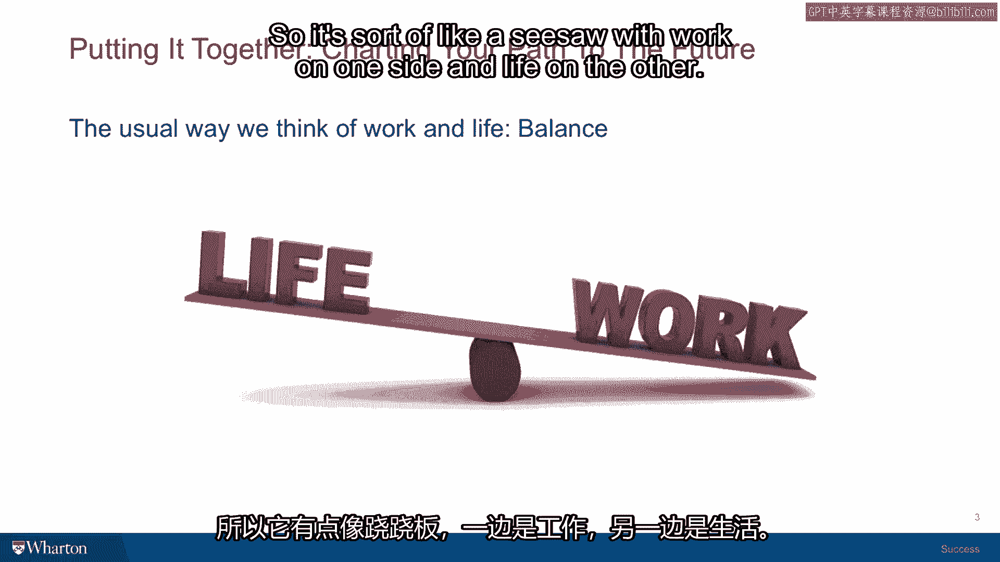
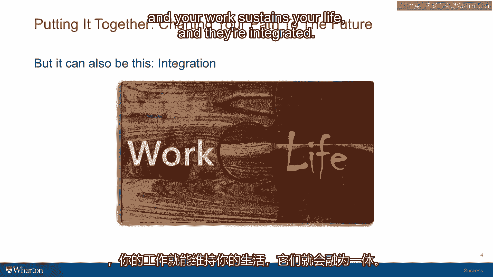
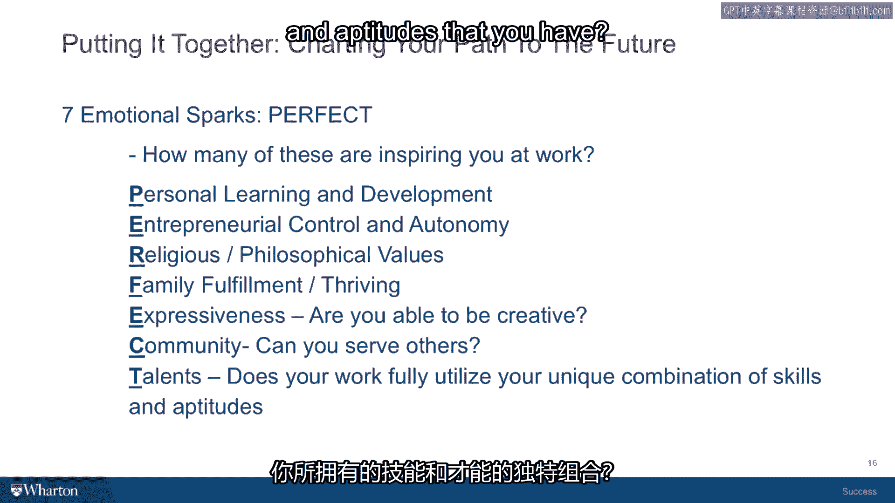

# 沃顿商学院《实现个人和职业成功》课程笔记 P25：有意义的工作 🧩

在本节课中，我们将探讨如何通过整合内在生活与外在生活，在职业中找到幸福感和满足感。我们将分析工作的不同定义，并学习一个实用的模型和框架，帮助你发现或创造工作中的意义。

---

在我们共同探讨成功意义的过程中，我一直在尝试用不同的方法，帮助大家思考如何整合内在生活与外在生活，从而在那些适合你的成就中找到可获得的幸福与满足。当你做擅长且令你兴奋的事情时，一方面，你能从快乐中获得能量和滋养；另一方面，你能够维持更长时间的动力，从而把事情做得异常出色。

本节讨论将聚焦于幸福、内在生活、外在生活，并最终落实到对职业、工作和岗位的一些思考上。

## 从“平衡”到“整合” 🔄

人们通常用“平衡”来讨论工作与生活的关系。这就像一个跷跷板，一端是工作，另一端是生活。每当工作多一点，生活就做出牺牲；每当多关注家庭一些，就不得不放弃一些工作晋升的机会。因此，这里存在一种权衡。

这种情况可能存在，但并非必然。你总可以思考不同的方式，让工作与生活建立更和谐的关系，使它们成为拼图的两个部分。当它们完美契合时，你的生活滋养着工作，工作也滋养着你的生活，二者融为一体。

如果这个目标吸引你，我认为重要的是思考工作的本质，以及为何有些人似乎找到了这种拼图式的解决方案，让内在生活与外在生活协同工作。

## 工作的三种定义 🏢

斯沃斯莫尔学院的巴里·施瓦茨教授及其同事进行了一项出色的研究。他们定义了三种不同形式的工作，并通过调研询问人们认为自己拥有哪一种。

以下是三种工作定义：

1.  **工作（Job）**：这仅仅是你为了赚钱而做的事情，目的是让你能够去做那些不赚钱的事情。这是人们养家糊口的方式，朝九晚五按小时计酬，做着自己不太喜欢但能从中找到尊严、支撑家庭的事情。
2.  **职业（Career）**：职业不同于工作，它意味着一种阶梯式的进程。你会经历不同阶段，沿着一条轨道获得晋升和加薪。例如，律师的职业道路可能从初级助理开始，然后成为高级助理，再到律所合伙人或公司的高级律师。
3.  **使命（Calling）**：这是一个带有半宗教色彩的术语。天主教称之为“天职”。这是你因为能赋予生活目标感和意义而从事的工作。有趣的是，不同的职业或工作都可能成为使命。宗教工作常被视为使命，但艺术家、厨师等也常认为自己的工作是一种使命，他们感到被召唤去做一些赋予生活巨大意义和兴趣的事情。

我稍微改变了这个词汇，去除了其中的宗教成分，将第三种形式称为 **有意义的工作（Meaningful Work）**。

## 关键洞察：意义由人赋予 💡

这项研究有一个有趣的发现：研究人员去了像医院这样的地方，向保洁人员发放问卷。结果发现，即使在同一个机构、同一岗位级别的人，对工作的看法也涵盖了以上三种。

*   有些人将保洁视为一份**工作**，仅为养家糊口，除了薪水别无兴趣。
*   有些人将其视为一份**职业**，他们身处保洁队伍，但加入了工会，希望成为工会代表或官员，将这份工作视为通往更多责任的垫脚石。
*   有些人甚至将医院的保洁工作视为**使命**。可能出于宗教原因，或与个人经历有关（例如，自己的孩子曾在他们现在负责保持整洁的病房里治愈了癌症）。他们认为自己的工作非常有意义，并以此态度对待它。

因此，关键的洞见是：**并非工作本身赋予意义，而是从事工作的人赋予了工作意义。** 本质上，任何工作对合适的人来说都可以有意义。这在很大程度上取决于这项工作如何融入你的生活故事，如何契合你的信仰和价值观背景。

我们讨论的一个重要部分是你的成功价值观。你越能将自身真实的成功价值观融入赖以谋生的工作中，你的工作生活与个人的幸福感、满足感就越能共存、重叠，并以积极的方式相互促进。

## 诊断你的工作类型 🩺

因此，一个重要的问题是进行自我诊断：你目前拥有的是哪种类型的工作？

为了帮助学生思考这个问题，我尝试提出一个希望有用的模型。

## 寻找“甜蜜点”模型 🎯

这个模型包含三个可能相交的圆圈：

1.  **圆圈一**：是那些有人愿意付钱让你做的工作类型。
2.  **圆圈二**：与圆圈一有所重叠，是你擅长做的工作。
3.  **圆圈三**：是能让你感到兴奋并受到启发的工作。

当这三个圆圈重叠时——即**有人愿意付钱**、**你擅长且有天赋**、**能让你兴奋**的工作——就形成了正中间的“甜蜜点”。

在特定的一天或一周里，你发现自己处于这个甜蜜点的程度越高，你就会发现从工作中获得的能量不仅被善用，而且常常在一天工作结束时，感觉精力比开始时更充沛，因为工作本身赋予了你能量。

## 创造意义，而非仅仅寻找 💎

需要说明的是，寻找有意义的工作不一定意味着寻找一份新工作。寻找有意义的工作，可以是**寻找现有工作中的意义**，并突出它、塑造它，通过可能的小调整为你正在做的工作带来更多兴奋感。这与认为自己陷入危机、必须抛弃一切去寻找完美工作的想法，同样具有建设性。

请相信，没有完美的工作，没有完美的老板，也没有我发现的完美谋生方式。因此，这始终是一个在你自己塑造的情境中尽力做到最好，并让它为你服务的问题。

## PERFECT 框架：工作的七个意义维度 ✨

我发现了一个首字母缩写词：PERFECT。这个词中的每个字母都代表了一个可以丰富你工作生活、为其增添目标和兴奋感的维度。

以下是 PERFECT 框架的七个维度：

*   **P - 个人学习与发展（Personal Learning and Development）**
    你的工作是否允许你进行学习，丰富对自我的理解，提升领导技能，或让你接触更多样化的人群并了解他们的文化？你是否能参加一些课程或培训？这些能扩展你的知识储备。

*   **E - 创业精神与控制（Entrepreneurial Control）**
    你对所执行的任务是否有任何自主权？你是否能看到自己有一定选择权的项目的开始、中期和结尾？人们拥有的自主权越多，通常就越能从工作中感受到活力。

*   **R - 宗教或哲学价值观（Religious or Philosophical Values）**
    你从事的工作是否推进了你所兴奋和认同的价值观体系？例如，在公司协助环保倡议、社区发展或教育项目，让你有机会践行珍视的价值观。

*   **F - 家庭（Family）**
    来自家庭的满足感，养家糊口带来的尊严感，以及如果工作允许你有足够时间与家人相处、陪伴孩子成长、为他们创造未来提供资源所带来的繁荣感。将工作与家庭联系起来，可以为你所做的事情提供重要的意义来源。

*   **E - 自我表达（Expressiveness）**
    你的工作是否给你机会进行自我表达和创造？这可以是计算机编程、装饰设计，或是策划能活跃团队生活的社交活动。这种个人表达及参与其中的机会，对许多人来说是深刻的意义来源。

*   **C - 社区（Community）**
    你在工作过程中是否有机会践行服务？即使在我的工作中（并非特别以社区为导向），我也将与学生的互动视为对他人服务。能够为他们提供咨询、建议，甚至在毕业后给予一些指导，这给了我深刻的为他人服务的感觉。

*   **T - 天赋（Talents）**
    你的工作是否让你有机会充分发挥你独特的技能和才能组合？你是否能够追求卓越？麻省理工学院的卡尔·纽波特教授有一个关于成功的理论，基本观点是：不要追随你的激情，要追随你的天赋。我认为，能够发挥天赋、在擅长领域成长并追求卓越的人，会从工作中获得深刻的满足感和成就感。

---

本节课我们一起探讨了如何超越工作与生活的简单平衡，追求二者的整合。我们学习了工作的三种定义（工作、职业、使命），并理解了**意义由工作者赋予**这一核心洞察。通过“甜蜜点”模型，我们知道了理想工作是兴趣、能力和价值的交集。最后，借助 **PERFECT框架**，我们掌握了从个人发展、自主权、价值观、家庭、表达、社区和天赋这七个维度，主动发现和创造工作意义的实用方法。记住，有意义的工作往往不是找到的，而是通过你的视角和行动塑造出来的。