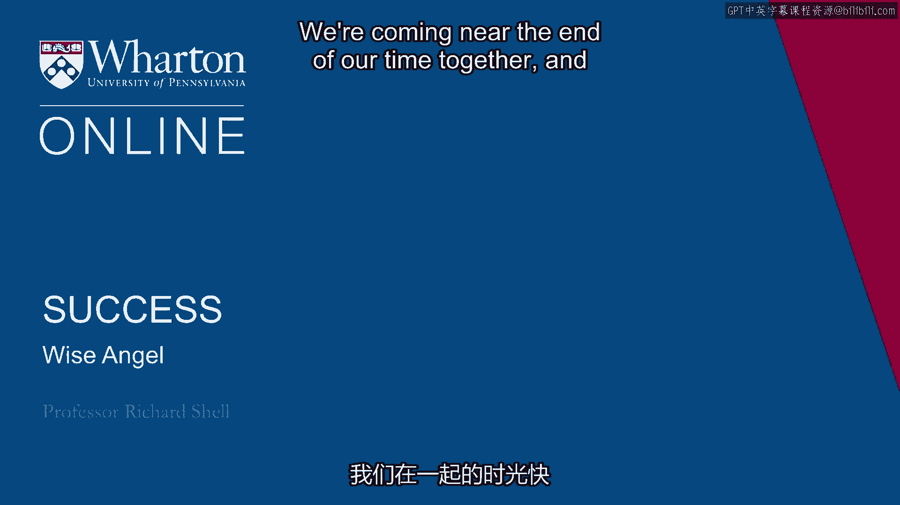
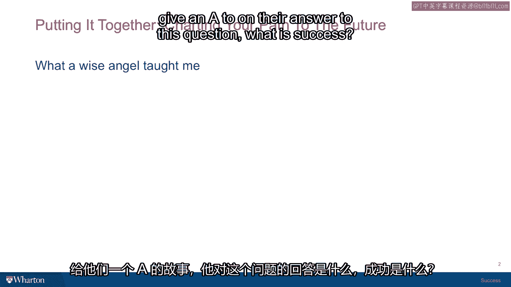

# 沃顿商学院《实现个人和职业成功（成功、沟通能力、影响力）｜Achieving Personal and Professional Success》中英字幕 - P26：25_智慧天使.zh_en - GPT中英字幕课程资源 - BV1VH4y1J7Zk

We're coming near the end of our time together and I want to share a story with you about。

someone who I think I would give an A to on their answer to this question "What is success？"。

So I was sitting in a Wharton conference room attending a seminar on happiness and relative。

income throughout the world and someone had done a country-wide study across different。

national boundaries， Nigeria， Bhutan， India， America， Denmark， Germany and doing correlational。

studies between overall happiness， the kind you measure by thinking you ask yourself。

overall how happy are you and wealth in that country and income。

It's a pretty complicated social science study and I was in there with about 15 faculty from。

across the university and before the seminar started and there was a presenter who was。

getting ready to show his data， the door opened and this older gentleman walked in who obviously。

looked to me as if he had been working on the campus on some construction project and had。

heard that there was a seminar being offered on happiness and we have a tradition here at。

the University of Pennsylvania that the members of the public are welcome to attend any seminar。

that is available and so seeing members of the public come in is not a crazy thing。

It's always some we always sort of wonder you know what it is that this person might take。

away or what they might say when they got there or not sure if they're not part of our， tribe。

the academic tribe what to make of them but here comes this gentleman and he ended。

up sitting down at the end of the table next to me and I could see from his hands because。

his hands were on the table and resting on the table that they were definitely working， man's hands。

They were sort of calloused and he was wearing like a flannel shirt and blue jeans and sort。

of a rough human face and so you know I just turned my attention back to the presentation。

and the scholar who's giving the research paper you know talked about the data here and the。

wealth levels there and the answers to the questionnaires and how happiness and wealth。

may or may not be correlated and then he concluded and he asked for questions and someone asked。

a question about the you know regression analysis that was used on this data set and there was。

some discussion and then this guy sitting next to me raised his hand。

Now you know as I said when a member of the public shows up at one of these seminars and。

actually speaks the rest of the faculty kind of hold their breath because it's hard to。

know exactly what they might be saying or where they're coming from。

So there was this sort of holding of the breath as this guy raised his hand and the presenter。

said yes sir。 And he said something I'll never forget he said you know I'm just a member of the public。

and I don't really understand a lot of what it is you're talking about here but it does。

seem to me you're talking about happiness and money and he said as far as I can understand。

it happiness and money have really nothing whatsoever to do with each other。

He says as far as I know happiness is just three things good health meaningful work and。

love if you have those three things you're happy。 Now at this point there was this dead silence in the seminar room because nobody knew what。

to say and the presenter said well thank you sir and there was a pause and then someone。

else said what about that data in the Denmark sample that you were studying and someone。

else made a comment and then the conversation just rolled over this guy's comment like a。

wave on the beach that just sort of flattens all the sand and covers it back up so that。

you didn't even know there was a sand castle there。

And this guy waited for a few minutes and the discussion drifted off and then he just。

sort of quietly got up and walked out the door and I thought to myself Wharton has just。

been visited by a wise angel God has sent an angel to reveal to us the secret of life。

and nobody listened but I remembered it and I give this guy a lot of credit because you。

know he said it was his theory of happiness but in many ways it was a theory about success。

because it combined the inner life good health love with the outer life meaningful work and。

had it in a package it was very easy to understand and it was quite clear that this guy had learned。

this through some very very important life lessons that had taught him the truth of it。

Now I don't know if he's right for you。 I think you can have good health and bad health and sometimes you have no control over that。

and just because your health turns bad doesn't mean that you're not happy or can't be successful。

and you can have love in your life and it can disappear you can lose a loved one and that's。

not anything you control either and just because the love in your life has changed and its。

amount of quality doesn't mean that you can't be happy ever again or successful。

He was the first one who used the phrase meaningful work for me and we just finished talking about。

that so I took his phrase and explored it in the context of this research on jobs and。

careers and colleagues so he taught me something very important about how to think about work。

but even if your work isn't exactly the most meaningful work in the world it still could。

be that you're doing something that you're good at and that allows you to support your。

family and the real passion and interest and excitement in your life comes from the coaching。

that you do on the weekends for your kid's soccer team or from a hobby that you have a studying。

you know reenactments of the civil war or your gardener and love to work in the public garden。

down the street so even meaningful work is not a final test of whether you're successful or not。

but I give this guy credit because he thought it through and he had his own values he had his own。

conclusions he had his own aspirations and he could articulate them in a really simple way that。

I credited him a great deal as being a truly wise person and that's why I call him the wise angel。

and so that's my final challenge to you in your journey towards success and that is this see if。

you can come up with your own definition of what this word success means what are the components。

what are the elements what are the goals and aspirations that you package together to make into。

the journey that you want to take the way you want to travel on that journey and if you can do that。

and bear in mind it may not be the same today or 25 years from now life happens we change our。

definitions of what we think success means but it's a well worth the effort to put that down as a。

task to summarize for yourself your own theory of success and how you plan to achieve it that is by。

the way the final paper that I always assign my students at the end of our success course。

what is my personal theory of success and how do I plan to achieve it and we recognize that。

this paper is just a snapshot of a moment in time when the students have given it some thought。

they articulate their thoughts and my goal for them is not to commit them to some path it's really。

to give them a photo of their thinking at a given point in time and then 10 years down the road。

I feel I've succeeded if that paper for them is something they can reread and reread with interest。

and profit and think to themselves hmm that's what I was thinking at that stage of my life about。

what success meant and how I would achieve it and I now see the nuances that I didn't see then or I。

now see that I may have actually drifted from the path and I should go back to the path that I had。

sketched out for myself and I need to remind myself of that better self that wrote that paper。

there are all kinds of ways that these little moments where you actually crystallize in thinking。

can be useful much later in life。 [BLANK_AUDIO]。

