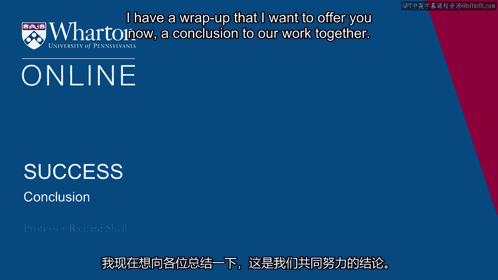
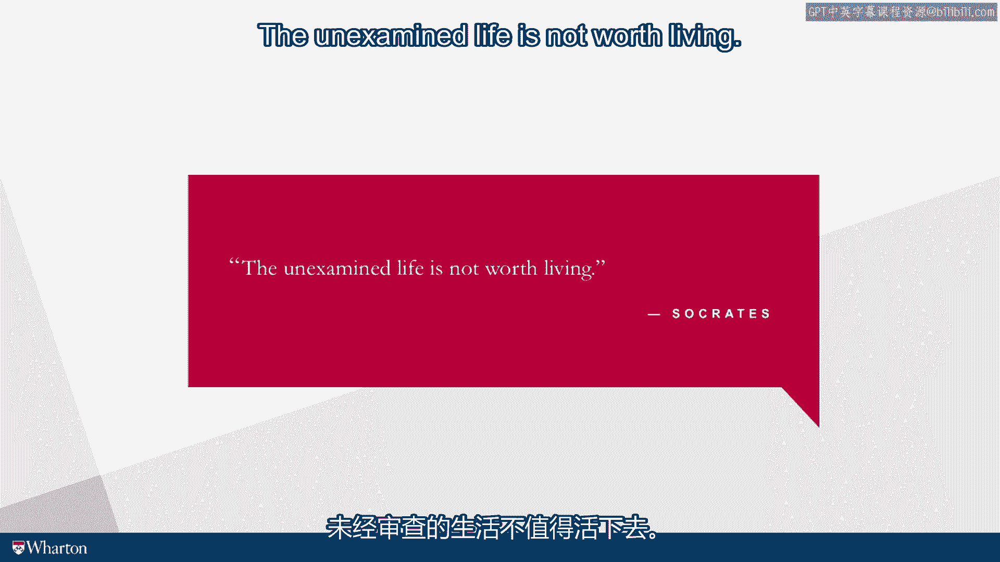

# 沃顿商学院《实现个人和职业成功（成功、沟通能力、影响力）｜Achieving Personal and Professional Success》中英字幕 - P27：26_总结.zh_en - GPT中英字幕课程资源 - BV1VH4y1J7Zk

I have a wrap up that I want to offer you now， a conclusion to our work together。

And it comes from the course， it comes from the final day and the final class and something。

that we do in the class。 So we work for 14 weeks throughout the semester with all the different exercises that you've。

done and a lot more sort of esoteric readings from this and that literature that we haven't。

bothered you with。 But in the final class， what I ask everybody to do is bring there one favorite quote that。

is from a source that they've read or a favorite book that they've seen or a poem or a play。

or a musical or a song and bring that final quote that embodies something about their。

theory of success and read it to the rest of the class and talk about why it's important， to them。

What is the emblem that they want to take with them from that quote and why is it signify。

something about success for them。 So I'm going to share three quotes to bring our class to an end。

But I want you to think of what quote you would bring to the final class and share that。

with your family， with your friends as a sort of banner that you would march under as far。

as your theory of success is concerned。 And I think you'll find that meaningful when you put it together with a lot of the other。

work we've done。 You'll have your own answers to the six lives exercise which we did in the first set of。

exercises and sessions that we worked on。 You'll have your own four diamonds that we assembled that are your interests and your。

capabilities and your experiences that all come together that are your unique story。

You'll have your own sense of what aspects of meaningful work， what aspects of happiness。

and achievement mean the most to you and how you understand them and value them。

And then you'll have a metaphor that you can bring to bear that is this kind of an emblem。

and an image and a picture that helps you think about what success is whether it's a。

tree or a compass or a pond or a ladder or a race。

So all these together can make up a little success book for yourself and write your own。

success book。 That's just your success book， not the how to succeed book that is supposed to work for。

everyone。 I think if you do that our work together is maybe to use a pregnant word been successful。

So here are the three quotes I want to give you。 The first one relates to achievement。

It's one of my favorites。 I'm a big fan of a Chinese book of wisdom which is called the eching。

You can find it in most bookstores and you can order it online。

It's basically a book of 64 chapters and you throw stones or coins。

They arrange themselves in a certain way and then it directs your attention to one of。

the 64 chapters。 You read it and then that helps you answer a question that you ask when you through the。

coins。 And in one of the chapters the following quote I think has a lot to do with how you actually。

zero in on that achievement part that we talked about。 And this is the quote。

It is only when we have the courage to face things exactly as they are without any self。

deception or illusion that a light will develop out of events by which the path to success。

may be recognized。 I think this is a really important quote because it tells you that your achievement skills。

are not things that are outside yourself。 Your achievement skills are things that are already latent or developed inside yourself。

Your problem is to face your aptitudes， your skills exactly as they are without any self。

deception or illusion and focus on those things that you do well。

And stop dreaming about the things that you may want to be an NBA star but the chances。

of that are pretty remote。 So focus on the things you actually do well in the combination that gives you a unique。

value proposition。 And once you're able to get that clarity on what you do and put together the set of things。

that you do the achievement part of your success in life will just accelerate。

It will explode because that's when you're offering a unique value proposition which when。

it finds the right context just takes off like a rocket。

So clarity and courage to see things exactly as they are。

The reason I think this quote is really powerful。 My second quote concerns happiness。

A Roman philosopher once said everything you need to be happy is simple。

This is a truth that's really easy to lose sight of。 In our quest for happiness we want more。

more variety， more experience， more exotic， more， choices， more of everything。

And the truth about happiness， momentary happiness， overall happiness， deep happiness is that。

they are just a part of the human experience。 And it's very likely that the deepest happiness you'll ever feel will be accidental。

You'll spend a night sleepless night in a hotel in Florida on a business trip。

You'll be tossing and turning worried about your family and the fact that you're not with， them。

You'll be worried about the presentation you'll be making the next day。 Your mind is restless。

You give up， surrender to the fact that you can't sleep。 Walk outside， out to the beach。

It just happens that as you're walking down the beach， the dawn breaks。

The sun just tips its little disc edge over the edge of the sea。

The sky suddenly goes from dark to an gorgeous pink and purple。 Bird flies by。

you see a fish jump just off the shore， and you're just captured by a moment。

of complete awe at your place in the nature of things。

And you're struck dumb with the profound connection that you have between your life。

and the life all around you。 And that's not complicated。

That's just being in that present moment where life is happening。

And I think the more you can open yourself to the simplicity of happiness， the more you。

can get to the pace of your perceptions and the rhythms of the life around you， the more。

likely you are to experience more of this very， very important aspect of success， that。

inner sense of joy and deep happiness。 And then the final quote is not about achievement and it's not about happiness。

The final quote is about how to think about achievement and happiness and success， which。

is what we've been working on for this entire course。 And it comes from Plato。 Plato's teacher。

of course， was named Socrates and Plato wrote the dialogues and the beginnings。

of Western philosophy。 And in the last few books that describe Socrates' life。

he was a philosopher in Athens。 He was a pretty unpopular guy。

He was actually put on trial for contaminating the ideas of the youth of Athens and for corrupting。

the miners by making them think too much， which was something that the elders of the city objected。

to。 And he lost his trial by a few votes and was sentenced to death and had to drink the hemlock。

and died basically for the cause of being a thoughtful person。

The reason we remember Socrates is because he took his ideas and gave them the meaning。

of his entire life。 And one of the things he said in the last days of his life was something that I think。

I tried to embody in my teaching that the course that we've just gone through tries， to represent。

it's a process and a focus。 And what Socrates said is this， the unexamined life is not worth living。

What he means I think is that if you go through life not examining the cultural values that。

you were endowed with， not examining the family influences that have shaped you， not examining。

the social forces of conformity or social pressures that have shaped you and put you in different。

places with different thoughts， just an unexamined life of essentially an automatic life， not。

based on your own thoughts but just on the assimilation of all the swirling thoughts that。

you happen to have been born into。 I'm not sure that's really worth the effort。

And everything that we've talked about here has pointed you towards self-examination as。

the actual method by which you can discover your true achievement capabilities， discover。

your true success values， discover what happiness actually means to you and all the answers to。

those things are not found on a television， in a computer or in a book。

They're all going to be found in your heart。 And that is what I think Socrates meant。

That's why this is one of my favorite quotes of all time for success and it's the one that。

I want to conclude with as my gift to you in our final class。

And I hope that you'll be sharing some of yours with your friends， colleagues and family。

So we've gotten to the end。 It's been great to be with you。

I felt like I've visited with you here in the office， the very same office where my。

students come for office hours， where they share with me difficult problems and conflicts。

and choices that they have to make。 And we just talk it out。 Of course。

my way of approaching that is not to try to answer the questions that they。

ask by giving them advice but by asking them what they think the answers might be。

And it's amazing how often if someone will just ask you what you think and what's the。

other side of that and have you considered this， how often they talk themselves into。

getting the choice exactly right for themselves。 And I hope that this course will help you get your choices exactly right for yourself。

It's been a pleasure to share this with you。 I look forward to hearing different adventures as our course goes out and we get feedback。

loops that go on between the people who take it and hear it warden， those of us who make。

these courses。 Thank you for joining me。 Good luck and I hope you have every success。 [BLANK_AUDIO]。

