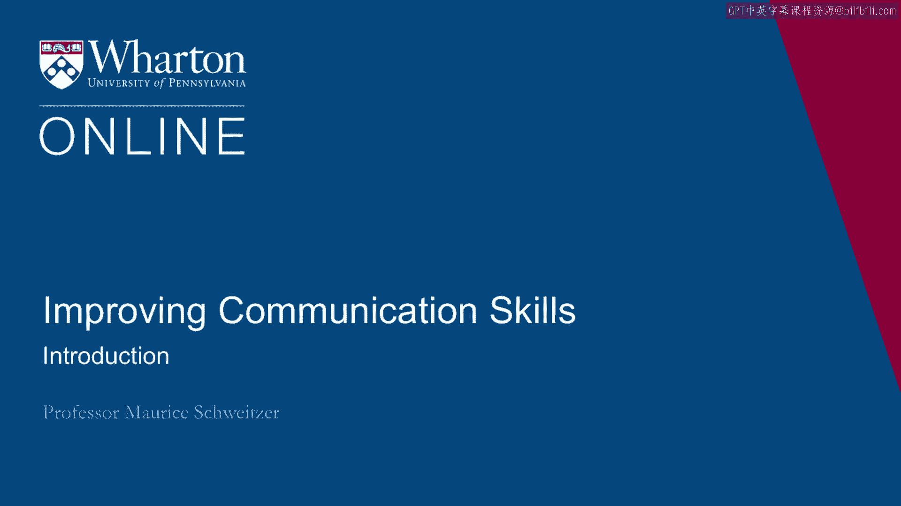
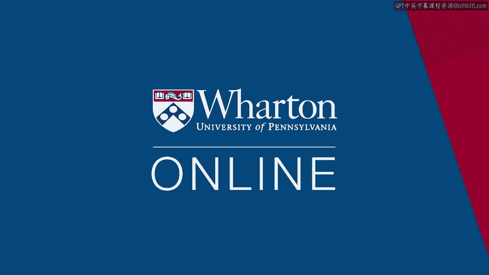

# 沃顿商学院《实现个人和职业成功（成功、沟通能力、影响力）｜Achieving Personal and Professional Success》中英字幕 - P28：0_简介.zh_en - GPT中英字幕课程资源 - BV1VH4y1J7Zk

Hi， I'm Marie Schweitzer， Professor at the Wharton School。

I teach negotiations and advanced negotiations， and my research interests are in trust， deception。

and emotions。 I'm a co-author of "Friend and Foe，" and I'm interested in the topics we'll be talking。

about in this course。 The tension between cooperation and competition。

how we navigate our social relationships with， topics like trust， deception， and apologies。

putting those pieces back together。 And I'm interested in communication more generally。

as well as motivation。 We'll talk about goal-setting when it goes in the right direction。

and sometimes when， it gets us into trouble。 Thanks for joining me， and let's get started。

Thanks for watching。 [BLANK_AUDIO]。

