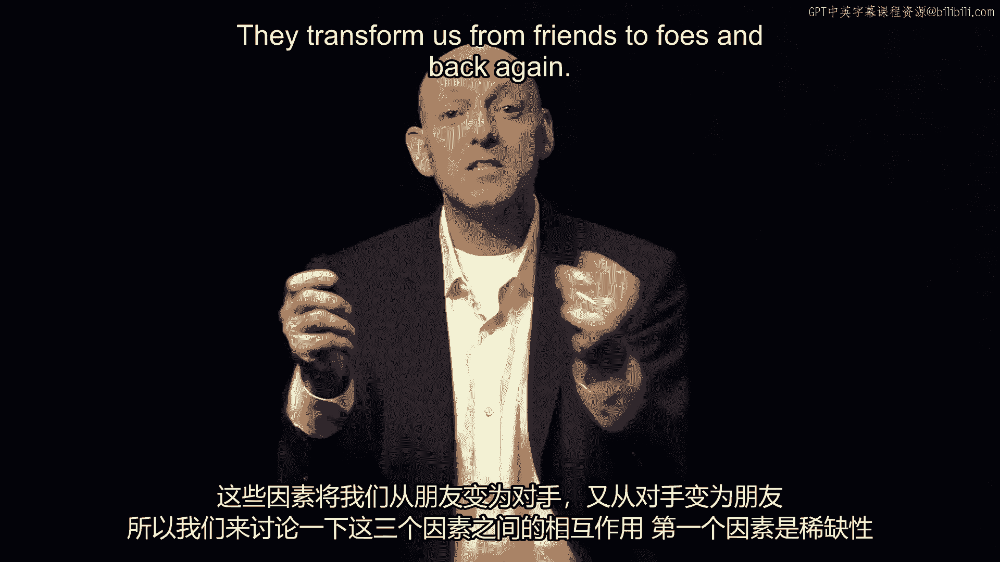
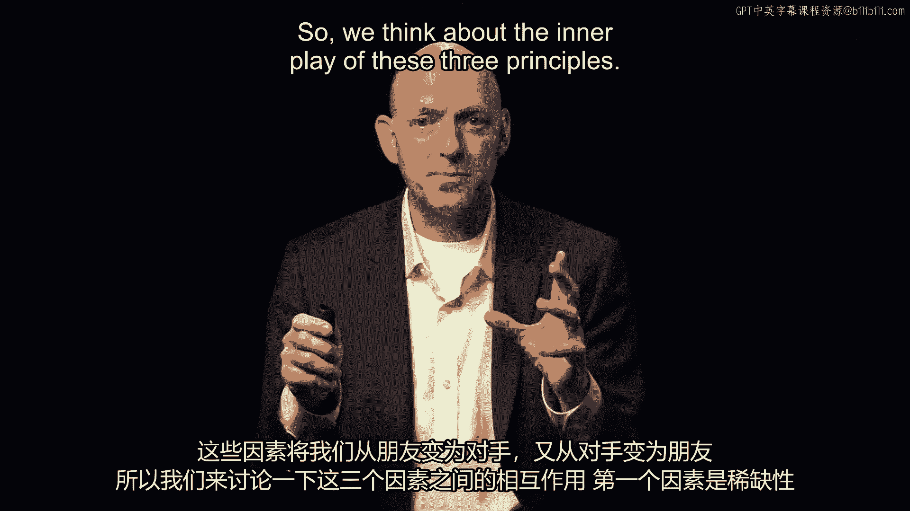
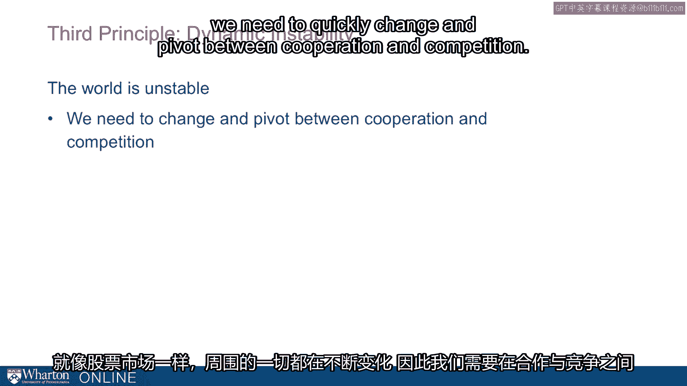
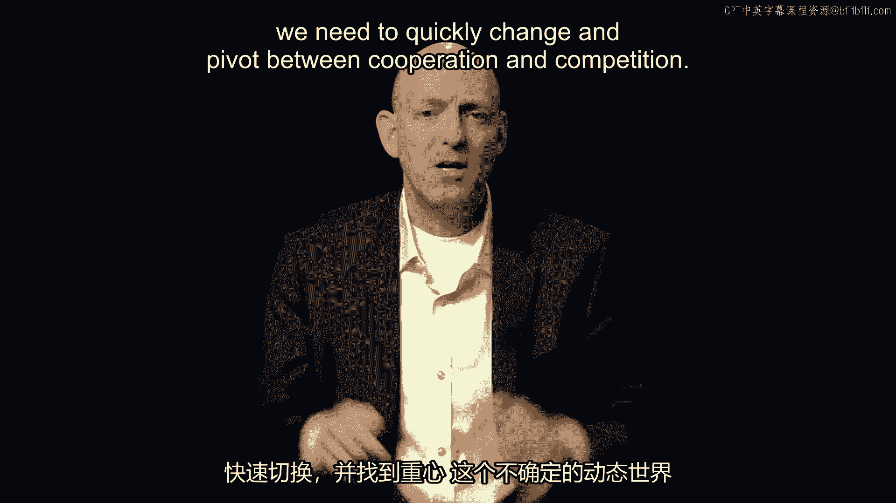
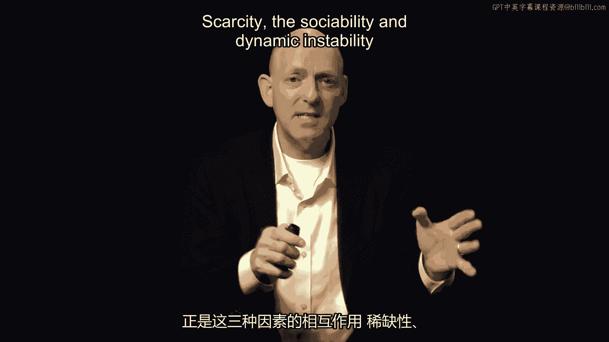
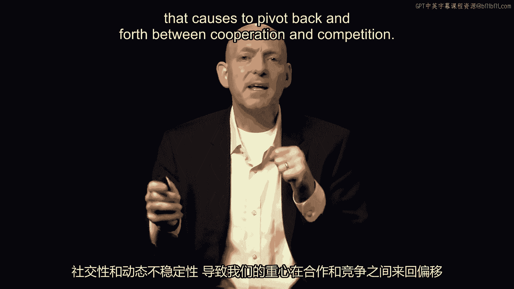

# 课程P30：合作与竞争的三大原则 🎯

在本节课中，我们将探讨驱动人类在合作与竞争之间转换的三个核心原则。理解这些原则有助于我们更好地把握个人与职业关系中的动态平衡。

---

## 概述

我们将分析三个关键原则：**资源稀缺性**、**社会性需求**和**动态不稳定性**。这些因素共同作用，促使我们在不同情境下从朋友转变为对手，或反之。

---

## 三大原则详解

上一节我们概述了三大原则，本节中我们将逐一深入探讨。

### 原则一：资源稀缺性 📉

资源稀缺性是驱动行为转变的首要因素。环境中的资源可以是稀缺的，也可以是充裕的，这直接促使我们在朋友与对手之间转换。

以感恩节为例，节日盛宴期间资源充裕，我们共同庆祝，体现合作精神。然而，当我们进入商场，面对限量低价电视等稀缺资源时，便会激烈竞争。

资源稀缺性不仅影响人类，在动物研究中也有体现。一项对细纹斑马的研究发现，斑马的社会行为会随环境中水资源的丰富程度而变化。当水资源充足时，它们形成一种集体；当水资源稀缺时，则形成另一种截然不同的集体。这表明，珍贵水资源的稀缺程度会显著改变它们的社会关系。

### 原则二：社会性需求 👥

人类本质上是社会性生物。我们渴望陪伴，事实上，最严厉的惩罚形式之一就是单独监禁。

仅几天时间，单独监禁就会导致人的心智开始衰退。人们会出现幻觉、突发性愤怒、不适感和冷漠。经历单独监禁后，我们既渴望人际接触，又难以适应。人的心智需要社会连接。

### 原则三：动态不稳定性 🌪️

我们周围的世界是随机的、变化的、不稳定的。就像股市一样，事物不断变化，我们需要迅速调整，在合作与竞争之间灵活转换。

在这个不稳定且动态的世界中，当我们学习新信息、尝试收集新情报时，这些信息会促使我们既合作又竞争。

---

## 原则间的相互作用

以上我们分别介绍了三大原则，现在来看看它们的相互作用。

正是**资源稀缺性**、**社会性需求**和**动态不稳定性**这三个原则之间的相互作用，使我们反复在合作与竞争之间转换。有时我们甚至同时进行两者，因此我们需要在作为竞争者和合作者之间找到平衡。

---

## 总结

本节课中，我们一起学习了驱动合作与竞争的三大原则：**资源稀缺性**、**社会性需求**和**动态不稳定性**。理解这些原则的相互作用，能帮助我们在复杂的社会和职业环境中更好地把握行为尺度，实现个人与集体的成功。