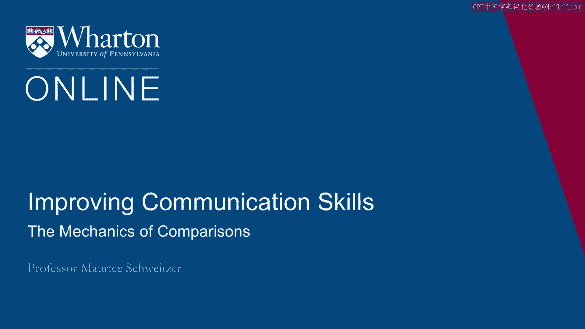
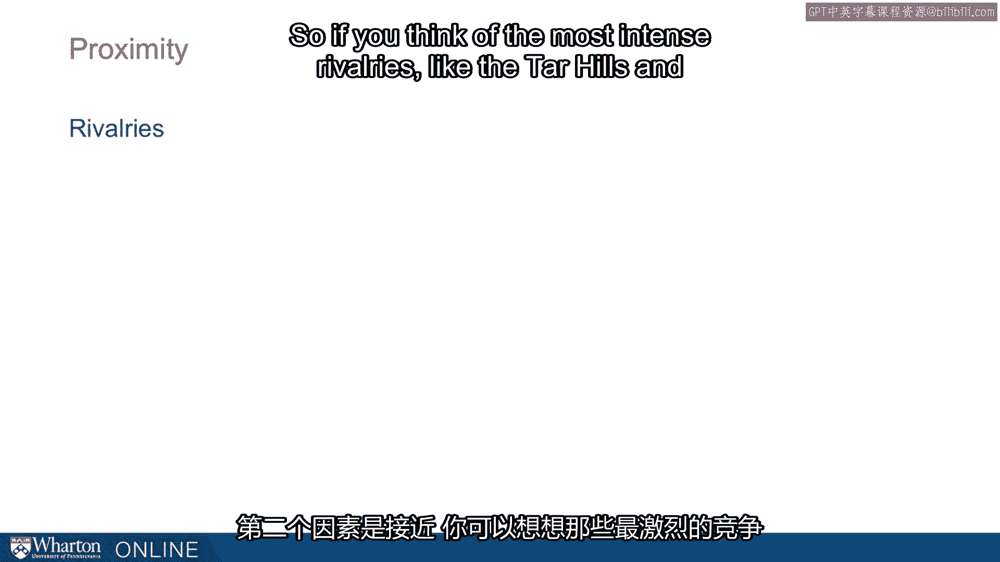

# 沃顿商学院《实现个人和职业成功（成功、沟通能力、影响力）｜Achieving Personal and Professional Success》中英字幕 - P31：3_比较的机制.zh_en - GPT中英字幕课程资源 - BV1VH4y1J7Zk

What do you want to talk about next are comparisons。

And our breakdown， the mechanics of the comparisons that we make， and argue that they're very。

fundamental force in our lives。 They help us understand some interesting puzzles。 Here's one。

Why are twins separated at birth often so similar？ Nick， Tom Peterson， and Steve Tazumi。

they were twins separated at birth。 The two grew up in completely different households。

different religions， different schooling， and， yet when they got together。

they were shocked at how similar they were。 One owned a bodybuilding gym and was a complete fitness addict。

The other owned a bodybuilding gym and was totally into fitness。 And when they got together。

they said， "Oh， we connected from the first time we met because， we're so much alike。"。

I want to think about that question。 That is， why might twins separated at birth end up being so similar？

Here's a second puzzle。 Why do expectant fathers gain weight when there's no biological reason for them to gain。

weight？ By understanding the comparison process， we could gain insight into these puzzles。

Now here's the first key idea。 The comparisons we make help us make sense of our world。

They help us understand if we went on a good vacation， if we're making a good salary， if。

I need to redo my kitchen， if I need to buy a new car， it's comparisons that help us make。

meaning out of all of these different outcomes we have in our lives。

Now here's some other key ideas about comparisons。 First， they're inevitable。

All of us make comparisons。 Now some of us are drawn to check Facebook more often than others。

but all of us are， drawn to make these comparisons and they help us make sense of things。

but they also， drive us to feel better or motivate us or to feel worse。

Now part of how they work are we make comparisons that are sometimes going up。

People who have done better than we have。 People who have nicer apartments， nicer cars。

or comparisons where we look down。 People who might not have accomplished as much as us。

Upward comparisons can inspire us。 They can also make us miserable。

Downward comparisons can make us feel content and satisfied by our less motivating。

Another key idea about comparisons is that we can make them within ourselves and with， other people。

So often the comparisons we make are to somebody else。 So it could be our neighbor。

it could be our brother-in-law， it could be the person that， cubicle next to me。

But we can also make internal comparisons where I think about how I did before or the。

comparison of what I could have done。 So these internal comparisons relative to me or comparisons relative to others。

When are comparisons most intense？ It turns out there are three dimensions that make comparisons more or less impactful。

The first dimension is similarity。 By similarity we're thinking about things like siblings。

And the closest sibling is a twin where we have very intense similarity。 So the more similar we are。

the more these comparisons matter。 And it's not just siblings。 It could be very close friends。

People that we find ourselves similar to in the same cohort。

We might have started in the same class together。 Similarity is really important。

And in fact this similarity helps us understand things like the spread of obesity。

So one reason why expectant fathers gain weight， even though there's no biological reason for。

them to do so， is they're comparing themselves to people right next to them。

And so the husbands and wives are comparing themselves and that comparison impacts motivation。

We can see from these graphs here， first there's some kinds of comparisons that matter most。

Those are comparisons where it's actually both of us see ourselves as friends。

So those are going to be the strongest friendships。

And we're comparing ourselves to the same sex others。 So the more similar the person。

the more impactful that comparison is。 And in fact we see this network that helps explain the spread of obesity through friendships。

through the network， the comparisons that we're making。 We find ourselves motivated。

So when I see everybody else around me reaching for a donut， I figure well， I don't think。

I should eat more donuts， but if everybody else is doing it or if that sort of looks fine， to me。

everybody else in my comparison set is influencing my own assessment of what is。

or isn't acceptable。 Now for some reason reunions can be quite stressful because at reunions we're going back and we're。

engaging in intense comparisons。 So it could be a high school reunion， it could be a family reunion。

There we're going to see people with whom we're likely to make comparisons。

These are people from our same cohort or the same family structure。

They started perhaps in similar circumstances and now we're going to make these comparisons。

because of similarity。 The second dimension is proximity。

So you think about some of the most intense rivalries like the Tar Heels and Blue Devils。

UNC and Duke。 After we're looking at rivalries， these are two schools separated by just nine miles with。

very strong basketball teams and that intense rivalries in part fueled by proximity。

Now proximity is also not just between universities， but it's things like neighbors。

So here in this quote from Borat， we see this intense neighbor comparison where we're thinking。

about going back and forth who has what in their homes until he says， "Oh， great success。

when he finally gets something that his neighbor can't have。"， So here we have the first two。

similarity and proximity。 The third thing that makes comparisons particularly intense is self-relivance。

By self-relivance， I mean something that we care about。

So if I really care about advancing my career， who gets that promotion is self-relevant？

And my neighbor wins a baking competition and I don't consider myself much of a baker that。

lacks self-relivance。 And as a result， that comparison isn't very intense。

So the most intense comparisons are people who are similar like brothers， cubical makes， neighbors。

my brother-in-law， proximity， people who are very close to me physically， and then， self-relivance。

a domain that I really care about。 So if I'm a musician。

I care about winning that musical competition， but if I'm not， then， I care less。

Social comparisons have these characteristics and they influence a few different behaviors。

We've already alluded to some of those so far。 The first is how we collaborate with other people。

So as we learn information， it can change the way we collaborate or compete with others。

We might find that somebody else is making more money than we are that might make collaboration。

harder， or we might find that somebody else has a very different background than we do。

and that might make collaboration easier and mitigate the intense comparisons we might。

otherwise have made。 So comparisons can make us collaborate or compete。

but they can also lead us to retreat altogether。 So sometimes comparisons can be so unpleasant。

We want to exit the situation because we find it so invidious。

[BLANK_AUDIO]。

