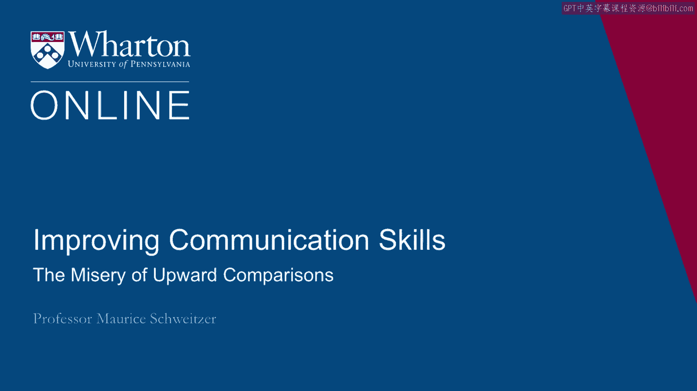
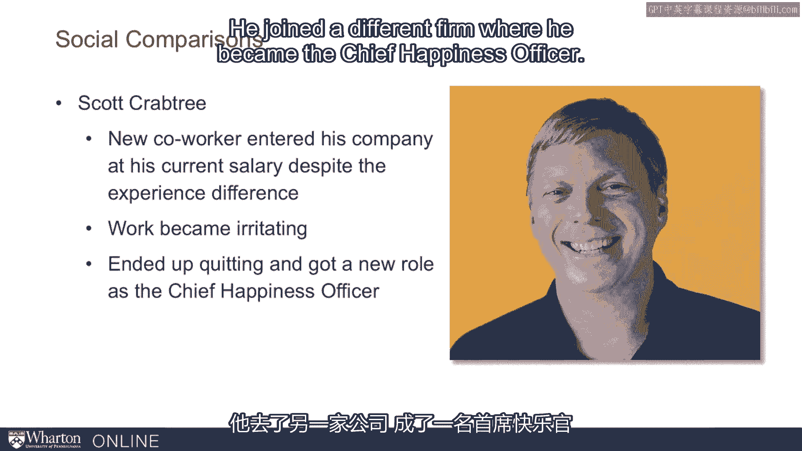
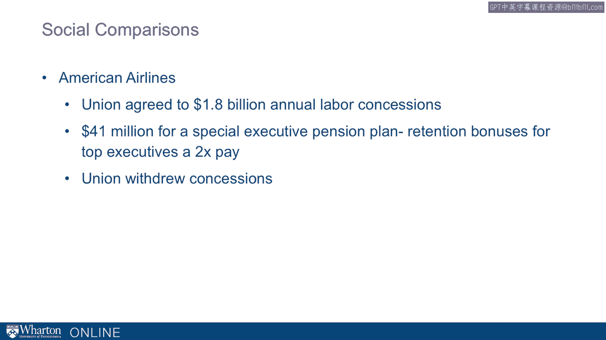
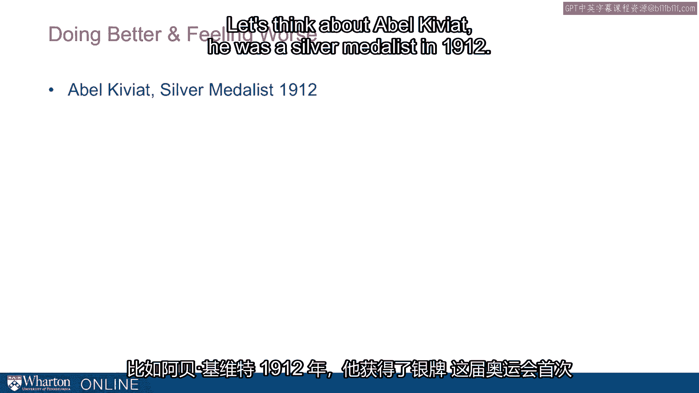
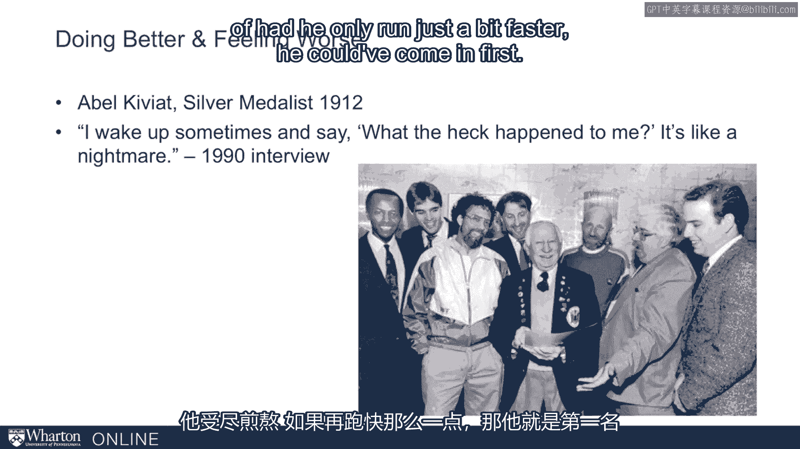
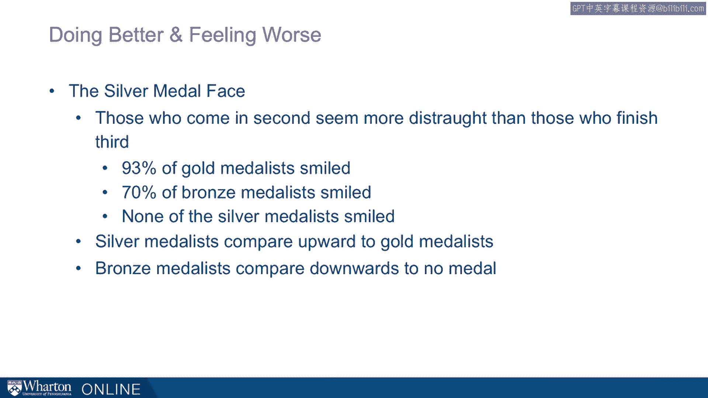

# 沃顿商学院《实现个人和职业成功（成功、沟通能力、影响力）｜Achieving Personal and Professional Success》中英字幕 - P32：4_向上比较带来的痛苦.zh_en - GPT中英字幕课程资源 - BV1VH4y1J7Zk

So we've thought about how comparisons can be motivating， but they can also have some。

adverse consequences as well。 And here we want to think about some of the bad in comparisons。

I want to draw on some of the work by Franz Duval， where what he did is he actually studied。

how ketchup and monkeys， very clever monkeys， reacted to unfairness。

He taught these monkeys to use stones for money， where he gave them stones。 Expere would come out。

open up their hands， and receive a stone， and then hand the monkey。

some reward like a slice of cucumber。 It turns out these monkeys would engage in this transaction all day long。

They love cucumbers， and they're happy to hand over the stones。 That is， until they see a neighbor。

a monkey in a cage next to them， getting something， better than a cucumber like a grape。

And here I'll show you a video from one of his studies where two catchment monkeys side。

by side are handing over stones， one's getting a cucumber， the other one's getting a grape。

We can see what happens。 [ Silence ]， I want to highlight three things about this video。

The first is how intensely focused the one catchment monkey is， the one who's getting。

the cucumbers， is in looking at what's happening in the cage next door to his neighbor getting。

the grape。 The second is， I want to focus on how upset this catchment monkey is。 And then third。

how this drives this catchment monkey to exit。 That is。

to not even want to engage in this transaction， throwing the cucumber and not。

wanting to participate where the stone now no longer becomes worth a cucumber。

And it's all relative。 That is， it's because some other catchment monkey is getting a better deal that this original。

deal that seemed fine is no longer okay。 And it's not just monkeys。

I want to argue that we're hardwired to make these comparisons。

and these comparisons really influence us。 So if we take us to Scott Crabtree。

here's somebody who's working for a tech firm， was， perfectly happy with his job， felt motivated。

inspired by it， until they had to go out to， the market， they recruited a new hotshot employee。

This new employee came in at almost the same salary that he had taken years to develop。

And all of a sudden his work became irritating and he got upset about it。 He was so upset。

He actually ended up quitting。 He joined a different firm where he became the chief happiness officer。

So just as a catchment monkey， Scott Crabtree， when he realized that somebody else was getting。

a deal that seemed better than his， a younger person with almost the same salary， he ended。

up quitting and leaving and trying to find happiness somewhere else。 Now it's not just individuals。

it happens to groups too。 And here American Airlines years ago were facing very tough financial straights。

They were on the verge of bankruptcy。 They negotiated assidiously with their unions。

the pilots union， the flight attendants， the， bag channellers， the mechanics。

And they got them to agree to incredible concessions。 So unions together， they agreed to 1。

8 billion dollar concessions。 Now at the same time， the executives at American Airlines。

they could have left American Airlines， for other more stable companies and they tried to retain those executives and to retain them。

they were giving them retention bonuses。 Now here's the problem。

They'd offered them $41 million in retention bonuses。

There was an SEC filing deadline and this information became public。

So just after the unions had agreed to steep concessions， they learned that the executive。

team was going to end up with these retention bonuses。 Well you can imagine。

just like the catchment monkeys， they became furious。

So the concessions were acceptable until they found out that somebody else was getting paid。

a bonus。 And the first thing they did was they fired their negotiator。

they withdrew these concessions， that he'd go back to the drawing table to try to negotiate。

So here's the question， is a stonewort the cucumber？ Are 1。

8 billion dollars in concessions reasonable？ Am I getting paid a fair salary？

And for all of these questions， the answer is well， it depends。

And we have comparisons that inform our answers。 Now let's go to the United Kingdom and I think about two brothers。

David and Ed Miliband。 These are two brothers， they grew up together and they both were members of parliament in。

the United Kingdom。 And when Gordon Brown stepped down as the head of a Labour Party。

they were both vying， for leadership。 The older brother David first announced that he was going to run for leadership。

Frank by 15 members of parliament， he announced his candidacy and he seemed like the odds。

on favorite。 There were several other candidates that also threw their hats in the ring in addition to。

David and Ed。 But these were the two primary contenders。 And as the voting went on。

David had a slight edge。 So in the first round， David was beating out Ed。 In the second round。

the same。 And the third round， the same。 But the gap became a bit narrower。 Now to win。

you need an outright majority， you need more than 50 percent and that's exactly。

what happened in the fourth round， just the two of them and now all of a sudden， Ed wins。

Now two things about this。 One， it's a very narrow margin of victory and the counterfactual of something else happening。

is quite salient。 And two， these are brothers and worse for David， it's the younger brother。

Now what happens is they end up， their relationship ends up fracturing and David talks about the。

permanent， the permanent， invidious comparison made professional life impossible。

He not only leaves parliament， he actually leaves the United Kingdom， he leaves to work。

in a nonprofit in New York。

So here this comparison is driving him crazy。 Now for similar reasons， we can think about twins。

Now one idea is you think， well what's an artificial twin？

An artificial twin is adopting someone that's similar in age to a biological son or daughter。

Now what would be great about it is you have a built-in playmate。 There's an economies of scale。

there's one carpool。 You have one school， you can have one soccer drop off。 It could be great。

And yet adoption experts， Sam will join later， argues against the corrosive social comparisons。

that are created by artificial twins。 That is by doing this， there's always going to be some twin。

one of those twins that's， going to be out ahead of the other。

There could be developmental differences and that constant comparison is going to make。

artificial twins really toxic。 And so many agencies not only counsel but almost prohibit the adoption of artificial。

twins。 Now let's think about something else。 Let's think about doing better but feeling worse。

How could that happen？ Now again， it's going to be comparisons that help us unlock this puzzle。

Let's think about Abel Kiviat。 He was a silver medalist in 1912。

And this Olympics， the first Olympics where they used a photo finish to determine who had， won。

And by a tenth of a second， he came in second。 This was 1912。

Now here's an interview he gave in 1990， almost 80 years later， he talks about waking up， thinking。

what the heck happened。 He's languishing and the intense counterfactual of had he only run just a bit faster。

he could。

have come in first。 It turns out that this intense feeling is not just unique to Abel。

It's actually incredibly prominent where you see silver medalists chronically express。

dissatisfaction。 A couple of academic articles have studied this。 In terms of this。

the silver medalists， where you have silver medalists who look downright， distraught。

really unhappy。 And in fact， by contrast， you see bronze medalists who end up looking much happier than their。

silver medal counterparts。 So in this study， almost all the gold medalists are smiling。

but the bronze medalists are， smiling a little bit less often。 But in these studies。

none of the silver medalists were smiling。 If you think about these comparisons。

the silver medalists， like Abel， are comparing， themselves to the gold medalists。

That would have been a lot better。 When you compare silver to bronze， they're kind of similar。

But the bronze medalists， if silver is kind of close， that's not a very big upper comparison。

But to fourth place， that's a chasm。 There you're just an athlete， not a medalist。

And so the bronze medalists are delighted to have escaped that other fate。

So we see this doing better but feeling worse phenomenon in these medalists where silver。

medalists are often downright miserable。

So here we can think about this important lesson where comparisons can drive us， they can motivate。

us， but they can also make us perfectly miserable。 [BLANK_AUDIO]。

