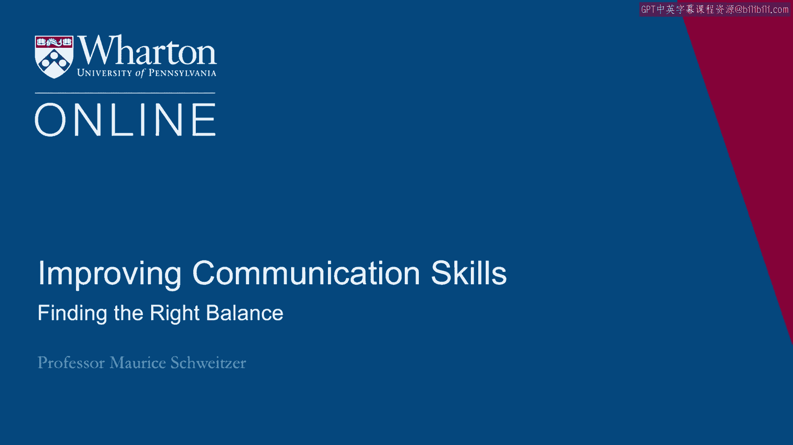
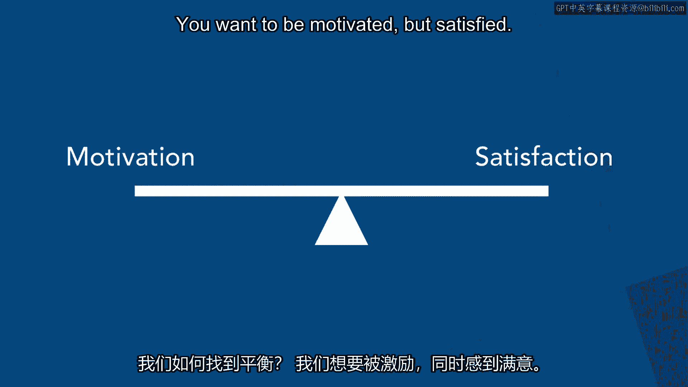
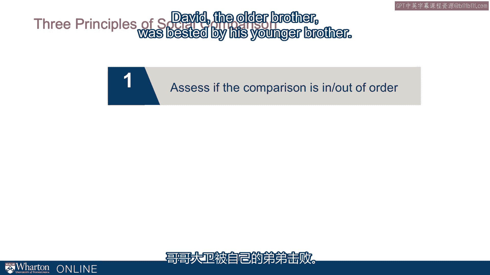
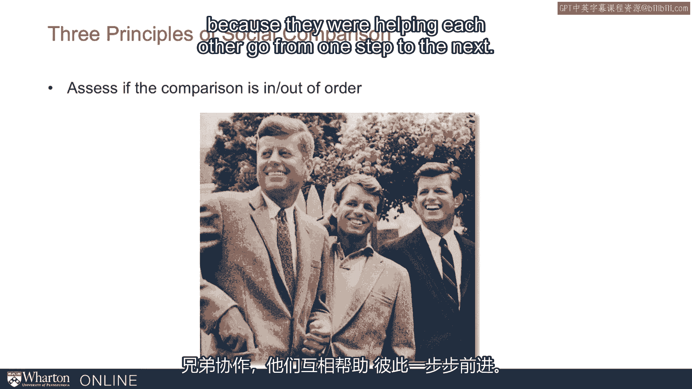
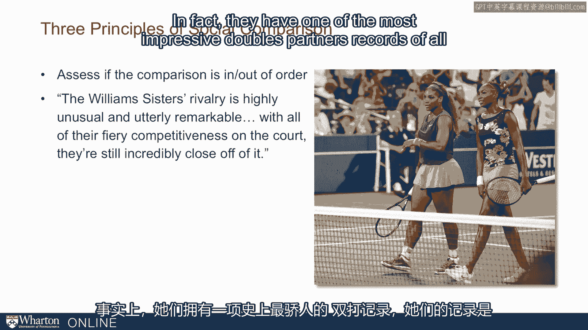
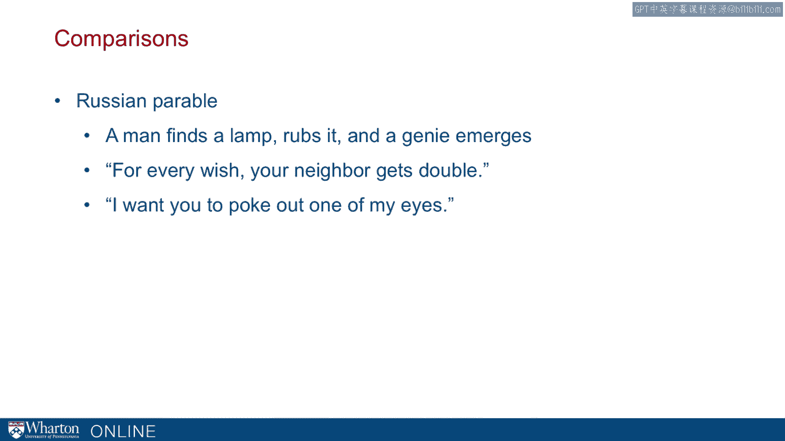

# 沃顿商学院《实现个人和职业成功（成功、沟通能力、影响力）｜Achieving Personal and Professional Success》中英字幕 - P35：7_找到比较的平衡点.zh_en - GPT中英字幕课程资源 - BV1VH4y1J7Zk

So we've thought about some of the mechanics of comparisons， some of the good in comparisons。

and some of the bad in comparisons。 So the question I want to think about now is how do we find the right balance？

So we know that comparisons can motivate us and that can be very constructive， but they。

can also create resentment and make us perfectly miserable。 How do we find that balance？

We want to be motivated but satisfied。

And here are some key rules。 One， we want to think about favorable comparisons。

that is comparisons where we look down at， people that haven't accomplished quite as much。

We can do this， for example， by volunteering or helping out people in need。 By doing that。

it will make us happier。 So one way to make ourselves happier is to engage in these downward comparisons。

Another thing to think about is how unfavorable comparisons can motivate us。

So just as we thought about with the Michigan Duke game being down by one at halftime， we。

can be incredibly motivated by these comparisons， or the Sputnik example。

these unfavorable comparisons， can push us to great efforts to new heights。

So favorable comparisons can make us happier。 Unreal ones can motivate us。

but they can both do things that aren't as good， like making， us dissatisfied or less motivated。

We can think about comparisons in the negotiation process where they both motivate us and influence。

how happy we are。 You can think， for example， in negotiation， you might have some targets。

some aspiration， some where you're trying to hit。 And you can think about your reservation price that leads to be willing to accept。

So you have something up high that can motivate us and push us hard and something lower or。

reservation price that can make us in comparison happy。 That is， in a negotiation。

we're not going to get everything we wanted most of the time。

So we're going to fall short of our target and we're likely to get something better than。

our alternative， what our reservation price is， and so we're going to end up somewhere。

in the middle。 Now it depends on what we focus。 If we focus people's attention on targets。

for focus on that target， we're going to be， more motivated but less satisfied。

If we focus on our reservation price， we're going to be less motivated but more satisfied。 In fact。

that's exactly what happened。 So here in this study that Adam Glinsky and his colleagues ran。

people who focused on， targets ended up doing better than people who focused on their alternatives。

their reservation， price， but people who focused on their target were less satisfied than people who focused。

on their reservation。 So here we can think about trying to use comparisons to our advantage。

So during the negotiation process， we like to focus on our targets but then afterwards。

we like to think about our reservation price and that can make us more satisfied。

So we want the benefits of that higher motivation as well as the benefits of feeling more satisfied。

and that can involve shifting our attention。 So that's how we can think about comparisons in negotiations。

But it's not just negotiations， it happens more broadly。 And here's another funny puzzle。

we think about the benefit of graduating in a recession。 Now why should there be a benefit？

If you graduate in a recession， it's actually harder to find a job and if you do find a job。

it's likely to be less highly compensated and actually people who have studied the effects。

of graduate in a recession are long lasting。 So you end up with a lower starting salary and that follows you for a long time。

But what's the benefit？ Well it turns out people who find a job in a recession are actually much happier even。

though they're making up to 15% less。 They're happier because of the comparison。

They're happier because they actually got a job and they realize that many of their peers。

ended up doing less well。 So here we can think about comparisons helping us make sense of a lot of unusual phenomenon。

both in negotiation and in a workplace and more broadly。

Here are three key principles of social comparisons。

I want to think about three key things that help us find our balance。

The first idea is that we want to think about comparisons that go in or out of order。

Now by in or out of order what I mean is is this the expected comparison outcome that。

was anticipated？ So if we're competitors， what do we expect？ If we're siblings who's older？

So we talked about David and Ed Miliband。

David the older brother was bested by his younger brother。 Now in contrast think about the Kennedys。

So here we have the Kennedys where these siblings were going in order。

Where the brothers collaborated because they were helping each other go from one step to。

the next and they went from one step to the next completely in order。

The same is true in tennis。 We think about one of the most dominant sibling pairs in tennis Serena and Venus Williams。

Now more recently Serena has dominated on the tennis scene。

She's eclipsed her bigger sister but things went in order。

It was Venus the older sister that was dominant first and Serena even said that as she was。

growing up everything was about Venus that's how it was supposed to be。

And there when Serena began to win and beat Venus she was going in order and even though。

she now has a much more impressive record that going in order turns out to be very important。

and it's actually enabled them to be incredibly effective as doubles partners。

In fact they have one of the most impressive doubles partners records of all time where。

their record is 21 and 1 in women's doubles finals and they have three Olympic gold medals。

to share。 So going in order is one of the key principles of making comparisons work。

The other key idea is providing opportunities to compete in the future。

So one thing that's particularly painful about say the Olympics is that for many athletes。

this is their one chance。 For able， give it for example he lost out， he'd never won the gold。

It was not in that race and there wasn't another future opportunity for him。

So if we have opportunities to compete in the future those comparisons are going to be。

less intense。 The third key principle is to think about the perspective of other people。

When good things happen to us we often are pretty happy and people will say oh I'm so。

happy for you you really deserve it they might or might not be。

That is they might be privately quite upset but we don't typically get to hear that。

To suggest that these comparisons are really quite intense and it really is a phenomenon。

that travels across culturally quite well。 I want to share Russian parable and as a lot of parables happen there's a man who finds。

a lamp， rubs it， a genie emerges and the genie says you can have any wish you want。

But here's the twist。 In this case the genie says the twist is your neighbor gets double。

So you can have anything you want but your neighbor gets double。 Well the man paces back and forth。

rubs his brow， thinks very deeply and hard about it， and finds it says ah I know what I want。

I want you to poke out one of my eyes。

Here we can see that the comparison process is so intense， it's so invidious that here。

the person is so worried about having something good because the neighbor and comparison will。

do even better。 And so to think about these comparisons it's important even when good things happen to。

us to recognize that others are going to make these comparisons and they might be less。

satisfied at least than they might appear hourly。 [BLANK_AUDIO]。

