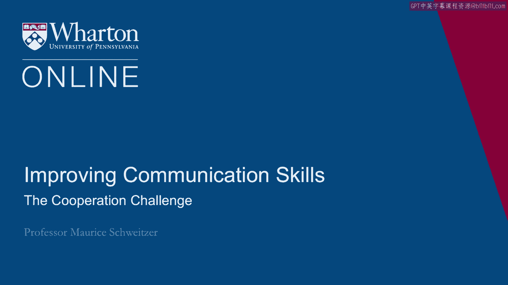
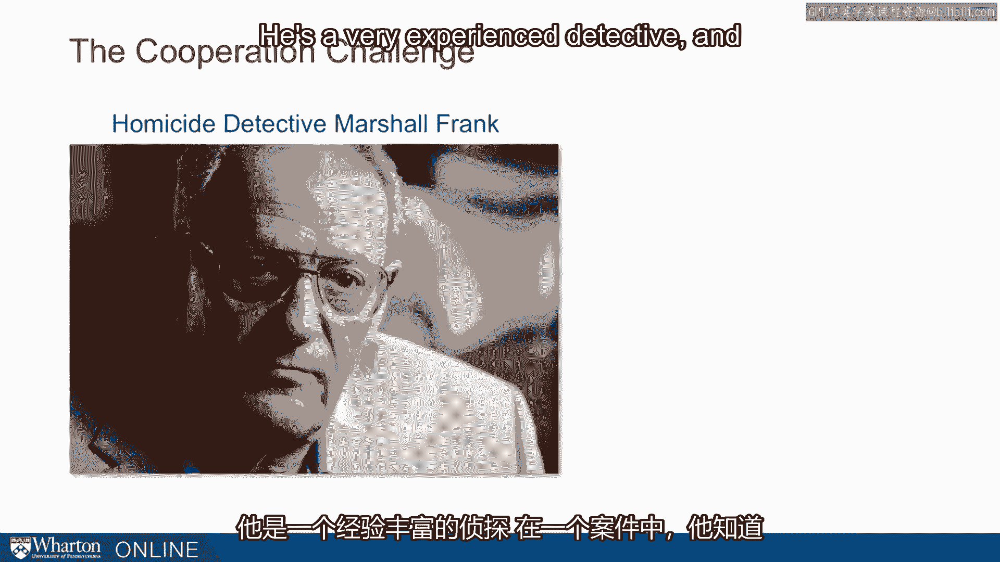
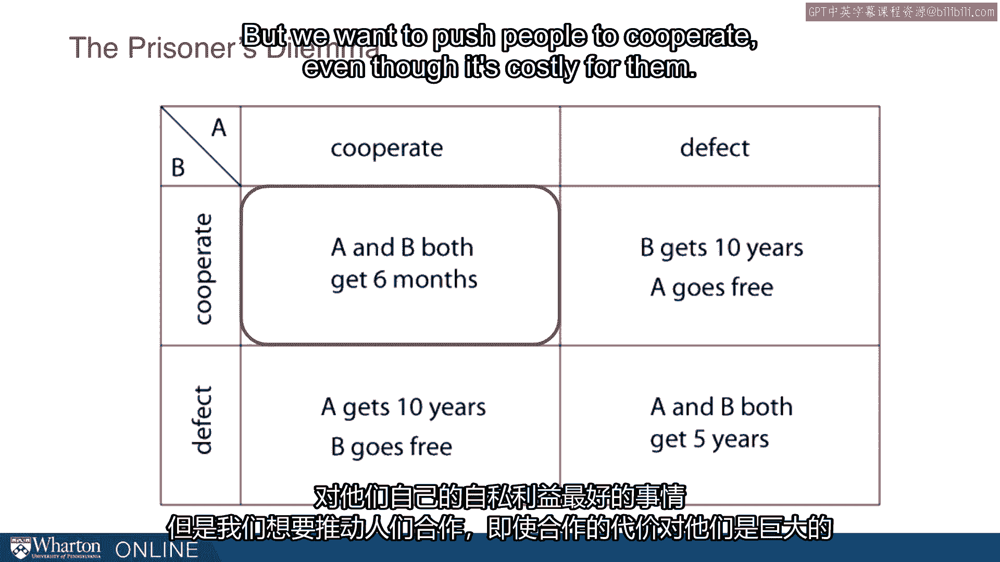
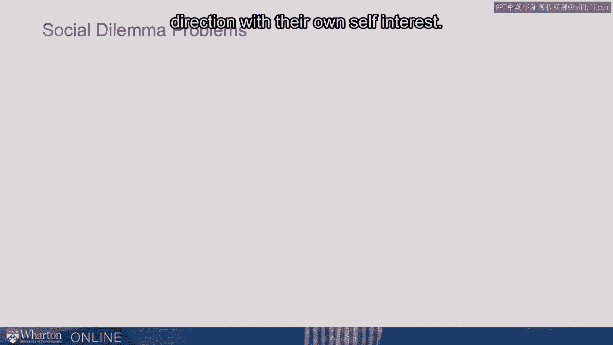
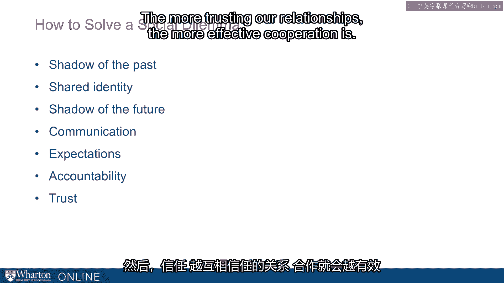

# 沃顿商学院《实现个人和职业成功（成功、沟通能力、影响力）｜Achieving Personal and Professional Success》中英字幕 - P36：8_合作的挑战.zh_en - GPT中英字幕课程资源 - BV1VH4y1J7Zk

Next， I want to think about the challenge of cooperation。

How do we get people to cooperate with us even when they might be better off themselves。

if they didn't have to work so hard or didn't have to help us out？ I want to start with a story。

And this is a story about a homicide detective， Marshall Frank。

He's a very experienced detective and he had this one case where he knew Paul Roles was。

guilty。 He knew it but he couldn't prove it and what he really wanted was a confession。

So he sat down with Paul Roles and in this case Roles' neighbor had been strangled and。

Detective Frank was going for this confession。 Now in this interrogation。

what's interesting is that Roles knows that this is the game。

that is he knows the detective wants a confession。 And in 30 minutes。

Detective Frank ended up getting that confession。 So he ended up getting somebody to be cooperative with what he wanted。

He wanted this confession and he did it relatively fast。 And one question I want to ask is how？

And Roles suggests that this really speaks to the idea of cooperation。

How do they get people to step over and help us out do things that we want even when it's。

not in their own best interest？ So it's related to other questions that are very different。

So would you let a complete stranger sleep in your house？

Well generally not but that's exactly what Airbnb is predicated upon。

That is it's a system that allows people to do exactly that。

So we think about how to cooperate in a social dilemma。

A social dilemma is a multi-party prisoner's dilemma。

So the prisoner's in the case is just two people。 But we often have a lot of cases with multiple people。

So we can think about things like how do we work together to reduce car emissions。

We want everyone to smog test their car。 But individually we'd rather not smog test our own car。

Or we think about overfishing。 We'd rather everybody else cut back with fishing。

But individually we'd rather fish as much as we could。

So individually we have incentives to defect or do what's in our own best interest。

But collectively we'd like everybody to come together and do what's best for the collective。

So those are social dilemmas。 How do we solve those？

And we can think about the prisoner's dilemma as the first case。

That is this is the fruit fly of the social dilemma problem。

Now in the classic prisoner's dilemma we have two people。 So you think about to take a Frank's case。

You'd like to get a confession。 And if they confess it's going to be easier for the whole legal process to go forward。

But individually for that potential criminal it's not great for them individually to confess。

Now imagine you've caught two people。 They could tattle on each other and confess or they could not confess。

And here I'm thinking about cooperation with each other。

So imagine these two criminals like to cooperate。 They like to cooperate with each other and not confess。

So if they don't confess then they both end up with a light sentence。

There isn't a lot of evidence they can't be prosecuted for that much。

So they both get a very light sentence。 Say six months。

Now if they both do confess they both get five years。

So clearly they're better off if they both cooperate with each other and don't confess。

Now here's what's interesting。 If one of them defects。

So one of them cooperates with the defense and spills the beans about the whole story。

And the other one doesn't。 Well imagine a detective here who says look I'm going to give you a special deal。

If you spill the beans and another one doesn't you're going to go free but the other person is going to get ten years。

So individually here the person who's facing this problem really has a dilemma。

They could try to do what's best for that group that collective and cooperate。

Or they could defect and do what's best for themselves in which case they end up with a better outcome。

Now in this case they always end up with a better outcome no matter what their counterpart does。

So if their counterpart is going to talk they'd rather talk。

If their counterparts not going to talk they're still better off talking。

So individually they still have this drive to do what's in their best interest。

Their own selfish interest。 But we want to push people to cooperate even though it's costly for them。

So when we think about how do we do that？ How do we get a co-worker to stay late take up an extra assignment？

How do we get our kids to do more chores around the house？

How do we get our spouse to help us out more even when they'd rather hang out on the couch watch TV or do something else。

So we have this constant problem both at working at home to try to get people to cooperate even when they're pulled in the opposite direction with their own self interest。

And we can think about a lot of social dilemmas。 So I talked about greenhouse gases before and overfishing but we want to try to conserve water。

We want everybody to take shorter showers but ourselves we'd like to take that longer shower。

Or contributing to things like public radio but working on a project in many negotiation settings we could share more information which helps to create value but it might be at odds with our own individual interest in trying to claim value。

So we have this tension。 Now as a manager， managers are constantly trying to solve this social dilemma。

They're trying to get people to cooperate when people might naturally be pulled in opposite directions。

Here's some ideas。 Here's things that facilitate cooperation。 First we want to build relationships。

So the more people identify with us the better。 Sociologists call this a shadow of the past。

So if we have team bonding experiences， we have a shared history that'll bind us together and it'll create a sense of we're all in this together。

We have a shared goal here and that shared goal gets people to cooperate more effectively。

It's related to this idea of a shared identity。 So do I see myself as part of this group？

So the names that we call each other。 So are we partners？ Are we employees？ Do I think of myself？

Do I wear low-code clothing that has my company name on it？

Do I see myself as part of this organization？ And the stronger that sense of identity。

the stronger cooperation is。 And then third， sociologists have this term shadow of the future for how likely we are to interact in the future。

So if I know this is a long-term relationship， then helping you out now is a much easier thing to do。

Because I know there's going to be a time in the future that you might help me out as well。

So the longer the future horizon is， the more likely we are to get cooperation。 So the past。

identity， and the shadow of the future。 A couple of other things that are important for cooperation。

One is clear communication。 So can I communicate what I need and why I need it clearly？

And can we figure out a way to collaborate？ So the better the communication。

the more effective the cooperation。 And this is going to mean that face-to-face communication is particularly important。

Face-to-face communication is important for a lot of different reasons that we'll talk about。

But one is it allows the most complete kind of communication we can get。 And the next。

we can think about expectations。 So what expectations do we have in this？

Am I communicating that I really care about my own self-interest？

Or am I communicating we're all in this together？ So people have actually played the Prisoner Dilemma game with experiments for money or other prizes。

And what they found is that when you describe the game as a community game。

people are far more cooperative， than if people describe it as the Wall Street game。

In the Wall Street game， people put on this lens or mentality that they're in it for themselves。

and end up being much more competitive。 So the way we describe things。

the expectations that we set profoundly influence how cooperative people are。

they're trying to figure out what game are we playing and the way we communicate is going to profoundly influence that。

Next， to think about accountability。 So can we observe behavior？ So I talked about saving water。

Now， people are more likely to cut back on watering their lawn because their neighbors can see that。

Taking a shorter shower is harder to observe。 When we can't observe people cooperating or defecting。

people are more likely to defect。 And anonymity hurts cooperation and things like raining systems。

which makes Airbnb effective， help cooperation。 And the more broadly trust。

if we can build a trusting relationship， then we get cooperation。

And we'll say a bit more about trust。 So here are the key ideas。 Shout of the past。

what we've done in the past， a shared identity。 I identify myself with this group。

A shout of the future， this future interaction we're going to have。

Effective and clear communication。 We set expectations for cooperation。 We hold people accountable。

That means we can observe what they do and their repercussions for what they do。

You can think about taxes， for example。 We sometimes audit people's taxes and their penalties for not paying taxes。

It's a way to get people to cooperate for the collective good。

even though individually they'd rather not。 And then trust。 The more trusting our relationships。

the more effective cooperation is。

[BLANK_AUDIO]。

