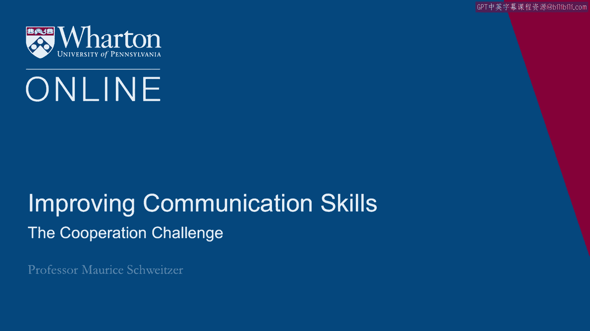
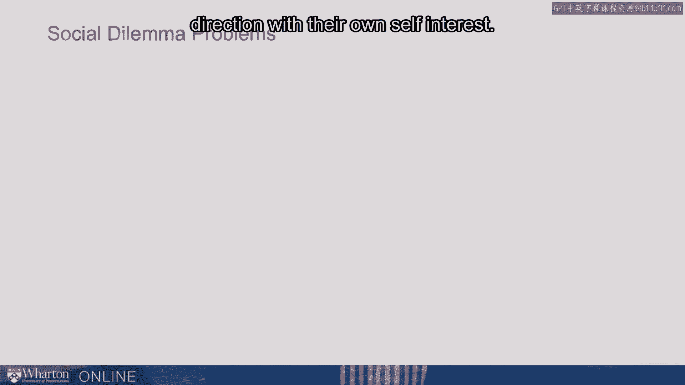
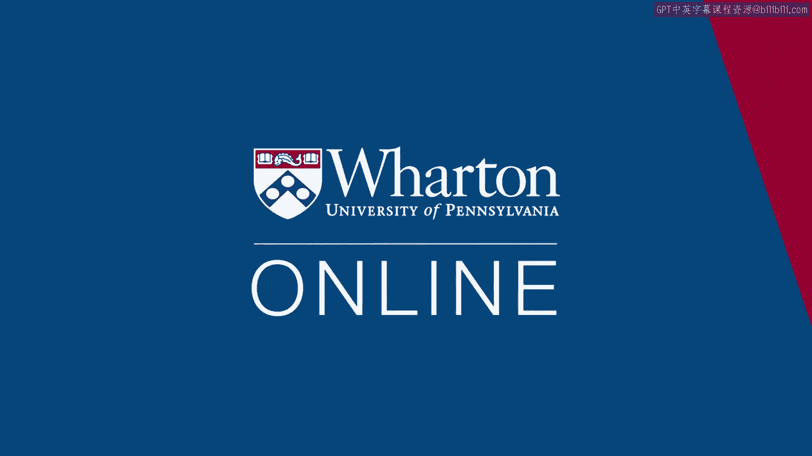

# 课程36：合作的挑战 🤝

在本节课中，我们将探讨如何促使他人与我们合作，尤其是在合作可能不符合他们个人短期利益的情况下。我们将通过案例和理论模型，分析合作面临的挑战，并学习一系列促进合作的有效策略。

---

接下来，思考合作的挑战。

如何让人们与我们合作，即使他们不合作、不努力工作或不提供帮助时，个人处境可能更好？首先从一个故事开始。

这是关于凶杀案侦探马歇尔·弗兰克的故事。

他是一位经验丰富的侦探，曾处理过一个案件，他确信保罗·罗尔斯有罪。

他知道这一点，但无法证明，他真正想要的是获得一份认罪供词。

于是他坐下来与保罗·罗尔斯交谈。在这个案件中，罗尔斯的邻居被勒死，弗兰克侦探的目标就是获得认罪供词。在这次审讯中，有趣的是罗尔斯清楚这场“游戏”的规则，即他知道侦探想要供词。

在30分钟内，弗兰克侦探最终成功获得了那份供词。他成功地让某人配合了他的需求，即获得认罪供词，并且速度相对较快。这里要问的一个问题是：他是如何做到的？

罗尔斯的案例引出了合作的核心问题：如何让人们跨出一步来帮助我们，做我们希望的事，即使这不符合他们自身的最大利益？这个问题与其他看似不同的问题相关。

例如，你会让一个完全陌生的人睡在你家里吗？通常不会，但这正是爱彼迎（Airbnb）商业模式的基础。它是一个允许人们做到这一点的系统。

因此，我们需要思考如何在**社会困境**中促成合作。

**社会困境**是一种多方的**囚徒困境**。

经典的囚徒困境只涉及两个人。但我们经常遇到涉及多人的情况。

例如，如何共同努力减少汽车尾气排放？我们希望每个人都进行尾气检测。但作为个人，我们宁愿不检测自己的车。

或者考虑过度捕捞问题。我们希望其他人都减少捕捞，但作为个人，我们宁愿尽可能多地捕鱼。

因此，个人有动机选择**背叛**（即采取对自己最有利的行动），但集体希望所有人团结起来，采取对集体最有利的行动。这就是社会困境。我们如何解决它们？

我们可以将囚徒困境作为第一个案例来思考。它是研究社会困境问题的“果蝇”（经典模型）。

在经典的囚徒困境中，有两个人。以弗兰克侦探的案件为例，他希望获得认罪供词。如果嫌疑人认罪，整个法律程序将更容易推进。但对那个潜在的罪犯个人而言，认罪并不利。

假设抓住了两个人。他们可以互相告发（认罪），也可以都不认罪。这里考虑的是他们彼此之间的合作。

假设这两名罪犯愿意合作。他们愿意彼此合作，都不认罪。

如果他们都不认罪，那么两人都将获得很轻的刑期。由于证据不足，他们不会被重判。假设两人都只判6个月。

如果两人都认罪，则两人都判5年。

显然，如果两人彼此合作、都不认罪，他们的处境会更好。

但有趣的情况是：如果其中一人选择背叛。

即其中一人与检方合作，供出全部实情，而另一人没有。想象一下，侦探提出一个特殊交易：如果你供出实情而另一人不供，你将获得自由，但另一人将判10年。

此时，面对这个问题的个人真正陷入了困境。他们可以尝试做对群体（集体）最有利的事，即合作；或者他们可以背叛，做对自己最有利的事，从而获得更好的个人结果。

在这种情况下，无论对方怎么做，选择背叛似乎总能带来更好的个人结果。如果对方打算招供，自己招供更好；如果对方不招供，自己招供（获得自由）仍然更好。

因此，个人始终存在这种追求自身最佳利益（自私利益）的驱动力。但我们希望推动人们合作，即使合作对他们而言需要付出代价。

那么，我们该如何做呢？如何让同事加班、承担额外任务？如何让孩子做更多家务？如何让配偶更多地帮助我们，即使他们更愿意躺在沙发上看电视或做别的事？

因此，无论是在工作还是家庭中，我们都持续面临这个问题：试图让人们合作，即使他们的个人利益将他们拉向相反的方向。

我们可以思考许多社会困境。之前提到了温室气体和过度捕捞，还有节约用水问题。我们希望每个人都缩短淋浴时间，但我们自己却想洗久一点。或者为公共广播等事业捐款，以及在许多谈判场景中，分享更多信息有助于创造价值，但这可能与个人试图索取价值的利益相冲突。

因此，我们面临这种张力。作为管理者，他们不断尝试解决这种社会困境，试图在人们可能自然倾向于相反方向时促成合作。

以下是一些促进合作的想法和因素。

首先，建立关系。人们与我们的认同感越强越好。社会学家称之为**过去的影子**。如果我们有团队建设经历、共同的历史，这将把我们凝聚在一起，创造一种“我们同舟共济”的感觉。我们拥有共同目标，这能促使人们更有效地合作。

这与**共享身份**的概念相关。我是否将自己视为这个群体的一部分？我们彼此的称呼（是伙伴还是雇员？）、我是否穿着印有公司标志的服装、我是否将自己视为组织的一部分？这种身份认同感越强，合作就越牢固。

第三，社会学家用**未来的影子**这个术语来描述我们未来互动的可能性。如果我知道这是一段长期关系，那么现在帮助你就会容易得多，因为我知道未来某个时候你可能也会帮助我。因此，未来的时间视野越长，我们越可能获得合作。

总结起来，促进合作的三个关键因素是：**过去的影子**（共同历史）、**共享身份**和**未来的影子**（未来互动）。

还有其他一些对合作很重要的因素。

一是**清晰沟通**。我能否清楚地传达我的需求以及为何需要？我们能否找到协作的方式？沟通越好，合作就越有效。这意味着面对面沟通尤为重要，原因有很多（后续会讨论），其中之一是它能实现最完整的沟通。

其次，考虑**期望**。我们对此有何期望？我是在传达我只关心自身利益，还是在传达“我们是一个整体”？实际上，人们曾用金钱或其他奖励进行囚徒困境实验。研究发现，当把游戏描述为“社区游戏”时，人们远比将其描述为“华尔街游戏”时更合作。在“华尔街游戏”中，人们戴上“为自己而战”的透镜或心态，最终变得更具竞争性。因此，我们描述事物的方式、设定的期望，会深刻影响人们的合作程度。人们试图弄清楚“我们在玩什么游戏”，而我们的沟通方式将深刻影响这一点。

接下来，考虑**问责制**。我们能否观察行为？以节约用水为例。人们更可能减少浇灌草坪，因为邻居能看到。缩短淋浴时间则更难被观察。当我们无法观察人们是合作还是背叛时，人们更可能选择背叛。匿名性会损害合作，而像评级系统（这正是爱彼迎有效的原因）这样的机制则有助于合作。

最后，更广泛地说，**信任**。如果我们能建立信任关系，就能获得合作。关于信任，我们稍后会详细讨论。

以下是关键要点总结：
*   **过去的影子**：我们过去的共同经历。
*   **共享身份**：我认同自己属于这个群体。
*   **未来的影子**：我们未来将有的互动。
*   **有效清晰的沟通**。
*   **设定合作期望**。
*   **保持问责**：意味着我们能观察他们的行为及其后果。例如税收，我们有时审计人们的税款，并对不纳税进行处罚，这是一种促使人们为集体利益合作的方式，尽管个人可能不愿意。
*   **信任**：我们的关系越信任，合作就越有效。

[空白音频]

---

本节课中，我们一起学习了合作的挑战。我们通过囚徒困境模型理解了个人利益与集体利益之间的冲突，并探讨了如何通过建立关系、塑造共享身份、展望未来互动、进行清晰沟通、设定合作期望、建立问责制以及培养信任来有效促进合作。掌握这些策略，将帮助你在个人和职业生活中更成功地赢得他人的协作。