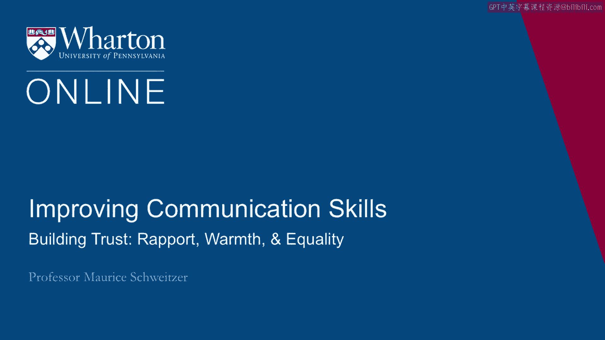
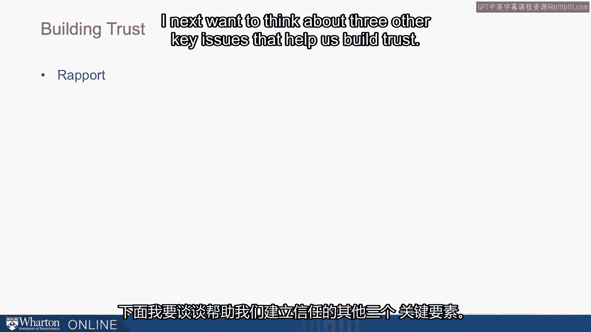
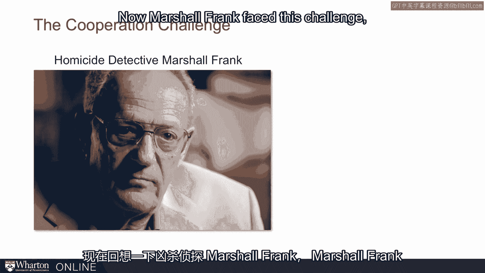
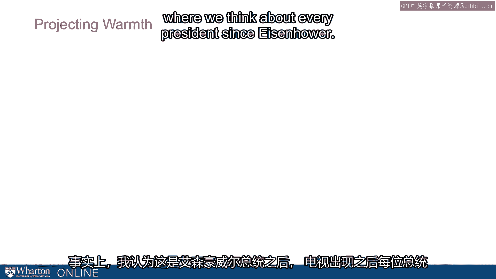
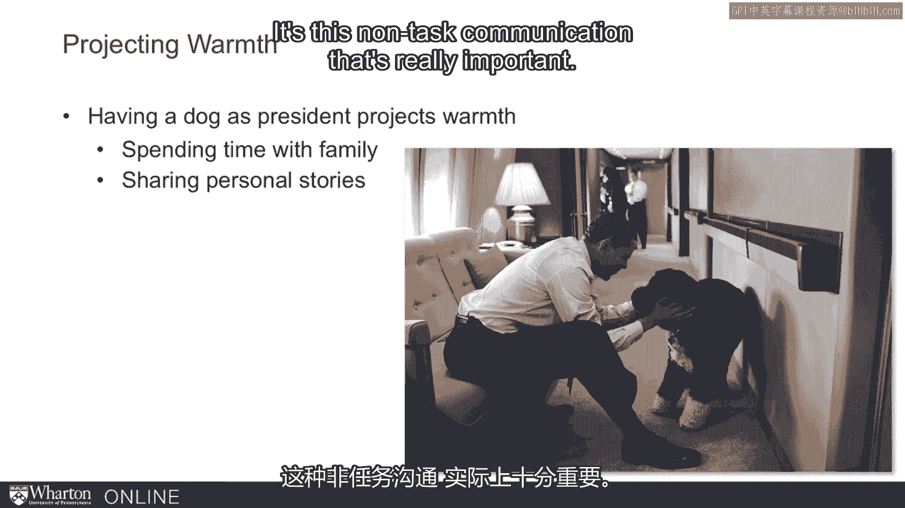
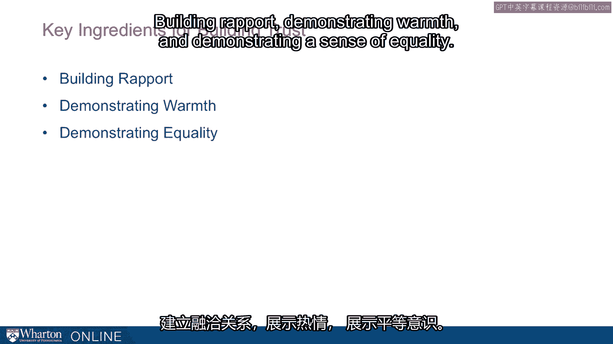

# 沃顿商学院《实现个人和职业成功（成功、沟通能力、影响力）｜Achieving Personal and Professional Success》中英字幕 - P38：10_建立信任-和谐、温暖、平等.zh_en - GPT中英字幕课程资源 - BV1VH4y1J7Zk

I next want to think about three other key issues that help us build trust。

Repur， warmth， and equality。 Now remember back to homicide detective Marshall Frank。

Now Marshall Frank faced this challenge。

He was trying to get Paul Roles to confess to murder。

Now Paul Roles certainly knew if you confess to murder you're going to prison for a long。

time for sure。 And yet detective Marshall Frank figured out how to get a confession within 30 minutes。

How did he do that？ Well it turns out that the key to what he did was building rapport。

And he built rapport through a lot of different steps and some of them seemed kind of funny。

He essentially treated this， this murderer as if he were a friend。 He sat in close to him。

In fact sat in so close their legs were almost touching。 He leaned in when he talked to them。

He spent most of those 30 minutes not talking about the murder or the victim but talking。

about family life in general。 Detective Frank talks about I made friends with him。

That is he's making friends。 He's talking about things that friends would talk about。

So we're thinking about this is non-task communication。

That is rather than getting right down to business he's chit chatting about things as。

if they were friends and that allowed him to build this rapport， to build a sense of friendship。

that created a sense of trust that then led to roles revealing all of this information。

So acting in a cooperative way in a way that Detective Frank was hoping for。

Now in general how do we do this？ Well we build rapport by this non-task communication。

So rather than getting right down to business we should talk with people about local events。

They're not their family， their friends， hobbies， recent sporting events。

We do things that aren't about the task at hand but that help build rapport that make。

it much easier when we do get to the task at hand。

We could also do things like share meals together。

We could actually go to events together like sporting events together when we do things。

together that allows us to build this sense of rapport and that really facilitates trust。

Now let me tell you about another story。 This was about an election。

It happened in Florida's 22nd District and it was Ron Klein， a neophyte to the political， scene。

He was taking on Clay Shaw a 13 time incumbent。 Now in this election Ron Klein knew his stuff。

He was a policy wonk。 He knew the ins and outs and he was ready for Congress。

But Clay Shaw was a formidable opponent。 After all he had won over a dozen elections before。

He was ready to take on all challengers but Ron Klein was persistent。

It turns out though Ron Klein had a challenge。 He was perceived as competent but cold。

We think about these perceptions of people。 We often think about them in terms of their competence and how warm they are。

Here Ron Klein when he talked about policy seemed competent but he wasn't warm。

He wasn't connecting with voters。 Now he brought in these consultants and he figured out how to overcome this key challenge。

How can he sound articulate but also warm？ So people saw him as a luff。

He actually did a practice TV interview with these consultants。

He went through the entire practice interview。 At the end the consultant said， "Okay。

I want you to watch this interview that you just， gave and tell me what would you do differently。"。

He said， "Well， there's actually another point that I would have raised。

There's some other material I could have brought in here。"， And Colin said， "Look。

I want you to watch it again and I want you to see that in this， whole interview you never smiled。"。

Now it seems funny why would we want somebody who's an expert in policy to smile but it。

turns out if you're running for political office people need a connection they need to， trust you。

And so they figured out is that what Klein really lit up with was when he talked about， his son。

When we talked about his family and they said， "Look， when you go out on your political。

stump speeches start off talking about your family， start off talking about your son。

and then pivot to talking about the key issues in policy。"。

And it turns out as he did that he was able to connect with voters。

He demonstrated warmth as well as competence and he was more likable and trusted。

So we need to do things sometimes that are different from just demonstrating pure competence。

to instill trust。 In fact， I think about this as a presidential imperative where we think about every president。

since Eisenhower， since the advent of television every US president as they've moved into the。

Oval Office bring with them a dog。 And this imperative is so strong it's true even for President Obama who had never had。

a dog。 And for good reason one of his daughters， Malia， is allergic to dogs。

And yet when they move into the White House， the Obama's went out and bought a dog。

a hypoallergenic， dog， but they needed a dog。 And so you think about how important it is， you know。

why would you need a dog？ And the key idea here is it projects warmth。

If you've won a national election， you've demonstrated some competence， it's hard to， do。

And then a key challenge is projecting warmth。 And when you see a president， a high power person。

you presume competence and then you're， looking for that warmth and having a dog does that。

So you want to do things like spending time with family， sharing stories， personal stories。

hanging around with a dog。 Those are things that project a sense of warmth and they end up building trust。

So Klein talked about a son， presidents end up getting dogs。

Now it's this non-tax communication that's really important。

We have experiences that we share in common， like going to sporting events or sharing meals。

together， using first names correctly。 Those are things that will build rapport。

If we come up with nicknames or we have shared hobbies， we find commonalities， those are。

things that are going to build rapport。 And that's really an essential ingredient for building trust。

So that's the rapport idea。 And it's related to warmth。

The idea that we can demonstrate warmth when we demonstrate concern for other people， we。

demonstrate kindness， we spend time with our friends， our family， with pets or volunteering。

We're demonstrating concern for other people and that concern projects a sense of warmth。

and that's a really key component。 There's an affective peace。

an emotional peace to trust and we want somebody who's going， to be warm。

Now one final point related to this is this idea of equality。 Now when we show up on time。

we're demonstrating that our time isn't more valuable than somebody， else's time。

That's communicating a sense of equality as well as this idea of benevolence and warmth。

We want to be equal so we don't sit on a higher chair。 We don't accentuate differences between us。

We can do things like dress in similar ways。 We convey a sense of equality and that's also important for building trust。

We're more likely to trust people who seem to not only care about us but also treat us。

as equal partners。 So taking together here are three key elements。 Building rapport。

demonstrating warmth and demonstrating a sense of equality， they're all。

key ingredients for building trust。 [BLANK_AUDIO]。

