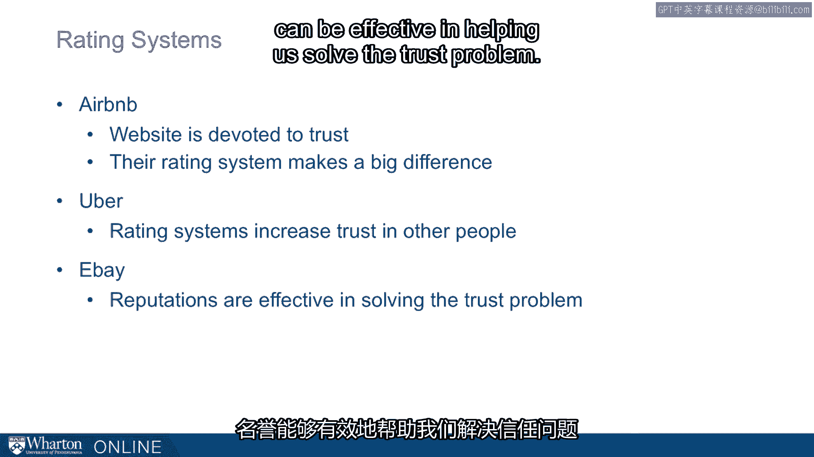

# 课程 P40：建立信任 - 沟通与制度 🏛️🤝

在本节课中，我们将探讨如何通过沟通和制度来建立信任。我们将分析言行一致的重要性、平等沟通的原则，以及制度（从法律体系到现代评分系统）在塑造和维持信任中所扮演的关键角色。

---

## 言行一致：沟通的基石

上一节我们介绍了信任的基本概念，本节中我们来看看沟通在建立信任时的第一个核心原则：确保言行一致。

当涉及沟通时，一个关键理念是确保我们的**言语与行动相匹配**。

这里有一个关于2008年的故事。当时美国三大汽车制造商的CEO来到华盛顿特区，请求联邦提供250亿美元的贷款。然而，媒体发现这三位CEO都是乘坐各自的私人飞机前来。这与他们声称“急需资金”的言辞形成了鲜明对比。因此，当他们第二次前往华盛顿时，他们改乘了混合动力汽车。这个例子说明，想让自己的话语获得最大程度的信任，就必须思考如何让你的**行动支持你的言论**。

---

## 平等沟通：尊重与联结

除了言行一致，沟通的另一个关键理念是进行**平等沟通**。

所谓平等沟通，意味着我们要准时出席。这表示我们没有暗示自己的时间比他人的时间更重要。同时，我们应尽量减少其他方面的差异，例如座位安排、着装等。语言的重要性不仅体现在沟通方式上，也体现在我们使用的**术语**上。

瓦达·利伯曼曾进行一项研究，在提供相同经济激励的情况下，将游戏命名为“社区游戏”和“华尔街游戏”。结果发现，在“社区游戏”中，人们的合作意愿远高于“华尔街游戏”。同样，将某人称为“伙伴”而非“对手”，将员工称为“团队成员”而非“雇员”，都会触发不同的思维模式，从而改变我们彼此互动的方式。

这不仅关乎语言。之前我提到了行动，这同样体现在我们的**就座方式**上。当我们并肩坐在桌子的同侧时，这种座位安排传递出“我们正在共同解决问题”的信号，有助于建立信任。

---

## 制度的信任：原则与代价

信任不仅存在于人际沟通中，也存在于我们对**制度**的信任中，例如司法体系。

我们对司法体系的信任方式会产生深远的影响。我们常常对制度怀有敬畏，但这种敬畏并非在世界各地都普遍存在。

我想讲述一个关于奥尔顿·洛根的故事。这里有一张安德鲁·威尔逊的照片，你需要想象在20年前，他们两人长相非常相似。1982年，芝加哥一家麦当劳发生了一起枪击案。犯罪现场混乱，但有目击者证词，这些证词足以给奥尔顿·洛根定罪。但有一个问题：奥尔顿·洛根当时根本不在现场，他与那起枪击案毫无关系。真正的凶手是安德鲁·威尔逊。

更糟糕的是，安德鲁·威尔逊的律师（当时正因另一起案件为他辩护）得知，他承认了自己在麦当劳犯下的这起谋杀。与此同时，奥尔顿·洛根被定罪并一直关在监狱里。律师恳求安德鲁·威尔逊说出真相，毕竟他已被判谋杀罪，难道他不愿承认这起罪行吗？律师们知道奥尔顿·洛根是被冤枉的。

然而，这里存在一个制度性问题。在美国，我们有**律师-当事人保密特权**。律师不能单方面披露这些信息，否则会损害其当事人的利益，因为这是在保密情况下披露的信息。这一原则很重要，因为它确保了罪犯或嫌疑人能够向律师披露信息，而不用担心这些信息被用来对付自己，从而获得最佳的法律代理。正是这一原则指导了律师的行为。他们实际上写了一份宣誓书，但将其密封隐藏了起来。

奥尔顿·洛根在监狱里度过了26年。直到安德鲁·威尔逊在狱中去世后，律师们才站出来披露了信息，奥尔顿·洛根最终获释。这个故事最令人惊叹的部分在于，他的姨妈在迎接他时说：“他们做了他们必须做的事。”这体现了对司法制度令人难以置信的敬畏。

---

## 非正式制度：流言与评分系统

现在，我也想从其他角度思考制度，这里有一个有趣的制度：**流言**。

这是一块放在教堂前的广告牌，上面写着：“如果你的朋友向你传播流言，你要知道他们也会在背后议论你。”

我们通常认为流言名声不好。流言当然有一些非常负面的特征，但它也做其他事情。它帮助我们传达社会规范和行为期望，传递关于声誉的信息。流言虽不是一件好事，但它实际上以一种比我们通常承认的更深刻的方式，帮助我们规范行为。

如今，我们开始通过**评分系统**将这种规范形式化。

如果我问你这个问题：你会让一个完全陌生的人住在你家吗？答案竟然是响亮的“会”。我们通过评分系统解决了这个问题。如果你查看爱彼迎的网站，他们会专门讨论信任，在其所有材料中持续谈论信任，并且发现人们实际上非常值得信赖，他们的评分系统起到了至关重要的作用。

其他关键问题也是如此，例如：你会让你的孩子坐一个陌生人的车吗？这里的答案同样是“会”。优步也通过帮助人们信任他人的评分系统解决了这个问题。易贝和其他电子商务网站也发现，声誉机制能有效帮助我们解决信任问题。

[空白音频]

---

## 总结

本节课中，我们一起学习了通过沟通和制度建立信任的多种途径。我们探讨了**言行一致**和**平等沟通**作为人际信任的基石。接着，我们分析了正式制度（如**律师-当事人保密特权**）在维护社会信任时所面临的复杂权衡。最后，我们看到了非正式的“流言”制度如何演变为现代的**声誉与评分系统**，这些系统在共享经济和电子商务中极大地降低了信任成本，使陌生人之间的合作成为可能。信任的建立既依赖于个人的真诚沟通，也离不开支撑这些互动的社会制度设计。