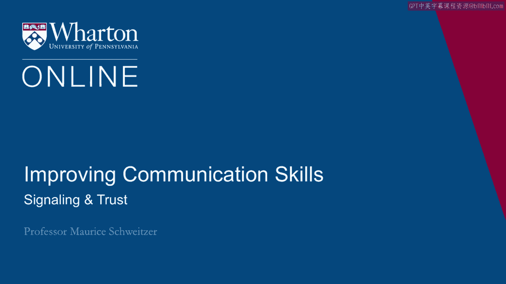
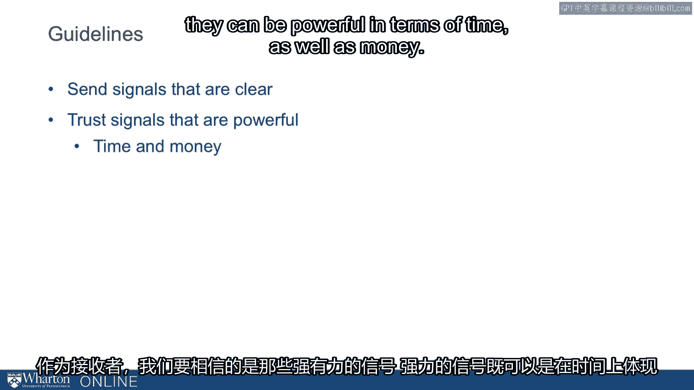

# 沃顿商学院《实现个人和职业成功（成功、沟通能力、影响力）｜Achieving Personal and Professional Success》中英字幕 - P41：13_传递信任的信号.zh_en - GPT中英字幕课程资源 - BV1VH4y1J7Zk

A key question we should often ask is， should we trust somebody's signal？

People often send us messages and we send other people messages。

Why don't we trust the messages people send us？ And how can we send messages that other people trust？

So the idea is that we have to convey unobservable information。 So information like。

how committed are you to this relationship？ Or how interested is this candidate in this career？

Or how intelligent is this candidate？ Or is this partner really sure that this product is going to succeed？

We're trying to make these judgments。 We're trying to trust other people。

And we often have to rely on signals of these unobservable characteristics。 So take， for example。

how committed somebody is to a relationship。 What can they do to signal their commitment？

Now often we think about things that have solved this problem like gifts。

So somebody brings a dozen red roses。 That's a signal of commitment。

You're signaling that I care about you， I care about this relationship。

Now what I want to do is I want to think carefully about signals。

And I think about signals along two key dimensions。 The key idea here is that it could be clear。

Signals can be very clear。 And they can also be powerful。

And by powerful what I mean is that this unobservable information is trying to be signaled。

in some way。 Is that way too expensive for some types of people？

And is it too relatively inexpensive for others？ So when I said I want to signal that I care about you with a dozen red roses。

that's， clear。 Everybody gets that idea。 But what about power？

Suppose that I don't really care about this relationship。 My aspirations perhaps are shorter term。

But I still afford to buy you a dozen red roses。 And the answer I want to suggest is that the answer is often yes。

That is sometimes these signals are not very expensive。 And when we're checking signals。

we want to think carefully in terms of power。 So here's some ideas。

To signal that we're committed to relationships， it's expensive gifts that can solve this problem。

So for example， we seem to have solved this problem too in relationships。 So roses are nice。

but jewelry is better。 And if we're really committed to a relationship。

we have just the thing that's a diamond ring。 And notice what's nice about this。

We're spending a lot of money and we have these rules of thumb for how much we should， spend。

The more money somebody makes， the more we should spend on that ring。

So that is it should hurt just enough。 It's expensive and costly。

but it should be more expensive and more costly the more resources， somebody has。

So expensive gifts can help us solve the problem of should we trust someone's intentions？

Are they really committed to this relationship？ And notice that it's the cost that really matters because we're spending money on characteristics。

of a diamond ring that are difficult to observe。 So how flawless the diamond ring is cut is difficult to assess with a naked eye without。

training， but we care about those things because of the cost。

Now we can think about how committed is this person to this career？

How interested are they in working in my firm？ If they're willing to take an unpaid internship or if they're willing to spend a summer during。

graduate school when they have few summers to spend， they're investing in that relationship。

that career in a way that's expensive if they weren't really committed。

Now notice that sometimes people prepare for an interview。

So they read five articles about the company。 They come prepared for the interview。

It's a clear signal of interest， but it's not a powerful signal。

Spending time interning is a powerful signal or we want to signal that we're intelligent。

How do we signal that？ Well， it turns out there's a costly and expensive signal for that and that's higher education。

So we invest in education and we do that in a way that signals that were intelligent。

If we weren't so intelligent， it would be difficult to invest， watch all these videos。

read all these books， take all these tests。 It's too expensive for some types of people and it's less expensive for others who can。

afford it and reap the benefits of sending that signal or how surely this product will， succeed。

Guarantees or warranties are things that help to send that signal。

Now the idea is that when we send a message， we should be focused on clarity。

Is this message sending the right information？ So you show up and you have a dozen lowways for somebody that might not be sending a very。

clear message。 We want to be thinking carefully about how clear is the message。

Is somebody receiving it going to get the idea？ And the second is towards power。

So when people send us messages， are they sending messages， these signals that are expensive？

One of my friends for example is working at a company on one of his work anniversaries。

He received a basket of flowers and with his basket of flowers was a note， we care about。

you and your commitments， this organization。 We really value what you do。 A week later he was fired。

Now could the company afford to send messages like the one in that flower basket？

And my answer is yeah， of course， they can afford to send that even if they don't really， mean it。

So sometimes we can send messages that aren't very powerful and as receivers we should be。

checking that power。 So in terms of guidelines， send signals that are clear。 In terms of receivers。

we should trust signals that are powerful and they can be powerful。

in terms of time as well as money。

So if somebody is limited in time， so a CEO has a limited number of lunch appointments。

spending a lunch with you or calling you on a Christmas day， there's a limited budget of， time。

We can think about the power in terms of both time and money。

But those are the two key key dimensions。 Clarity won't particularly when we send signals and power particularly when we receive signals。

[BLANK_AUDIO]。

