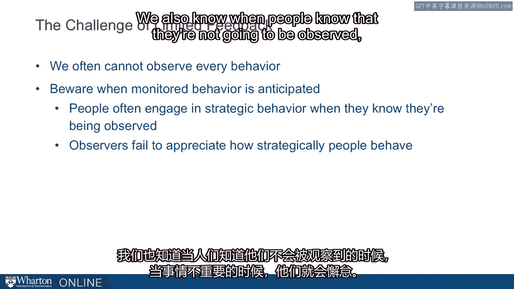

# 沃顿商学院《实现个人和职业成功（成功、沟通能力、影响力）｜Achieving Personal and Professional Success》中英字幕 - P42：14_信任、情感和有限的反馈.zh_en - GPT中英字幕课程资源 - BV1VH4y1J7Zk

There are two additional topics I want to think of with respect to trust。

One is emotion and the second is feedback。 Now let me think about emotion。

Suppose I ask you how do you feel？ It turns out our feelings are pretty complicated。

Often when we're making judgments we use our feelings as a summary statistic that integrates。

a lot of different dimensions。 So if I were to ask you how do you feel about this candidate we're trying to integrate。

across a lot of different things。 How competent are they？ How much do we need their skill set？

Would they get along with the people here？ We're trying to integrate across a lot of different dimensions and we often summarize。

this with how do I feel about this。 Or think about going out and you look at 20 different homes and you try to figure out。

which home you want to buy。 How do you feel about this？ Again。

it's this summary statistic that integrates a lot of information and the trust decision is。

a lot like this。 Do I trust this person is often predicated on a feeling？

Do I feel like I can trust this person？ We talk that way and it's absolutely how we behave as well。

In my own research I've actually looked at the link between emotions and trust and one。

thing I found that's particularly interesting is how our feelings can influence our trust。

The idea here is that sometimes our feelings are really relevant so you betrayed me。

I'm upset and so I don't trust you。 It's a directed emotion that makes a lot of sense for influencing trust。

What's interesting is that our incidental emotions， emotions that are unrelated to the。

situation at hand also matter。 By incidental what I mean is suppose you get a parking ticket or suppose you get into。

an argument with your spouse and then you come into work and you deal with somebody who's。

totally unrelated to that other experience。 The question is does that emotion bleed into your new interaction？

And the answer is yes。 So how we feel in the moment is influenced not just by what's happening in this exact。

moment but it's also influenced by what's happened before。 And so these incidental emotions。

these unrelated emotions from some other experience can influence， our judgments。

So here's the idea。 If we're angry about something else and that bleeds into our judgment it'll make us less。

trusting。 If we're happy about something else， so we just found some great news unrelated to the。

meeting that I'm currently having that happiness can bleed in and boost my trust。

So I'm maybe too trusting when I'm otherwise very happy and I'm maybe not trusting enough。

when I'm a little bit angry from something else。 I've documented this in my own research and the implication is that we should be careful。

to recognize that our trust judgments can move。 They're relatively labile particularly for people we don't know well。

So a new partner or a prospective client， we're making these trust judgments on the fly。

It's a constructed judgment。 Our insulin emotions don't really matter very much for people you know well。

So how much you trust your mom isn't going to be influenced by how you're feeling unless。

you're feeling pretty strongly about something。 Now when it's not just our own judgments I'm worried about。

I also worry about how much other people are likely to trust us。

So when you go to the boss or you're meeting a new partner if they're upset about something。

else and it could be almost anything。 Their favorite sports team lost a political outcome and argument they have with their spouse。

If they're upset about something you should recognize that those feelings may well bleed。

into their assessments of you and you want to make sure that either you let time pass。

and come back at different time。 That's the first best option。

Well the second best option is to make sure they're making the correct attribution。

You might say oh I know you're pretty upset about that other outcome。

I'm hoping that doesn't influence this situation。 By explicitly acknowledging and recognizing something that does mitigate the influence。

of that incidental emotion on the current judgment。

Okay now those are judgments that can influence our trust but in whom should we place our trust。

and what do emotions have to say about that。 And here I'm going to switch to a very different kind of emotion and I'm going to talk about。

guilt。 It turns out that when we're assessing in whom to place our trust the people we should。

really trust are the guilt prone people。 And by guilt prone I mean people who are likely to feel guilty should they fall short。

Here's an example of how to assess that。 Imagine you ask someone and it could be a prospective employee。

You ask them something like the following。 Describe a time when you made a mistake at work。

How did you feel when this occurred？ What did you do？ What did you learn from this experience？

When you listen to those responses what you're listening to are answers to these questions。

So how likely is person to feel badly if they did something wrong even if nobody knew about， it。

Does this person have a strong sense of responsibility for others？

And will this person feel bad about letting others down？

Now those are all guilt-prone-ness questions。 So would they feel guilty if they did something bad even if nobody knew about it。

It turns out the guilt prone people are exactly the same people we should trust。

Those are the most trustworthy people around。 People who are low in guilt proneists we should be careful about。

People who are high in guilt proneists are people we should trust the most。

The last idea I want to suggest has to do with limited feedback。

When we're trusting other people we often face a challenge because we can't monitor them。

all the time。 Sometimes we can check in and see what they're doing。 Sometimes we can't。

And the key idea here is we want to think about how anticipated that monitoring is。

So can we observe occasions when they don't expect to be monitored？

Or is it the case that they always know when we're coming？

They always have time to prepare or they always know when they're going to be observed。

It turns out people act pretty strategically。 So they know that when they're being evaluated they step up and they behave in an exemplary。

way。 We also know when people know that they're not going to be observed when things aren't。

going to be important that they slack off。 Now again the high guilt prone people are going to be pretty good even in those cases。

But people who are low in guilt proneists are likely to behave very strategically demonstrating。

exemplar behavior when they're observed and then slacking off when they're not。

Now here's the problem。 When we observe behavior and I've run a number of studies looking at this。

when we observe， behavior the people who are observing others put too much weight in that observed period。

So it's like the boss who comes back from vacation and sees the office staff working really， hard。

Then goes back on vacation and then when they return again sees the office staff working。

really hard。 And the more observations the boss has the more and more convinced the boss becomes these。

are really hard workers。 That is they're relying solely on what they can see and they're failing to imagine what。

happens when they're not around。 So we want to be careful about making inferences from limited feedback when the feedback that。

we get is constrained and it's anticipated。 We want to make sure that we account for how strategic other people often act。

how particularly， often act and recognize that the limited observations we have can actually send us off。

in the wrong course we might actually build very high trust in sometimes very strategic， people。

[BLANK_AUDIO]。

