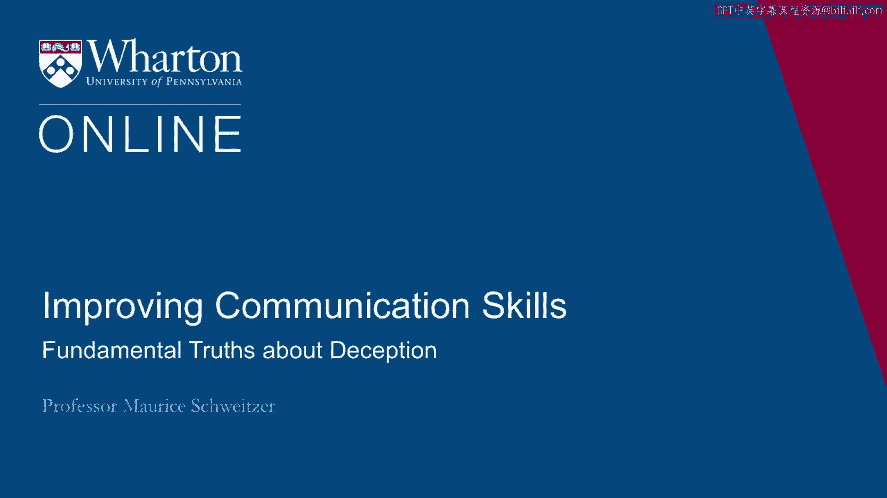
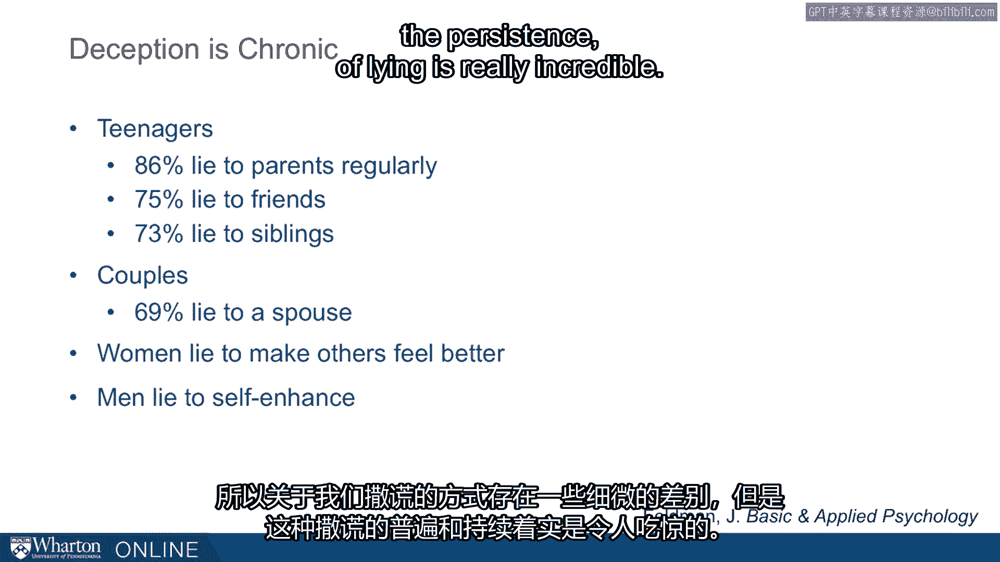

# 沃顿商学院《实现个人和职业成功（成功、沟通能力、影响力）｜Achieving Personal and Professional Success》中英字幕 - P43：15_关于欺骗的基本真理.zh_en - GPT中英字幕课程资源 - BV1VH4y1J7Zk

There are some key fundamental truths about deception。

I'm going to start with a story about the Kuku Bird。

We might be familiar with the Kuku Bird mostly because of the Kuku Clock， but it turns out。

the Kuku Bird can teach us something really important about the deception process。 The Kuku Bird。

rather than laying its own eggs and feeding its own chicks， actually lays。

eggs in other birds' nests。 So birds like the tree pipette will actually be tricked into raising Kuku chicks。

There's something odd about this。 You can sometimes see Kuku Birds waiting。

watching another bird's nest， waiting for， that bird to leave to go get food。

The Kuku Bird will fly in， sometimes discard eggs that are already in the nest， quickly。

lay an egg and then fly away。 Now what happens after that， it's actually even more bizarre。

We've hijacked a system here， or the Kuku Bird is hijacked a system where as soon as。

that bird hatches， the Kuku Bird hatches， there's an open beak and here this bird mother。

instinctually feeds that open beak， even when the bird looks nothing like their own offspring。

So here you can see a Kuku Bird chick being fed by a tree pipette who's so much smaller。

than the chick。 So it can seem really odd and yet we're hijacking this trusting process and we've used deception。

in a way that allows Kuku Birds to exploit other birds' generosity。 Now。

it turns out deception is hardwired。 I talk about the Kuku Bird because I want to suggest the deception of something that's。

hardwired。 It's not just an aberrant human behavior。

but it's something that's actually deeply ingrained， in our animal nature。

And it turns out it's not just Kuku Birds and tree pipettes。

Kuku Birds do this to many other kinds of birds and there are other birds too that engage。

in the same behavior。 We've seen actually deception documented in ravens。

Ravens will actually do things that will trick other birds about where food is。 We've seen apes。

monkeys， even fish engage in deception。 So catch-up in monkeys， for example。

will sound an alarm as if a predator is nearby to， go steal food from other monkeys。

Some predators will fake their own death， pretend to be dead until prey comes near and they'll。

grab that prey。 Or in a very prosocial way， you'll see some birds fake injury。 So the morning dove。

for example， if there's a predator nearby and they have young offspring， in their nest。

will actually pretend to drag their wing as if they're injured to draw attention。

away from their offspring。 So they're engaging in deception as soon as the predator comes near。

the morning dove， flies off。 So we see deception throughout the wild animal kingdom and it's not surprising that it's。

a really integral part of our human experience。 So here are some key truths about it。

Deception hijacks existing systems。 So like the tree pipit， there's a system that's hardwired。

The tree pipit will feed the beak of a hungry bird in its nest。

It's a reasonable system and the kookabur is just figured out how to exploit that。

And the same is true in a lot of our other transactions where， for example， a lot of these。

scammers with telephone calls will hijack existing trusting systems or somebody will， say。

"I'm in trouble。 I need help。"， We're hijacking that system and deception exploits trust。 Now。

deception is also hardwired。 It's something that we're hardwired to do and it's actually an important part of our cognitive。

development as we develop more complicated thinking， deception comes along with that。 Third。

deception is often successful。 Most deception goes undetected and that makes it a very pervasive issue that's sometimes。

a big problem and sometimes a benefit。 And so this fourth point about deception is it's not always bad。

And in fact， I'm going to argue that we should teach people how and when to deceive。

So it's a developmental milestone。 So when your child starts telling you lies。

rather than punishing them too severely， I would actually celebrate that milestone。

It demonstrates a theory of mind。 The idea that what's in our own heads is different than what's in everybody else's。

head。 And deception reflects that。 That is， it's the recognition that what I know。

I know I just had a cookie， but you， might not know that。 And so when I tell you。

"I haven't had a cookie yet，" it's a demonstration of this theory， of mind。 Of course。

I'm trying to get another cookie， but it represents the idea that I know that。

you might not know that。 And that really represents an important ability for us to take perspective and to engage with。

other people successfully。 And of course， there are many positive ways for us to use that deception to say things。

like， "I really like that gift or I'm really happy you showed up。"。

So deception is a developmental milestone and not just something to be punished。

And deception is chronic。 In surveys of teenagers。

they found that 86% say they lie to their parents on a regular， basis。 75% say they lie to friends。

73% say they lie to siblings。 So it's not just parents， but teenagers say they lie all the time。

Couples， in couples， 69%， more than two-thirds say they lie to their spouse。

Now the lies we tell tend to be a little bit different。

So women are more likely to lie in a prosocial way to make people feel better。

And men are more likely to lie in ways that enhance themselves， that make them look better。

than they actually are。 So there's some slight differences in how we lie。

but the persistence of lying is really。

incredible。 [BLANK_AUDIO]。

