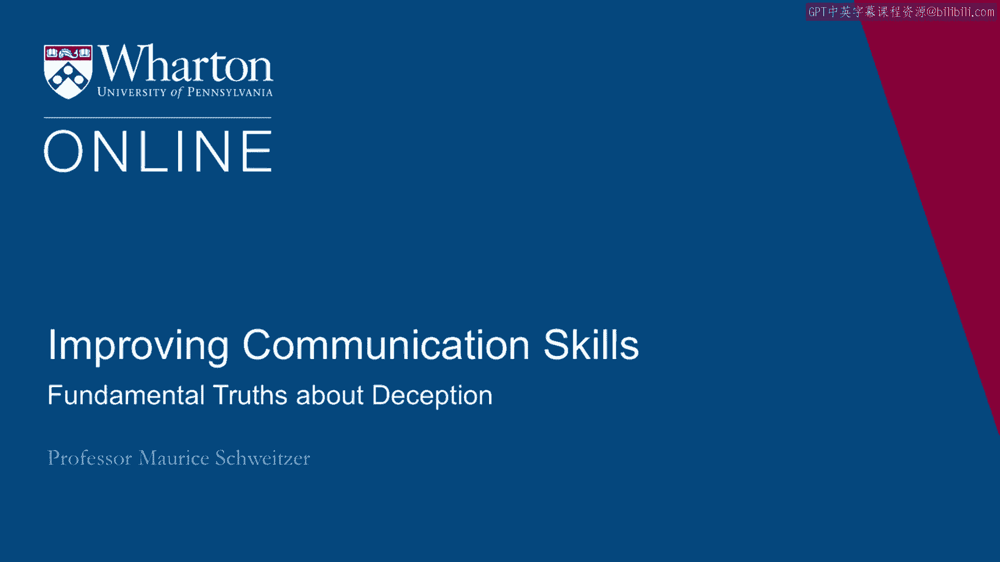

# 课程15：关于欺骗的基本真理 🕵️

在本节课中，我们将探讨欺骗行为背后的一些核心真相。我们将从一个关于大杜鹃鸟的故事开始，了解欺骗在自然界中的普遍性，并揭示其在人类社会中的表现与意义。通过学习，你将理解欺骗并非仅仅是人类的异常行为，而是根植于生物本能，并在我们的认知发展和社会互动中扮演着复杂角色。

---

## 欺骗的普遍性：从大杜鹃鸟说起

上一节我们引入了课程主题，本节中我们来看看一个来自自然界的生动例子。

大杜鹃鸟的故事能让我们深刻理解欺骗的过程。我们可能主要通过布谷鸟钟熟悉这种鸟，但实际上，大杜鹃鸟能教给我们关于欺骗过程的重要一课。

大杜鹃鸟并不自己产卵和喂养幼鸟，而是将蛋产在其他鸟类的巢中。像树鹨这样的鸟类，会被欺骗去抚养大杜鹃的雏鸟。

这个过程有些奇特。你有时能看到大杜鹃鸟守候着其他鸟类的巢，等待那只鸟离巢觅食。大杜鹃鸟会飞进去，有时会丢弃巢中已有的蛋，迅速产下一枚自己的蛋，然后飞走。

之后发生的事情更加离奇。我们（或者说大杜鹃鸟）劫持了一个系统：一旦雏鸟孵化，大杜鹃雏鸟会张开嘴，而鸟妈妈会本能地喂养这张嘴，即使这只雏鸟看起来与自己的后代毫无相似之处。

因此，你能看到一只体型小得多的树鹨在喂养一只巨大的大杜鹃雏鸟。这看起来非常奇怪，但我们（或大杜鹃）劫持了这个基于信任的过程，并利用欺骗手段，使大杜鹃得以利用其他鸟类的慷慨。

---

## 欺骗是根深蒂固的本能

上一节我们看到了自然界中的欺骗，本节中我们来探讨其根源。

事实证明，欺骗是根深蒂固的。我谈论大杜鹃鸟，是想说明欺骗是某种与生俱来的东西。它不仅仅是人类的一种异常行为，而是深深烙印在我们的动物天性之中。

并且，实施欺骗的不只是大杜鹃和树鹨。大杜鹃会对许多其他种类的鸟类这样做，也存在其他鸟类有相同的行为。事实上，有记录显示乌鸦也会欺骗。乌鸦会做一些事情来误导其他鸟类关于食物位置的信息。我们还观察到猿类、猴子，甚至鱼类也会进行欺骗。

例如，卷尾猴会发出警报，假装附近有捕食者，以便从其他猴子那里偷走食物。一些捕食者会装死，假装死亡直到猎物靠近，然后抓住猎物。或者以一种非常亲社会的方式，你会看到一些鸟类假装受伤。例如，哀鸽在附近有捕食者且巢中有幼鸟时，会假装拖着翅膀，好像受伤了一样，以将注意力从它们的后代身上引开。它们一实施欺骗，当捕食者靠近时，哀鸽就会飞走。

因此，我们在整个野生动物王国中都看到了欺骗行为，所以它成为我们人类经验中不可或缺的一部分也就不足为奇了。

---

## 关于欺骗的关键真相

以下是关于欺骗的一些关键真相。

**欺骗劫持了现有系统。** 就像树鹨一样，存在一个固有的系统。树鹨会喂养巢中饥饿小鸟张开的嘴。这是一个合理的系统，而大杜鹃只是发现了如何利用它。在我们许多其他互动中也是如此，例如，许多电话诈骗者会劫持现有的信任系统，或者有人会说“我遇到麻烦了，我需要帮助。”我们正在劫持那个系统，而欺骗利用了信任。

**欺骗是根深蒂固的。** 这是我们天生就会做的事情，实际上是我们认知发展的重要组成部分。随着我们发展出更复杂的思维，欺骗也随之而来。

**欺骗常常是成功的。** 大多数欺骗行为未被察觉，这使其成为一个非常普遍的问题，有时是个大问题，有时则是一种益处。

因此，关于欺骗的第四点是：**欺骗并不总是坏事。** 事实上，我认为我们应该教导人们如何以及何时进行欺骗。

---

## 欺骗作为发展里程碑

上一节我们了解到欺骗具有多面性，本节中我们来看看它在人类成长中的特殊意义。

欺骗是一个发展里程碑。所以当你的孩子开始对你撒谎时，与其过于严厉地惩罚他们，我实际上会庆祝这个里程碑。它证明了“心理理论”的存在，即我们头脑中的想法与他人头脑中的想法是不同的这一观念。欺骗反映了这一点。也就是说，它是对“我知道的事情，你可能不知道”这一点的认知。所以当我告诉你“我还没吃饼干呢”，这正是在展示这种心理理论。当然，我是想再得到一块饼干，但这代表了我明白你可能不知道（我吃了饼干）。这确实代表了一种重要的能力，让我们能够换位思考并成功地与他人互动。

当然，我们也可以以许多积极的方式运用这种欺骗，比如说“我真的很喜欢那个礼物”或“你来了我真高兴”。因此，欺骗是一个发展里程碑，而不仅仅是应该受到惩罚的事情。

---

## 欺骗的普遍性与性别差异

欺骗是普遍存在的。在针对青少年的调查中，他们发现86%的人表示会定期对父母撒谎。75%的人表示会对朋友撒谎。73%的人表示会对兄弟姐妹撒谎。所以不仅仅是父母，青少年们表示他们一直在撒谎。

在伴侣关系中，69%（超过三分之二）的人表示会对配偶撒谎。

我们所说的谎言往往略有不同。女性更可能以亲社会的方式撒谎，为了让别人感觉更好。而男性更可能以提升自我的方式撒谎，让自己看起来比实际更好。所以我们在撒谎方式上存在一些细微差别，但撒谎的持久性确实令人难以置信。

---

## 总结

本节课中，我们一起学习了关于欺骗的基本真相。我们从大杜鹃鸟的例子出发，认识到欺骗在自然界中普遍存在且根深蒂固。我们了解到欺骗通过劫持现有系统（如信任）来运作，并且常常成功而不被察觉。重要的是，欺骗并非总是负面的，它是人类认知发展（心理理论）的一个重要里程碑。最后，我们看到欺骗在人类社会（如青少年、伴侣间）中普遍存在，且在动机上可能存在性别差异。理解这些真相，有助于我们更全面地看待这一复杂的社会与心理现象。