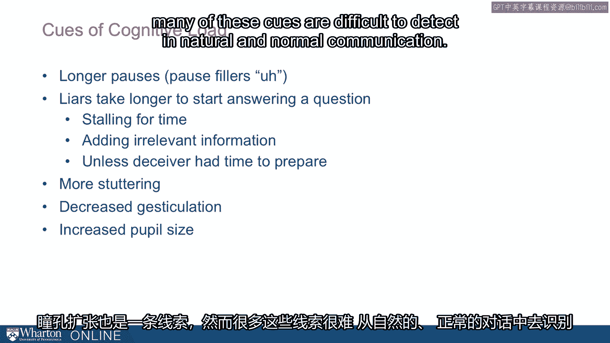

# 沃顿商学院《实现个人和职业成功（成功、沟通能力、影响力）｜Achieving Personal and Professional Success》中英字幕 - P46：18_匹配内容与背景.zh_en - GPT中英字幕课程资源 - BV1VH4y1J7Zk

I want to think more carefully about matching the content and context of messages as a。

place for us to look for deception。 So we talked a little bit about this idea of synchrony and asynchrony。

So does the text and the nonverbal cues around that text， do they match， they correspond。

or are they different？ So sometimes they're incongruous。 So somebody will say no。

but nod their head yes。 Or they'll catch themselves and correct themselves midway through。 Like no。

I mean yes。 That catch and correct is sometimes a really important cue to detect deception。

I mentioned polygraph tests before。 They're polygraphers that will do things like ask somebody a question and if they catch。

somebody doing this， sort of catch and correct。 Like no， I mean yes。

They'll shut down the polygraph and say， I know you did it。

That is they'll be so certain that these cues are diagnostic that they'll know exactly。

what's happened。 Sometimes there's this delay。 So this delay that I mentioned before that I'll say I didn't do it and then negative head。

swing follows that。 But as we sometimes will say things and then follow that later with the nonverbal cues and。

all of that asynchrony should really tip us off that there's something not quite right。

So when the emotions don't match， the behaviors don't match， we're learning something important。

and we should dig deeper into that issue。 So there are often cases like somebody reports a kidnapping。

but they wait to report it or， sometimes they'll cross county lines and report it in a different county。

I want to think about why would you do that？ That is when the behavior doesn't match。

there's something asynchronous about it that， should cause us to be quite suspicious。

Now a lot of this asynchronous comes from discomfort。 So I mentioned anxiety before。

but more broadly there's a discomfort。 So in general liars want the meeting to end。

So they'll be looking at the clock。 They'll be talking about ending the meeting or they'll cut the interview short or they'll。

be very happy if there's a disruption。 They'll welcome that or even look for an opportunity to switch topics and do something else。

Often this discomfort is represented by the desire to create distance。 So liars will lean back。

they'll lean away or what's been called eye blocking。

They'll close their eyes pretending as if they're somewhere else。

Sort of like the same way we might sort of cover our ears as if we're saying， "Oh， I。

can't hear you。"， Sometimes people will close their eyes as if I'm not here giving themselves this sort。

of quick sort of mental vacation from that awkward and comfortable situation。 So again。

it's the sign of discomfort。 I want to think about why would this person be uncomfortable？

You sometimes see artificial barriers。 People put a backpack between them and the person interviewing them or they'll cross their。

hands or they'll put pencil holders， they'll sort of build a sort of wall between them。

and somebody else that gives them again the psychological space because they're feeling。

uncomfortable。 Now another thing people will do is engage in self presentation。

We're constantly trying to create positive impressions。

So this is the reason why we spend more time getting ready before we go out on a date or。

when we interview， we'll try to be particularly focused and attentive， we'll try to create。

a positive impression。 It turns out we're trying to create positive impressions all the time at work and at home。

We're trying to create these positive impressions and deceivers are particularly intensely trying。

to create impressions。 They're trying to create impressions of honesty and veracity that might not be true。

And as they're trying to create these impressions， a lot of deceivers overdo it。

And what I mean by that is they might be concerned that they're creating an impression of anxiety。

and so they try to work at doing it in the opposite direction。

So they stretch out on the couch or they yawn and pretend that they're not anxious at all。

or sometimes they'll even self medicate， they'll drink alcohol or take drugs to really lower。

their anxiety so much they almost seem kind of out of it。

So people will sometimes overdo this drive to appear not anxious or they might engage。

in statements like， "Oh， I'd never lie to you。"， Or let me tell you the truth。

Or to be honest with you， again， these are statements trying to convince you that they're。

being honest。 Now some people use these just as a matter of speech but when it's unusual。

it's different， from how people normally speak。 You want to ask yourself why is somebody telling me that they never lie to me or they'd always。

I've always been taught to tell the truth or it turns out my father's a preacher， why。

would somebody be sharing that information and often the reason is they're overdoing。

their self presentation。 They're trying to convince they're being honest and they're working too hard at it。

Now we sometimes try to manage our impressions with other tools。 So group attendance。

People sometimes show up with friends or family or prominent members of the community。

They're trying to bring in other people， "Oh， I know my friend， the judge or the city council。

person， I'm bringing them in to create this positive impression。"， Or we'll change our parents。

So people will work really hard。 For example， changing their clothes or changing their hairstyle。

Is to create this impression as if you're， you know， you really care about how I'm appearing。

and how you're responding to me。 Lacey Peterson is a woman who is pregnant and her husband professed a deep interest in。

finding where she was and who took her。 And one of the things that he did following her disappearance was to change his own appearance。

Now it could have been because he wanted to escape， but he also worked very hard at creating。

a positive impression。 He dyed his hair。 He was very carefully sort of quaffed and shaven。

He did things that were really odd。 It turns out later he was convicted of murdering his wife。

And we find that some of these appearance changes are really cues of deception。

Now I mentioned cognitive load。 We have more on our mind when we're telling lies。

And this leaks out in a lot of ways。 Part of it is we need to do things to help us think better and pause fillers like ums。

and aus， they give us time to think。 So people who are lying use more pause fillers。

They take longer to answer questions as if they're thinking harder， they're stalling， for time。

Sometimes when they're telling stories they add in more irrelevant details。 Again。

it gives them more time to prepare。 Now ironically。

there are sometimes when deceivers are faster to answer almost too fast。

And those are times when they've had time to prepare， they're anticipating the question。

and they're quick， sometimes too quick with that answer。

Other cognitive load cues are more stuttering。 We see just just articulation go down。

So people just focus on the text of what they're saying and they don't justiculate the way。

they might normally do。 So you want to think about what the baseline is for normal and then see what people are。

actually doing and if it's very different that's a big cue for deception。

Now people sizes dilate but many of these cues are difficult to detect in natural and。

normal communication。 [BLANK_AUDIO]。

