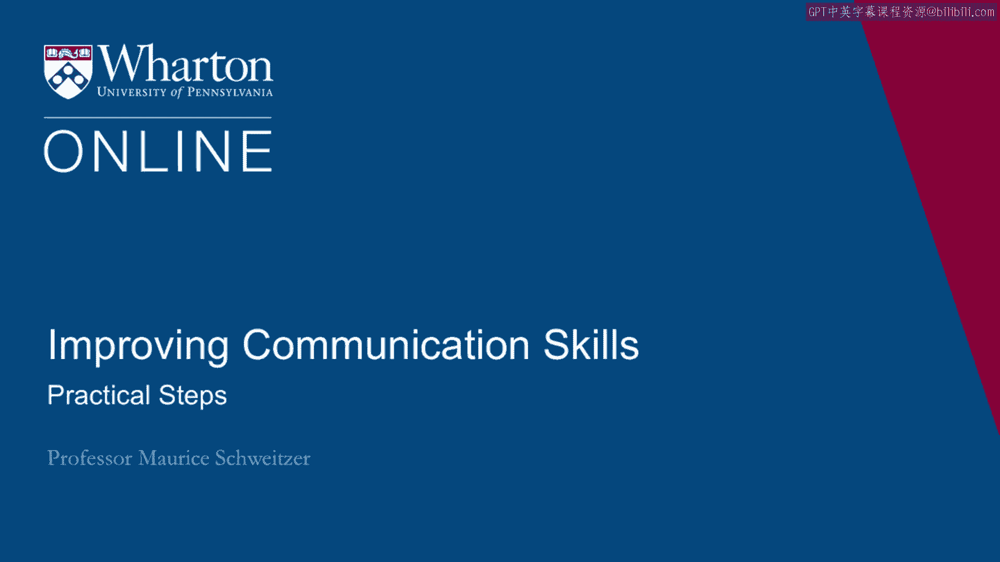
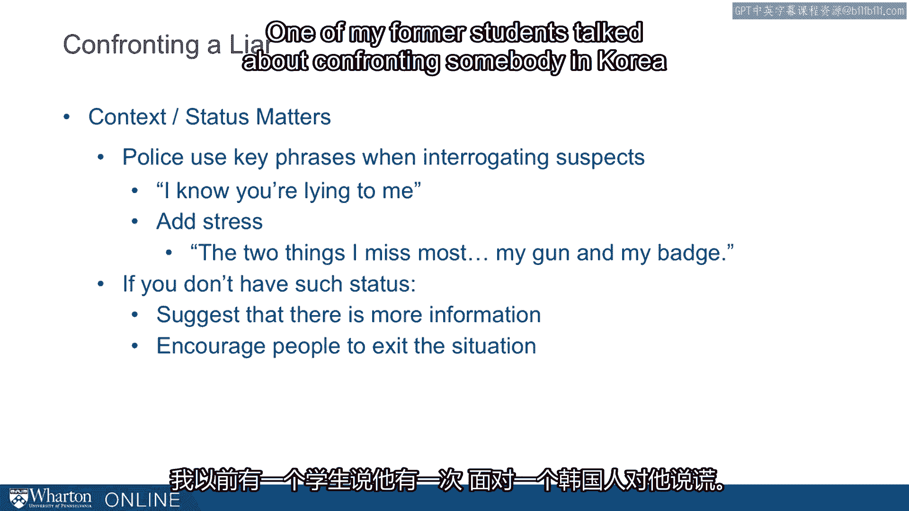

# 沃顿商学院《实现个人和职业成功（成功、沟通能力、影响力）｜Achieving Personal and Professional Success》中英字幕 - P47：19_实际步骤.zh_en - GPT中英字幕课程资源 - BV1VH4y1J7Zk

All right， let's think about some practical steps we can use for detecting deception and。

then figuring out what we can do once we suspect it or detect it。 So first。

I mentioned cognitive load。 Our cognitive load is very high when we're telling lies。

And if someone were to increase that further， I'm more likely to make mistakes。

So if we ask somebody we suspect of deception to perform a second task while they're talking。

to us， that increases cognitive load。 And for many people， pushes them over the edge。

They start making mistakes or leaking out other information。

You can think of something like trying to remember another additional information like。

another phone number or you hear other things in the background， like TV or talk radio。

sort of going in the background or you ask many questions about different topics。

It turns out when we try to remember things out of chronological order， that's very cognitively。

loading。 That is， it's easy for us， easiest for us in our minds， particularly if it's not true。

to describe a story in chronological order。 If we try to get things out of order。

we ask questions about things that go out of sequence。

people who are lying are likely to make mistakes。 Eye contact is something that also increases cognitive load as our detailed follow-up questions。

So who else was there？ What else happened？ Was the weather like outside？ For example。

that weather question， you're causing people to try to figure out what time， a day was it？

Was there a window in that room？ Was the weather like and so on？

So we can do things that increase cognitive load that can push people to make more mistakes。

particularly if they're lying。 Now， we can also meet in person。

Now meeting a person has a great advantage， not only is it more cognitively loading， but。

it allows us to assess nonverbal cues more accurately。

But it also can be an opportunity for a deceiver to gauge our gullibility more carefully as， well。

So we want to be careful about just meeting in person as a blanket prescription。 But in general。

I like the idea of meeting in person。 It also makes people less likely to lie。

they're more concerned about lying in person， and。

people become a lot less aggressive or hostile in person。 They're keyboard bullies。

I spent time with people who are investigating insurance fraud。

They're talking about these keyboard bullies that become Mika's lambs in person。

So sometimes when people are texting or emailing or tweeting， they might say one thing， but。

then in person they behave quite differently because they find the interpersonal dynamics。

much more anxiety provoking and they're more likely to be accommodating and trustworthy， in person。

So in general， I want to think about the environment。

The environment is really important for thinking about the cognitive load to know who else。

is listening， what's happening， who else is there。

So one of my key prescriptions is to meet in person， but also recognize that we're also。

leaking information as we meet other people in person。 Another key idea is to search broadly。

So we want to be sensitive to how people act in other domains。

So somebody who boasts you about how they cheat on their taxes or how they were deceptive。

to somebody else， but not you， should be something you should be careful about。

We can also do things like pretest with questions that we don't know answers to to see how forthcoming。

and how honest people are behaving。 So one of the key ideas。

we want to value and collect information from other sources。

So if it's really important information， we don't want to just trust one source。

We want to gather other information and recognize that deception is pretty common and we're not。

very good in social situations at detecting it。 Now if we can。

so suppose you're doing something over Skype or video conference， sometimes。

recording interviews allow us to go back and watch things。 So for example。

we can go back and watch a video with the sound turned off so that now。

we're just focused on the nonverbal cues and we can look for things that might seem a。

little bit off or seem a little bit weird。 There's also computer text analysis that people have used to do things like word counts to。

look at the use of negative statements or to look at things like a lot of irrelevant。

information that can give us other cues related to deception。 Again。

it's very difficult to detect in our natural communication。

Now suppose that we're confronting a liar， how should we do that？ Well。

the context and our relative status matters a lot。 So police， when they're interrogating somebody。

will say， "I know you're lying to me，" or the， polygraph I mentioned before will say， "Oh。

I know you're lying to me。"， But we can't always have that kind of dynamic。 In fact。

when I was talking to insurance investigators， a lot of them were former police officers who。

talked about the two things I missed most。 So when they were interrogating somebody that suspected of deception。

they said， "The two， things I missed most were my gun in my batch。"， And they said， "Yeah。

whenever I was connecting interrogation， I'd put the two of those things。

on the table that created anxiety and made people much more forthcoming。"。

There's sometimes other things we could do when we don't have that status。 We don't have that power。

What do we do then？ And there， for example， you're dealing with a customer or a potential partner。

we have， to do things that are a little bit softer than that。

And so we might do things like suggest， "Hey， maybe there's more you wanted to say。"。

Or I feel like there was something you wanted to add to that answer。

Or ask a follow-up question that allows people to elaborate or ask the same question in a。

slightly different way that gets people to repeat things。

In a way that suggests you're not completely comfortable with that answer， but without being。

as confrontational。 And we can offer people or encourage people to exit the situation in a way that allows。

them to save face so they're not likely to retaliate。

Because that's one risk when we confront somebody and tell them that they're lying to you， you。

can engage reactants as they come back and they get very angry， particularly if there's。

a loss of face。 One of my former students talked about confronting somebody in Korea who was lying to him。

And he said this Korean manager， once he confronted him and said that he was lying， had。

lost so much face in front of not just him but the entire group that he was talking to。

that they cut off relations completely。 So he had just meant to put things back on track。

but it turns out he'd blown up that， relationship。

So we need to be very tactful and we need to ask sometimes softer questions that allow。

people to come to us with a more forthcoming answer。 [BLANK_AUDIO]。
