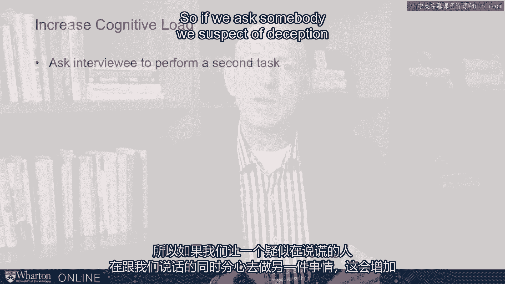

# 课程19：识别与应对欺骗的实用步骤 🕵️♂️

在本节课中，我们将学习一系列识别欺骗行为并有效应对的实用步骤。欺骗在社交和职场中并不罕见，但人们通常不擅长察觉它。我们将探讨如何通过增加对方的认知负荷、选择合适的环境以及运用巧妙的沟通策略来提高识破谎言的概率，并在怀疑或确认欺骗时采取恰当的行动。

上一节我们介绍了欺骗行为的一些理论基础，本节中我们来看看具体有哪些可以操作的步骤。

## 增加认知负荷

当一个人在说谎时，其大脑的**认知负荷**已经很高。如果我们能进一步增加这种负荷，说谎者就更容易出错。

以下是几种增加认知负荷的方法：

*   **要求执行双重任务**：在对方说话时，要求其同时完成另一项任务。例如，让其回忆一个额外的电话号码，或询问与当前话题无关的细节。
*   **打乱事件顺序**：要求对方以非时间顺序（如倒叙）描述事件。对于编造的故事，按时间顺序叙述最为容易，打乱顺序会显著增加认知难度。
*   **追问细节**：提出需要具体回忆的跟进问题，例如“当时还有谁在场？”或“外面的天气怎么样？”。这些问题会迫使对方在脑海中构建更复杂的场景，容易暴露矛盾。

## 选择沟通环境

沟通的环境对于识别欺骗和影响对方行为至关重要。

关于环境选择，有以下几点考虑：

*   **优先面对面交流**：面对面沟通不仅能更准确地评估对方的非语言线索（如肢体语言、微表情），其本身对说谎者而言就是更高的认知负荷。人们通常更不愿意当面撒谎，且当面交流时，人的攻击性往往会降低。
*   **注意环境泄露**：需意识到，面对面时我们也在向对方泄露信息。对方可能会借此评估我们的轻信程度。
*   **警惕“键盘侠”**：有些人通过邮件、短信等文字方式交流时可能更具攻击性或更不诚实，但在面对面时会表现得截然不同，因为人际互动的动态更让他们感到焦虑，从而更倾向于合作。

## 广泛搜集与交叉验证

不要仅仅依赖单一来源的信息，尤其是当信息非常重要时。

我们可以采取以下策略进行信息验证：

*   **观察行为一致性**：留意对方在其他领域的行为。如果一个人向你吹嘘他如何在报税或对待他人时耍诈，你就需要对他保持警惕。
*   **进行“预测试”**：提出一些你已知答案的问题，观察对方的回答是否坦诚、准确。
*   **利用技术辅助**：对于视频会议，可以事后回放录像，关闭声音以专注观察非语言线索。对于文字交流，可以借助文本分析工具，查看负面词汇的使用频率或无关信息的数量，这些都可能与欺骗相关。

## 巧妙应对与质询

当我们怀疑或需要面对一个可能的说谎者时，质询的方式需要格外讲究。直接对抗可能导致关系破裂。

根据情境和双方地位的不同，可以采取以下策略：

*   **高地位/权威情境**：如警察审讯，可以直接断言“我知道你在说谎”，利用身份和权力施加压力。
*   **平等或低地位情境**：在面对客户、伙伴或上级时，需要采用更柔和的方式：
    *   **暗示性提问**：例如，“我觉得你好像还有些话没说完？”或“关于这一点，你还有什么想补充的吗？”
    *   **变换方式重复提问**：以略有不同的方式询问同一个问题，让对方重复叙述，从中寻找破绽。
    *   **给予保留颜面的出口**：为对方提供一个可以“体面退出”的选项，避免其因丢面子而产生激烈的抵触或报复心理。例如，可以表示“也许我们之间存在一些误解”。

---

本节课中我们一起学习了识别与应对欺骗的多个实用步骤。核心在于通过**增加认知负荷**（如要求双重任务、打乱叙述顺序）来促使说谎者暴露破绽，并重视**沟通环境**（优先选择面对面）的影响。同时，我们应养成**广泛搜集和交叉验证信息**的习惯，并在质询时根据双方地位灵活采用策略，**以柔和的提问代替直接对抗**，并为对方保留颜面，以维护重要的人际关系。记住，目标是辨明真相并有效解决问题，而非赢得一场对抗。