# 沃顿商学院《实现个人和职业成功（成功、沟通能力、影响力）｜Achieving Personal and Professional Success》中英字幕 - P48：20_违规行为的本质.zh_en - GPT中英字幕课程资源 - BV1VH4y1J7Zk

To understand how we can repair relationships， it helps to start by understanding the nature。

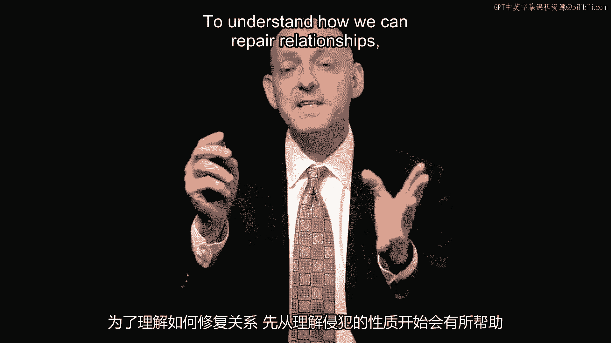

of violations。 And I was talking to the story about Kayleen Sosa。

She was a one and a half year old。 She was horse around at home。 She'd climbed up a couch。

was playing with her brother。

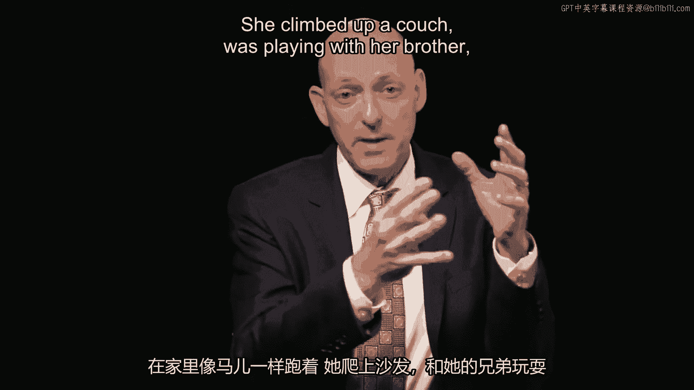

She fell off from the couch and hit her head。

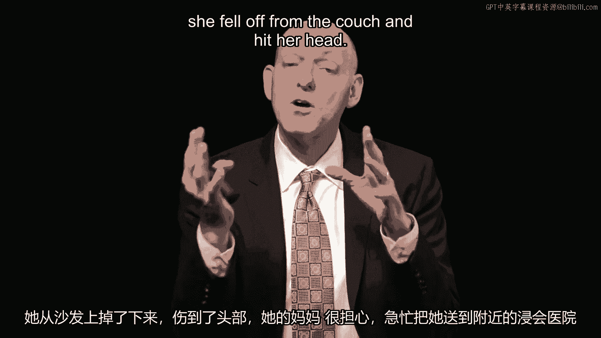

Her mom was so worried she rushed her to Baptist Hospital， the nearby hospital。

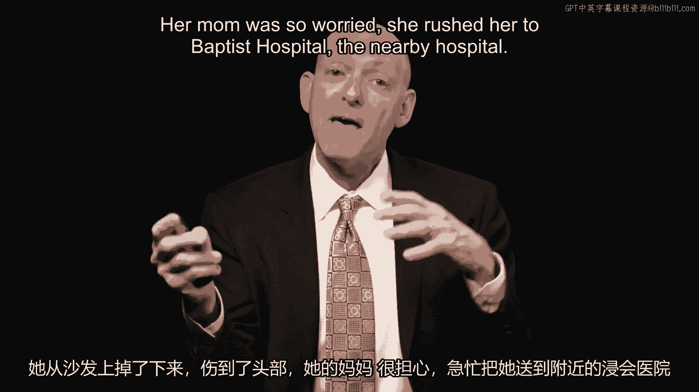

And next day was inconclusive。 They decided to do an MRI。

so they sedated her so that she would sit still。

One and a half year old's aren't great at sitting still。

And they put a breathing tube in her to make sure she'd get enough oxygen。

Turns out the breathing tube became dislodged。

She suffered permanent brain damage。 What's interesting about this story is that the Sosa's never sued the hospital。

They ended up becoming advocates for the hospital。 And Aussie Sosa， the father。

said that he completely forgave the hospital。

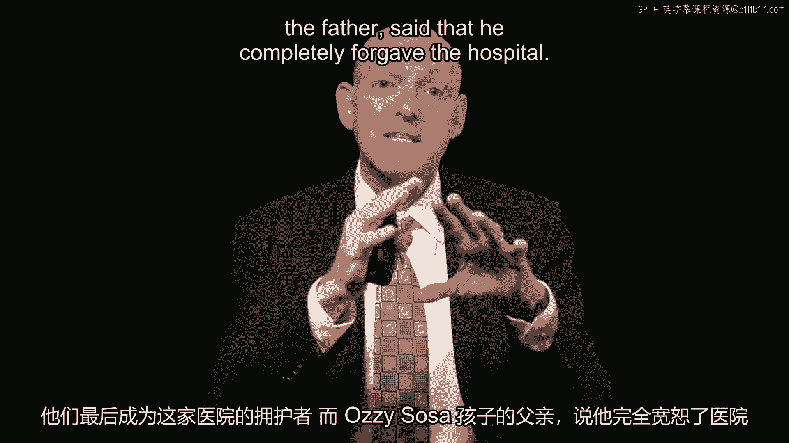

This is a remarkable transformation。 That is， when they could have easily sued for substantial sum of money。

they could have， become fierce adversaries。 They actually became collaborative friends。

And they did this because of the nature of the violation and the way Baptist Hospital。

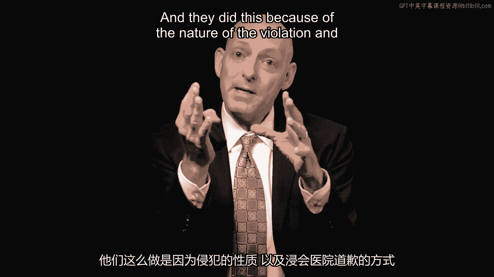

apologized。

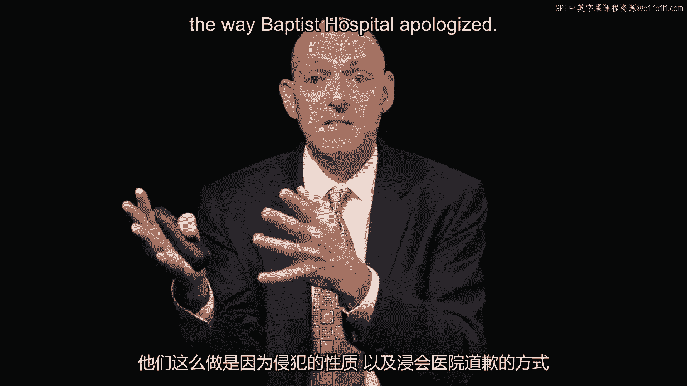

So we first think about some other violations。 And when it characterizes violations as being very substantial。

we'll call them core violations。 They strike at the very core or essence of that relationship and non-core violations。

Less critical violations。 So first we'll go to Elliot Spitzer。

Elliot Spitzer was the governor of New York。 He built an incredible record of prosecution。

A lot of prosecution of white collar crime。 And that included prosecuting prostitution rings。

He became the governor in 2007。 And he was known as Mr。 Clean。

And he promised this bringing ethics and integrity to the governor's house。

Now he ran a very clean campaign。 He was known to have these incredibly high ethical standards until it all came crashing。

down。 It turns out that Spitzer had been partaking in the very kind of crime he had been prosecuting。

He had paid a substantial sum of money to the Emperors Club VIP。 This prostitution ring。

this upscale prostitution ring， he ended up over a period of seven years。

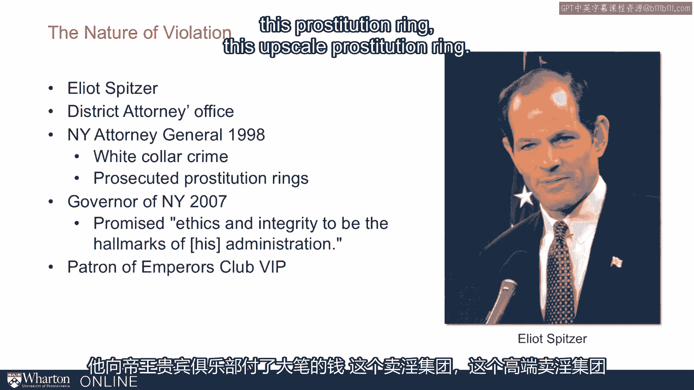

and actually very carefully figured out how to give them small amounts of payments that。

amassed sort of almost $80，000 total。 So here he ends up falling from grace because he had been soliciting。

he had been participating， in some of the very activity he had also been prosecuting。

So he ends up resigning from the governor's position。

And he tries to rehabilitate his reputation and just how damaging this was。 That is。

this is a core violation。 It strikes at the very heart of the relationship。 He is known as Mr。

Clean。 And yet this violation really represents the essence of who he is and his relationship。

to the voters in New York。 Five years later， he's running to be a city comptroller。

a relatively minor office。 He says， "I'm hoping there will be forgiveness。 I'm asking for it。"。

He doesn't even make it through the primary。

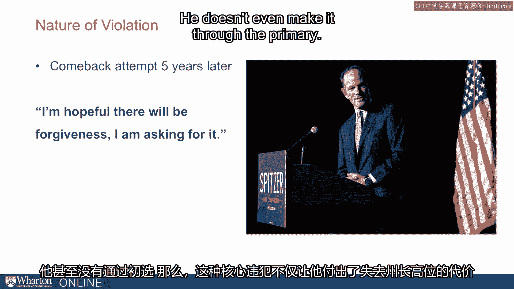

So here this core violation not only costs him his high perch as the governor， but it。

means years later he's still unable to get traction even for a relatively minor office。

Next we can think about David Letterman。 David Letterman on the Late Show。

a late night talk show host and comedian。 And here he seems to make everything funny。

Now he faced some sexual misconduct of his own。 It turns out that he was accused of sexual harassment。

having sexual relationships with， interns and staff。 But he's able to transform this into a joke。

He talks about how I got into my car this morning and not even the navigation lady would speak。

to me。

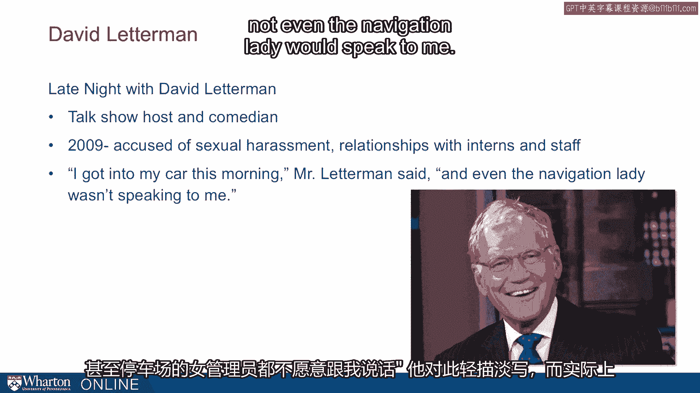

So he's making light of this。 And actually this inappropriate behavior turns to be a bump in the road for David Letterman。

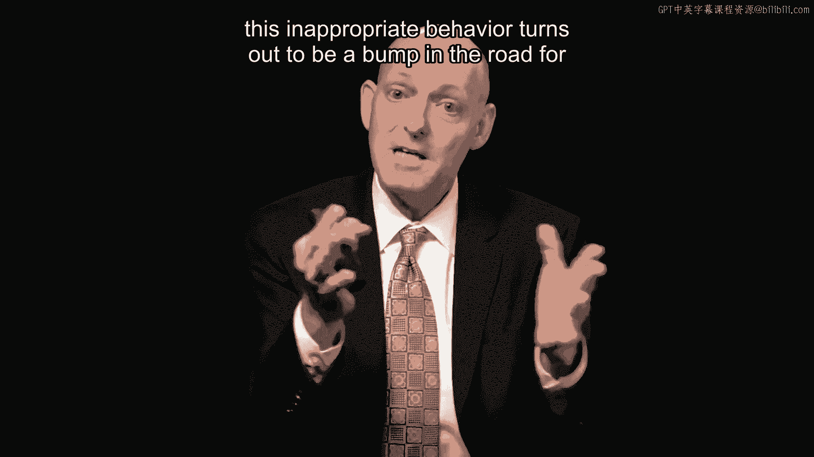

but it was terminal for Elliot Spitzer。 That is the relationship we have with David Letterman is as an entertainer。

as a comic， and he maintains that form and this violation doesn't derail us from the relationship that。

we have with him。 Now similarly Martha Stewart accused of insider trading。

she ends up going to prison。

Now insider trading however， it's serious financial wrongdoing and she lied to investigators。

That's what really tripped her up。 While she's in prison she ends up doing just fine。

Her Kmart products are selling well。 That sales in her magazine Living Turnout to be Fine。

Her inter-paint line is doing well and on a media stock it took an initial hit but it。

rebounds while she's in prison。

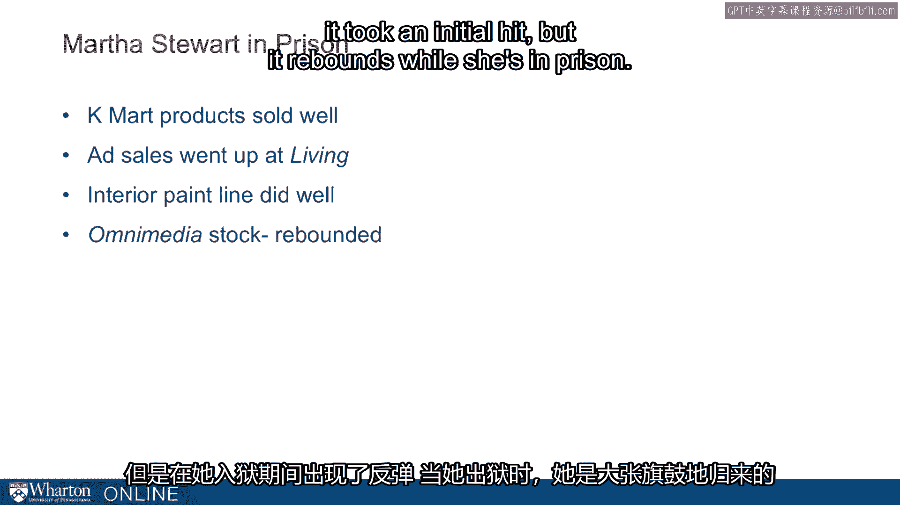

And when she gets out of prison she comes roaring back。 So she gets a show on the apprentice。

she goes back on daytime television， she ends， up doing very well。

This transgression is not a core violation for her。

We turn to Martha Stewart for advice about what colors to use， how to decorate our homes。

how to cook meals。 That style advice she still got and this is a non-core violation。

Now in contrast， when Arthur Anderson accounting ran into trouble that turned out to be terminal。

That was a core violation。 They built a brand for integrity not just a lasting name。

she's a lasting name， a lasting， name。 And Anderson was their brand。

They were signing off on accounting statements and companies turned to them for that verification。

but they signed off on misleading documents and worse they ended up shredding a bunch of。

these documents in 2002 for Enron。 Now it turned out to be people made light of this too。

I see from resume you spend time working at Anderson and here this resume is half shredded。

Now that's a little bit funny but it wasn't funny for Arthur Anderson accounting。

Anderson accounting was finished。 That violation meant that companies could no longer go to Anderson for trusted verification。

of their accounting statements。 That's a core violation。

So I think about when trust can be repaired and I want to argue that even serious violations。

like with the Sosa family can be repaired but that requires serious work and a very carefully。

crafted apology that requires both words and actions。

But when we think about these violations their core violations that struck at the very core。

of who you are and what your relationship is and non-core violations。

So for Arthur Anderson accounting that's a core violation。

For Martha Stewart that's a non-core violation。 For Spitzer it's a core violation that as we care about that integrity that was his。

brand that was his campaign it's a core violation he can't recover but for David Butterman it's。

a non-core violation。 Now more broadly we think about competence and benevolence or integrity violations。

When it's a competence violation we felt short that is we just didn't have the capability， to do it。

Those violations people are more easily forgiven。 As we forgive people for falling short if they were trying but what we feel is if it。

was an integrity violation they had bad intentions and remember with Arthur Anderson accounting。

that shredding demonstrate some intentionality that's they were trying to cover things up。

that cover up suggests that they actually had bad intentions and it's much harder to recover。

from bad intentions。

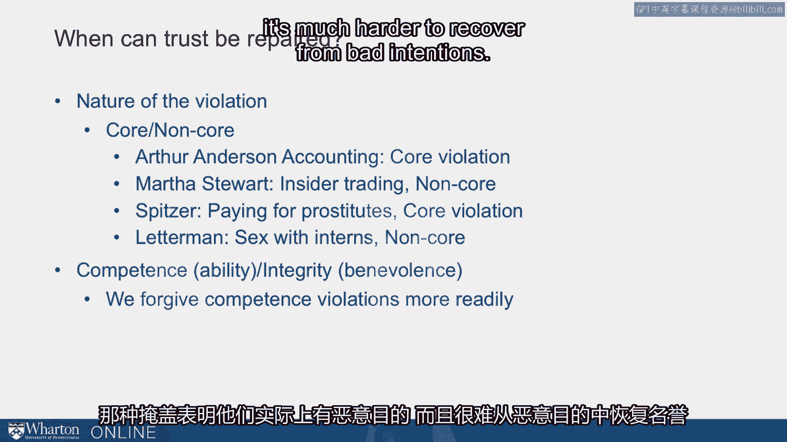

So the idea is that we have core violations non-core violations and we want to think about。

the competence and the integrity parts。 [BLANK_AUDIO]。

