# 沃顿商学院《实现个人和职业成功》课程笔记 P49：从糟糕的道歉中学习 🧠

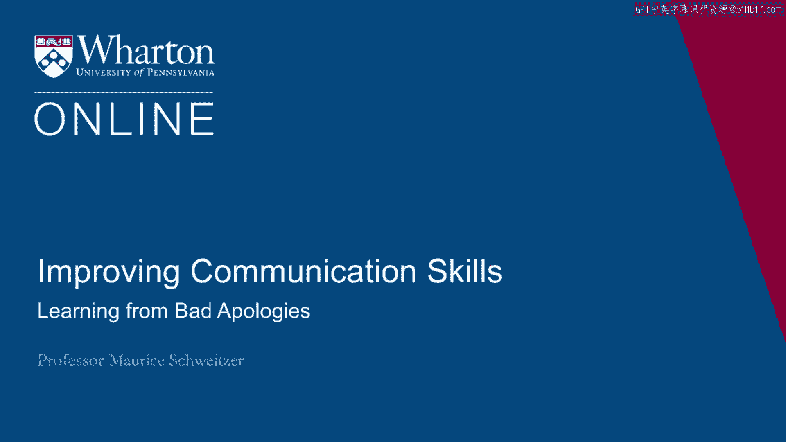

在本节课中，我们将通过分析几个著名的失败道歉案例，来学习如何避免在危机沟通中犯下同样的错误。我们将探讨道歉失败的核心原因，并提炼出有效的道歉应遵循的关键原则。

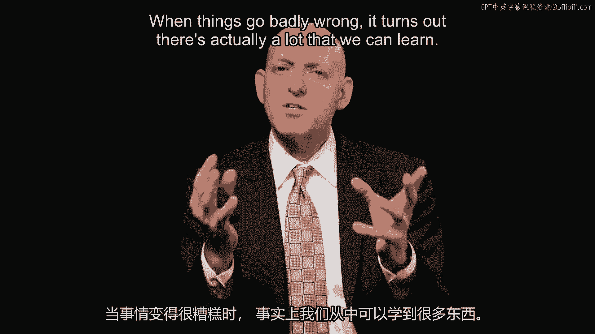

---

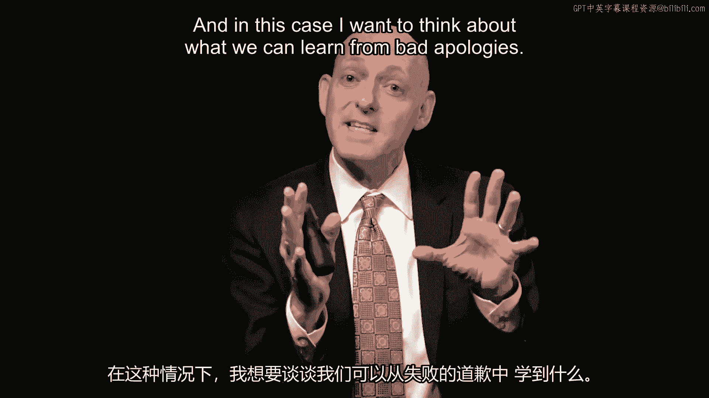

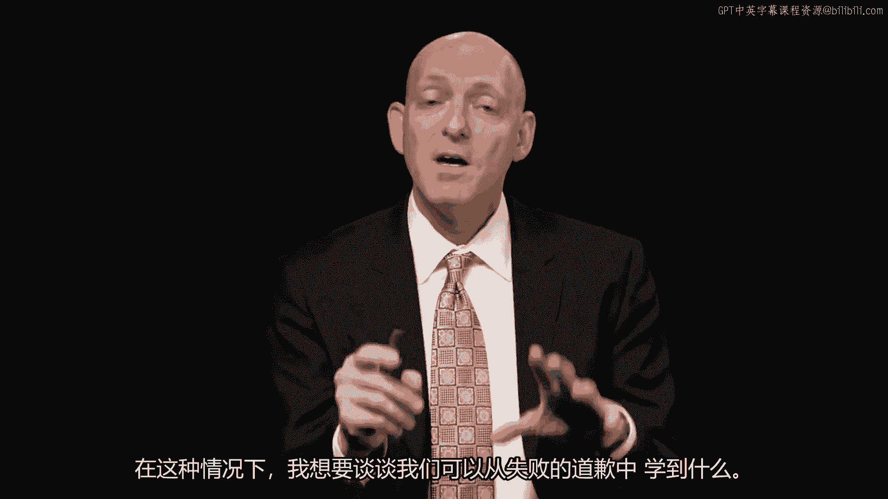

当事情变得非常糟糕时，事实证明我们实际上可以学到很多东西。

在本案例中，我们将思考能从糟糕的道歉中学到什么。

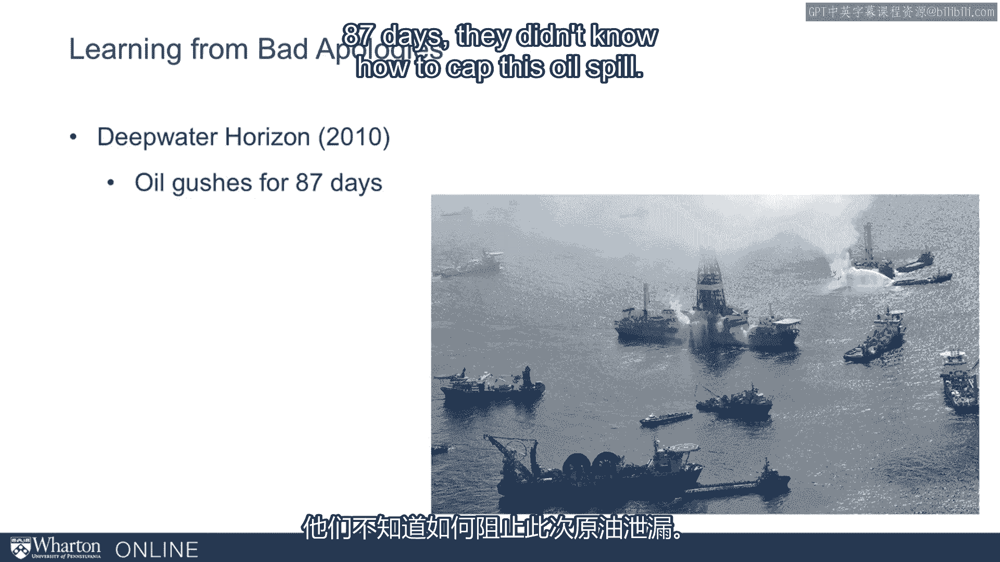

## 案例一：英国石油公司（BP）漏油事件 🌊

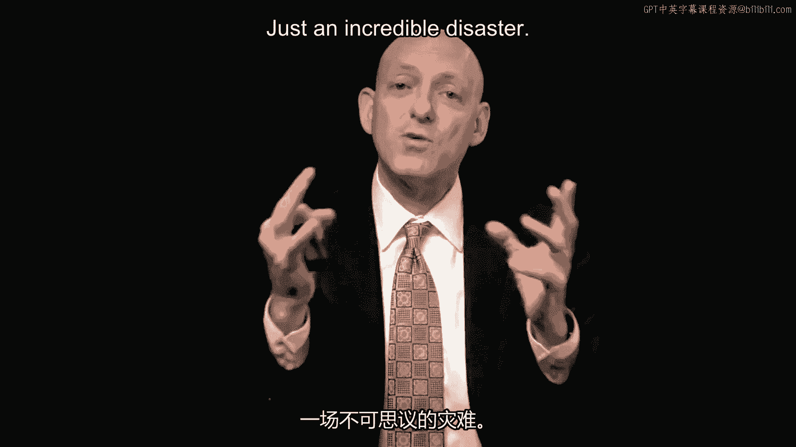

2010年，我们目睹了本世代最严重的环境灾难之一。

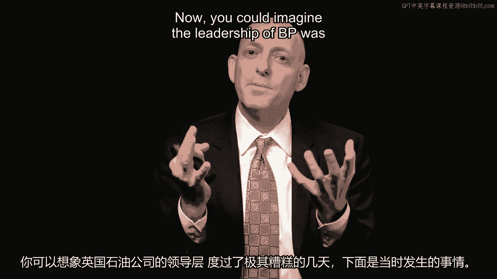

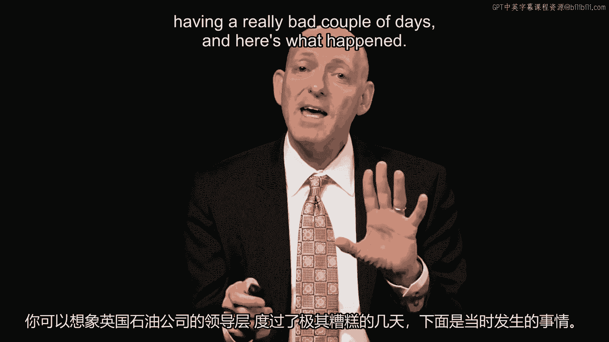

“深水地平线”石油泄漏事件持续喷油87天。当时人们不知道如何封堵这次漏油。

在最初的爆炸中，有11名工人丧生。这是一场难以置信的灾难。

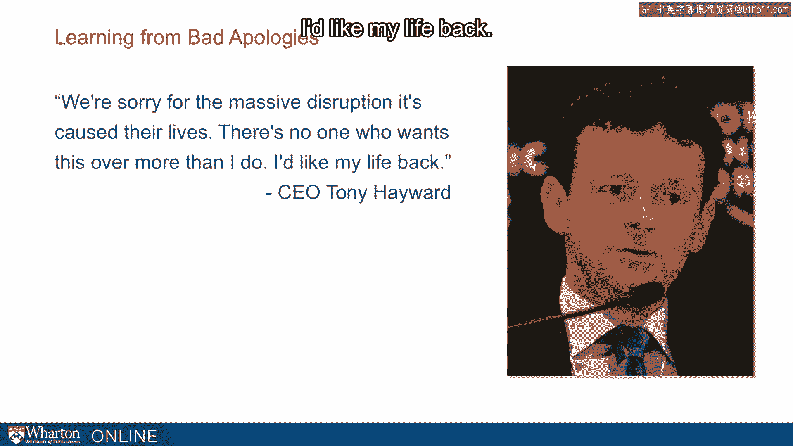

可以想象，英国石油公司的领导层度过了非常糟糕的几天。

以下是当时发生的情况。首席执行官托尼·海沃德说：

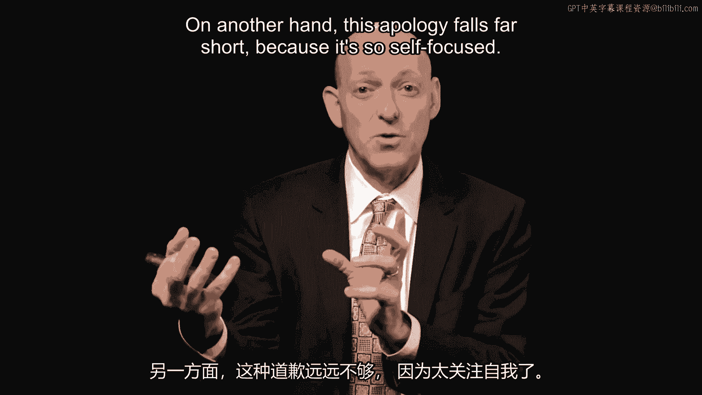

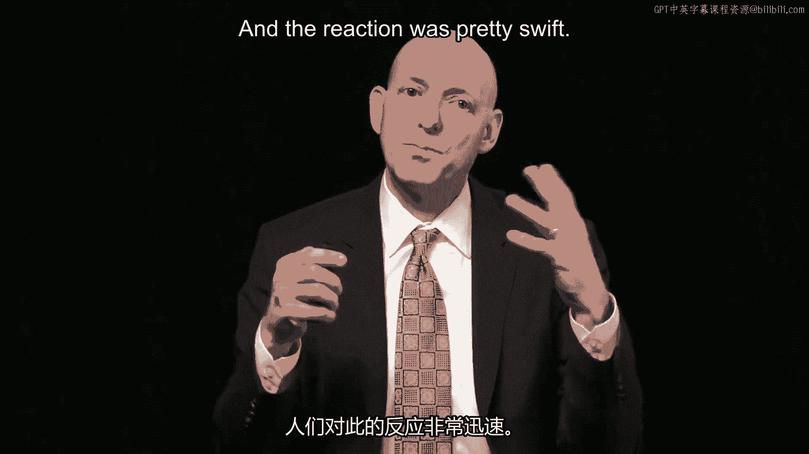

> “我们为造成的巨大混乱和（对他们）生活的影响感到抱歉。没有人比我更希望这一切结束。我想要回我的生活。”

这就是托尼·海沃德。

一方面，我们可以理解他当时的日子不好过。另一方面，这个道歉远远不够，因为它过于以自我为中心。

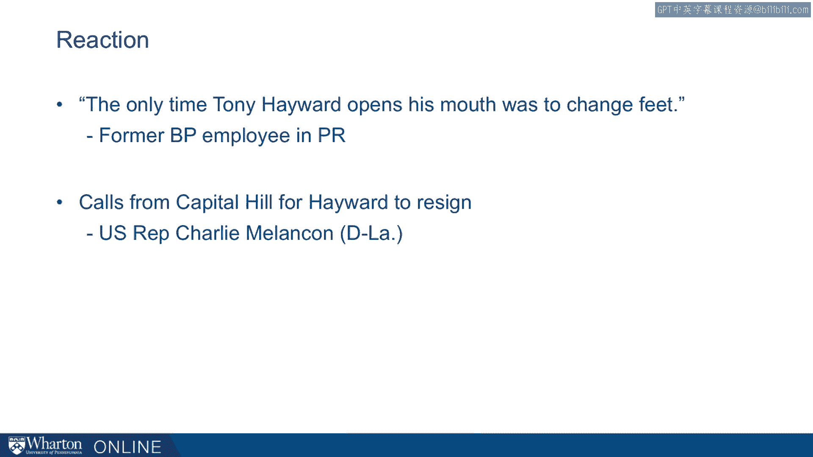

外界的反应相当迅速。

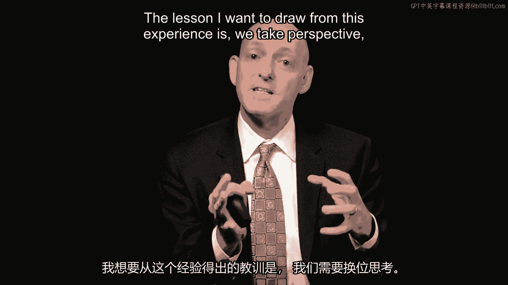

即使是英国石油公司的员工，一位从事公关工作的人也说：“托尼·海沃德每次开口说话，都是为了把脚塞进嘴里。”这句话语法上并不完美，但它确实抓住了这个道歉有多么糟糕的本质。

美国国会山甚至有人呼吁海沃德辞职。事实上，他最终确实丢掉了工作。

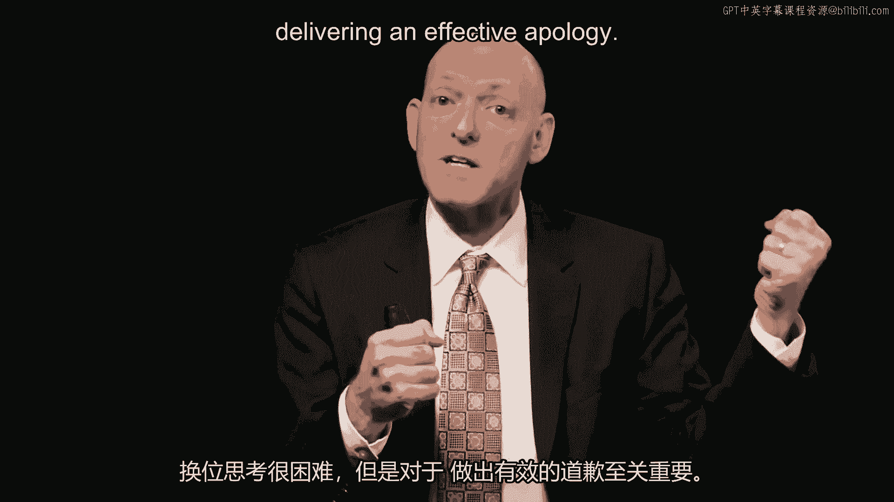

从这个经历中，我们可以吸取的教训是：**我们需要换位思考**。

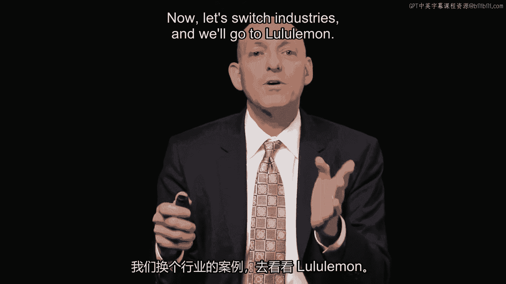

也就是说，当我们自己处境糟糕时，别人的处境可能更糟。这种换位思考虽然困难，但对于做出有效的道歉至关重要。

## 案例二：Lululemon瑜伽裤面料问题 👖

现在，让我们换个行业，看看Lululemon的例子。

Lululemon在2013年遇到了面料密度问题。以下是董事长兼创始人奇普·威尔逊当时的说法：有些女性的身材就是……实际上不太合适。

这有点可笑，因为我们通常认为裤子应该适合人，但他似乎在暗示：“也许人应该去适合裤子。”

他后来向员工道歉说：“我很抱歉让你们经历了这一切。”

这个道歉是针对员工的，而不是针对顾客。因此，这里我们再次看到，**换位思考是困难的，我们需要考虑对方的视角，并且道歉的对象很重要**。也就是说，谁接受这个道歉至关重要。

## 案例三：泰格·伍兹的婚姻危机 ⛳

好的，让我们再次转换话题。这里我们要谈谈泰格·伍兹。

泰格·伍兹的婚姻出现了一些问题，他在道歉中猛烈抨击了媒体。

> “我沮丧地意识到，小报会做什么真的意味着什么。”

不过，在最后，他确实说：“我致以深切的歉意。”这是2009年的事。

这个道歉有趣且不足之处在于：就在他发表这个道歉之后，当他的处境似乎非常糟糕时，他却乘着他的游艇出海了。随后，大量媒体注意力都集中在了这艘价值2200万美元的游艇上。它长155英尺，配有私人按摩浴缸和电梯等设施，讽刺的是，这艘游艇的名字叫“隐私”。最终，人们的焦点落在了游艇和他的这次逃避上。

这个道歉的问题和缺点之一是，它最终失败恰恰是因为**我们在乎忏悔**。也就是说，当一个人真正感到悔恨时，我们期望他受苦或为此付出代价。而在这里，泰格·伍兹所做的似乎恰恰相反。

## 案例四：1999年欧洲可口可乐污染恐慌 🥤

现在，我要跳到1999年的可口可乐事件。

在欧洲，事件始于一名小男孩报告感到头晕和有点恶心。随后，其他人在饮用可口可乐后也开始提交类似的报告。

这些关于头晕的报告传播开来，似乎问题出在安特卫普一家工厂的二氧化碳上。

如果你是可口可乐公司，你会怎么做？当时的首席执行官道格拉斯·艾夫斯特说：“嗯，我们想保持低调。我们想看看这件事是否会过去。”

然而，就在他犹豫不决、等待观望的时候，媒体抓住了这件事。它被大肆渲染。

等到事件结束时，有5000万件产品从货架上撤下，在法国、德国和比利时被丢弃。

这里我想思考的教训是：**速度很重要**。你不能只是等待事情过去。你不能等待最终内部调查的结果。你需要更积极主动，并且你的形象很重要。

这里涉及一种心理契约，你不仅要为契约的条文负责，还要为人们的期望负责。在这个案例中，人们期望更多。他们期望看到你在乎、你关心、安全第一。而对于饮用可口可乐产品的顾客来说，情况似乎并非如此。

## 案例五：大众汽车（VW）排放测试作弊事件 🚗

快进到另一个失败的道歉。这是大众汽车。

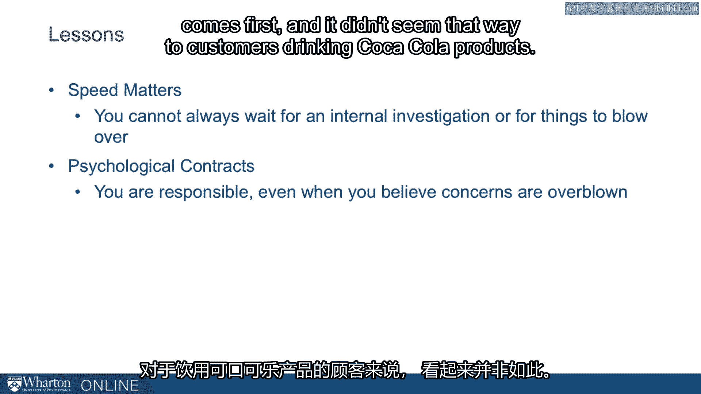

大众汽车被发现在排放测试中作弊。随后，大众汽车美国分部的负责人被拖到美国国会作证。

他在那里进行了道歉，但这只是一个半心半意的失败道歉。

首先，去的人是谁？是美国分部的负责人，而不是公司的总负责人。我认为，我们需要公司的总负责人。我们想真正弄清楚发生了什么。我们需要一个坦诚、清晰的道歉。

这个道歉在几个方面存在不足。一是**推卸责任**：“这不是公司的决定。汽车驾驶是安全的。我们不太确切知道会发生什么。召回和处理过程可能需要数年时间。”

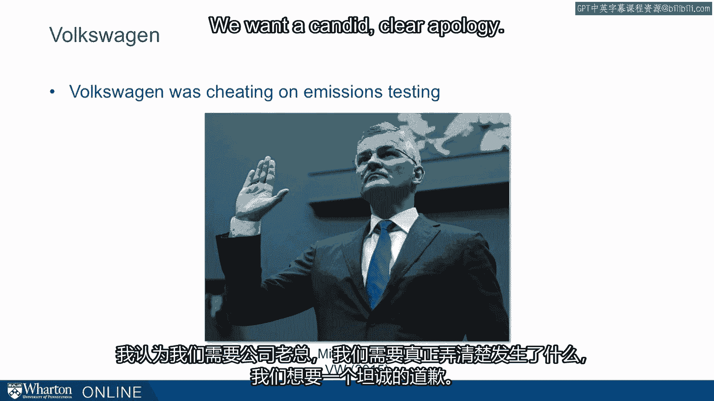

发生的另一件事是，首先他说自己并不是真正负责的人，所以这让人感觉是一个有限的道歉。去那里的不是大众汽车的总负责人。

第二部分是**没有改变的承诺**。我们真正想做的是了解大众汽车打算怎么做，我们需要一个清晰、可信的改变承诺。在这个案例中，这几乎肯定需要引入外部机构进行监督。

## 总结与核心教训 ✅

从这些失败的道歉中，我们可以总结出一些核心教训：

以下是有效道歉应避免的陷阱和应遵循的原则：

1.  **避免自我中心**：道歉应关注受害者的感受和损失，而非道歉者自身的困境。公式：**有效道歉 ≠ “我很难过” + “我想要…”**
2.  **精准定位道歉对象**：必须向所有受影响的利益相关方道歉，而不仅仅是内部员工或单一群体。
3.  **展现真诚的忏悔与代价**：口头道歉需配合可见的、相匹配的补救行动或牺牲，以证明悔意。
4.  **迅速主动回应**：危机中等待和观望会加剧信任崩塌，必须快速、主动地承担责任和沟通。
5.  **承担全部责任并承诺改变**：避免模糊或推卸责任（如“这不是公司决定”）。道歉必须来自最高负责人，并包含具体、可信的改进计划和外部监督承诺。

---

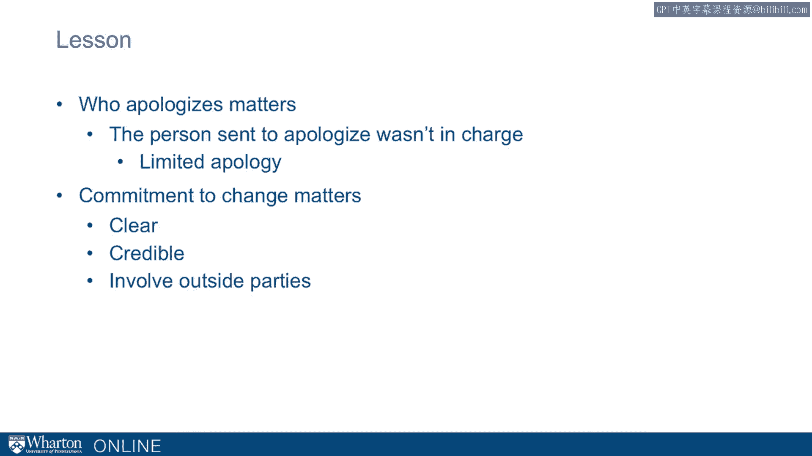

本节课中，我们一起学习了从英国石油公司、Lululemon、泰格·伍兹、可口可乐和大众汽车等案例中糟糕的道歉所能汲取的深刻教训。关键在于学会**换位思考**、**精准沟通**、**迅速行动**、**真诚担责**并给出**明确的改变承诺**。掌握这些原则，能帮助我们在个人和职业生活中，更有效地处理错误、修复关系并重建信任。