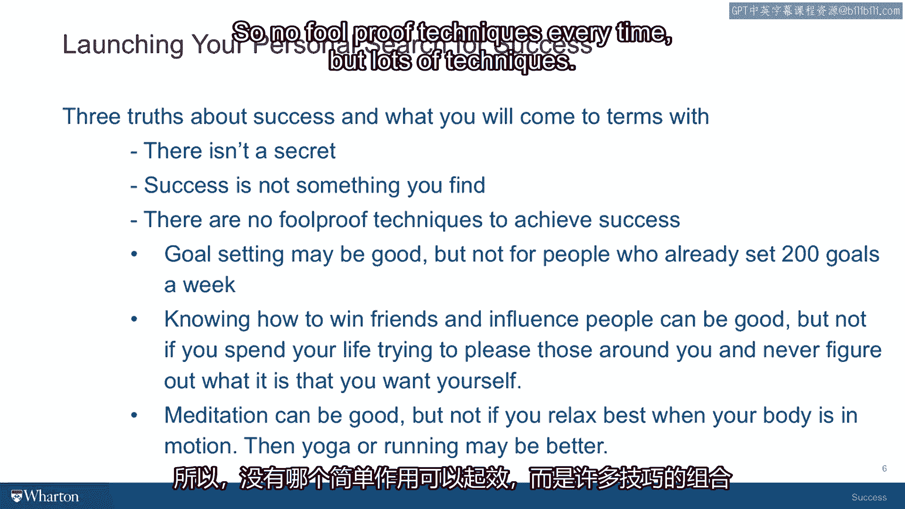

# 沃顿商学院《实现个人和职业成功（成功、沟通能力、影响力）｜Achieving Personal and Professional Success》中英字幕 - P5：4_关于成功的三个真理.zh_en - GPT中英字幕课程资源 - BV1VH4y1J7Zk

In this session we're going to talk about three truths about success that I hope you'll。

come to terms with as the course goes along。 These are three very important things that often people get confused about。

So the first is really the most important of the three。 Many people。

because they've read books or seen movies about success， have the impression。

that there is some single secret to success， that if they're only able to uncover it， that。

it'll answer all the questions， all the problems will be resolved and that life will be a completely。

rosy experience from there on。 And the truth about success is much more complicated。

It's not a secret。 It's complicated because the answer to these questions lies within you。

not outside you。 And I think it's always simpler for we humans if we can just put ourselves on a quest and。

then go look for the tallest mountain or the most exotic plant and then we can say， well。

we found it， we're successful。 Unfortunately success is something that you carry with you。

It's a wonderful book by an author named Ram Das， the title of the book is， no matter where， you go。

there you are。 And when it comes to success， I think that's more of the truth than that it's out there。

someplace。 So no secrets。 This is all going to be stuff that you find on your own in yourself that I think will give。

you a higher sense of confidence in what it is that you're striving toward。 Just to underline that。

the second truth is that this is not a quest of discovery as much， as it is a quest to recognize。

To recognize the patterns that you already have within you， to recognize the values that。

you're striving to accomplish， these values may come from your family， they may come from。

your culture， they may come from a religion。 And recognizing them means understanding and finding the familiar。

the value of say， compassion for others。 Recognizing that you were taught that but that you sort of forgot it in your quest to。

get to the top of the ladder or to cure some drug disease and you've now got a chance to。

think and go， you know what， I see that value inside me， I now can honor it in a different。

way and it doesn't mean you have to stop looking for the cure for the disease， it just。

means that you bring this value， whatever it might be， compassion is an example。

And bringing along with you， it doesn't take any more time to do that， it just brings a。

deeper understanding to your relationships when you do it。 So it's about recognition。

not about finding new things you've never thought of。

And then the third truth that I hope will uncover as the course goes along is that there are。

no single foolproof techniques that work every time to achieve whatever the success value。

is that you've decided to embrace。 In the how to succeed market， if you go to any bookstore。

go online and look at Google， the word success， you're going to find just both loads of books on how to succeed and。

almost all of them are going to provide this template of one true path。

The one true path may be goal setting。 The one true path may be social skills。

The one true path may be mind power and visualization and the power of your imagination to bring。

things into reality。 Again， all these things may be perfectly relevant and they may be very useful to you。

But the chances are pretty high that you're going to use your own unique combination of。

them with your own unique experiences and capabilities to build on them and what works。

for the person who lives next door to you who needs to learn how to set goals will not。

work for you because you already set 200 goals a day and you're going to be trying to figure。

out how to relax and focus on three goals。 So no foolproof techniques every time but lots of techniques your goal is to try to adapt。

or yourself the tools that will work uniquely well for you to achieve whatever your success。

goals are。 They may be internal goals， they may be external goals or a combination of the two。

I think as the course goes on you're going to get a richer sense of how those two play。

against each other and sort of fold in and integrate with each other。

So we'll be addressing some of these issues in our next session。 Thank you。 [BLANK_AUDIO]。

