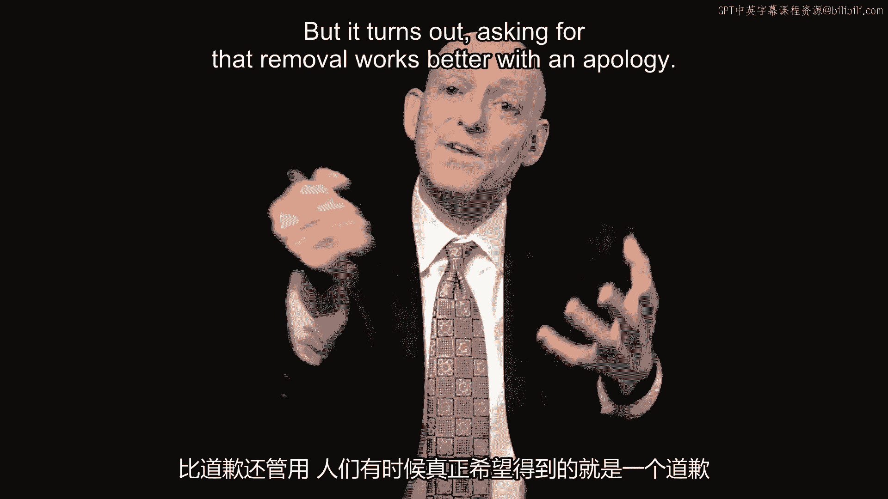
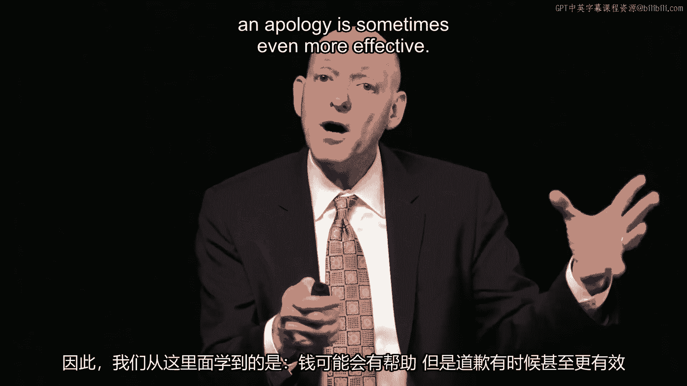
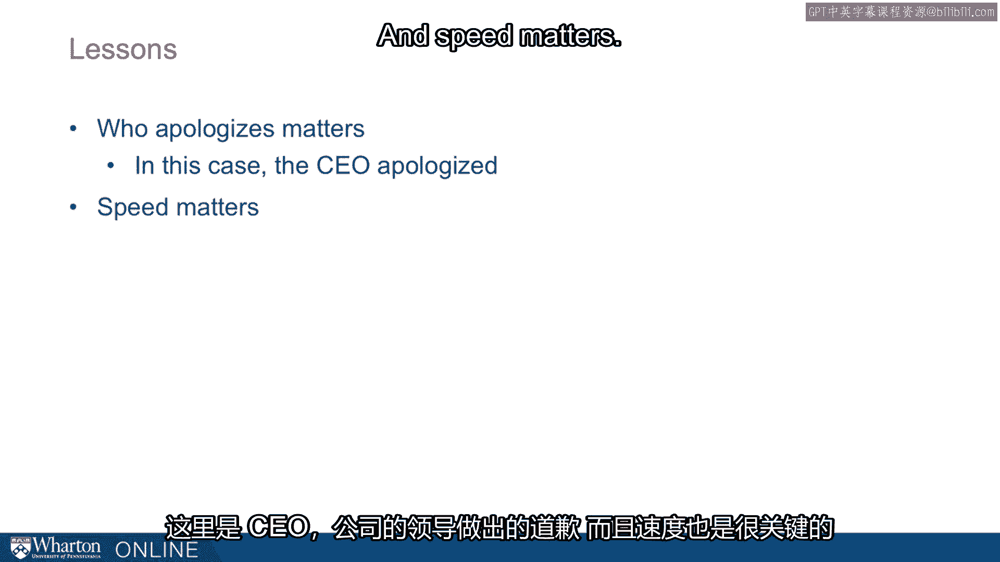
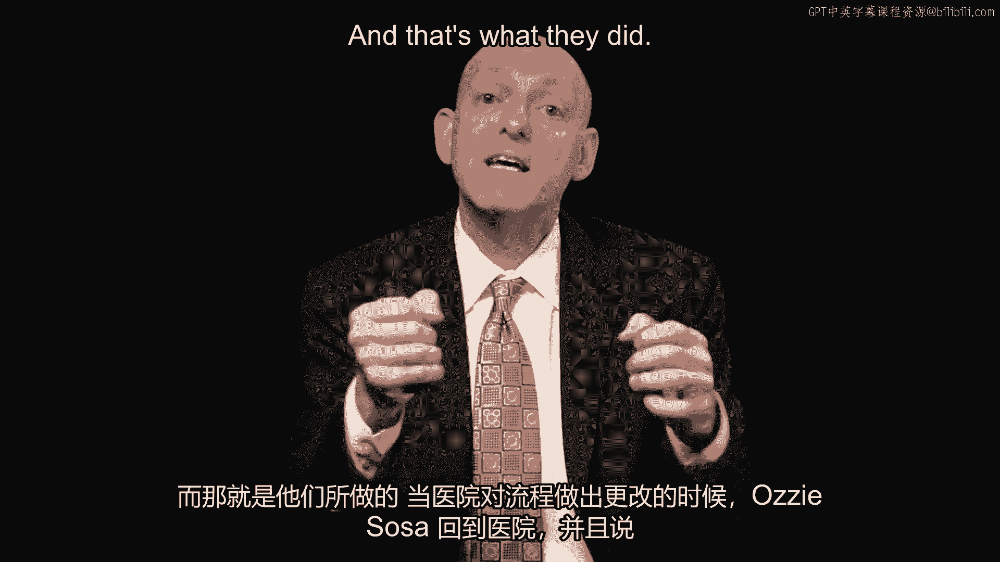

# 沃顿商学院《实现个人和职业成功》课程笔记 P50：道歉公式 🧩

在本节课中，我们将学习如何构建一个有效的道歉。通过分析真实案例，我们将了解为什么道歉有时比金钱补偿更有效，并总结出有效道歉的三个核心要素。

---

让我们将这些信息整合起来，思考一下道歉的公式应该是什么。

我将从一个研究开始。这项研究针对的是德国eBay用户。

当时有632名客户发布了一些负面反馈。正如大多数人所知，在线系统中的负面反馈影响很坏。

这些客户被联系，并被请求撤销他们的负面反馈。

其中一半人收到了道歉。道歉的内容是：“我为此道歉，并询问您是否可能撤销您的评价。”

结果有45%的人撤销了他们的批评性评分。另一半人没有收到道歉，但他们收到了现金返利。这是作为一种善意姿态提供的，然后询问他们是否愿意撤销评价。

结果这里只有21%的人撤销了评价。有趣的是，从经济学角度看，我们会想：“难道钱不比道歉更好吗？”但事实证明，请求撤销时，道歉的效果更好。

人们有时真正想要的只是一个道歉。

因此，我们从中学到的是，金钱可能有帮助，但道歉有时甚至更有效。

我想思考另一个极其有力的案例。

这里说的是西南航空，他们的首次致命事故，涉及一次在米德韦机场的坠机。当时路面结冰。

飞机着陆后冲出了跑道。那里有一个登机口，飞机冲过了登机口，进入一个十字路口，撞到了下面的汽车。

在这次首次致命事故中，西南航空的首席执行官加里·凯利道了歉，他的道歉有效且迅速。在当时，由首席执行官亲自道歉是不寻常的。

所以他站了出来，他的反应在几小时内就做出了。他表达了哀悼。

他带着他的应急团队，94名应急团队成员和他一起飞往芝加哥，他发表了诚挚的道歉：“言语无法充分表达我们的悲痛和悲伤。”

他的反应被媒体描述为迅速且充满关怀，从各方面看都似乎非常有效。

我想思考这里的教训，即**谁道歉很重要**。

我们之前讨论过大众汽车的案例。这里是首席执行官，是领导者在道歉，并且**速度很重要**。

我之前提到过卡琳·索萨的案例。现在我想指出的是，是这位急诊护士首先注意到了问题。

卡琳·索萨的情况是，她的呼吸管脱落了。

她最终缺氧，而道歉在这种情况下能够完全修复关系。

为什么？

因为道歉迅速、完整，这个案例真正有趣的地方在于，道歉计划是在**制度层面**制定的。

也就是说，组织承认了承诺。他们有一个清单，列出了如果出现失误人们应该做什么。

如果出现失误，人们应该迅速道歉，对整个程序失误保持坦诚，主动联系，了解家属，他们正是这样做的。当他们改变程序后，奥西·索萨（卡琳的父亲）实际上回来说：“我对这些改变印象深刻。”

他们最终为医院制作了安全视频。

他们没有起诉，而是与索萨家庭进行了调解和解。

这就是一个良好道歉能起到的作用。它们可以根本性地改变看法。

言语很重要，正如我们在eBay研究中看到的，言语出奇地有效，但行动也很重要。

就像浸信会医院改变程序那样。以下是浸信会医院所做的。

他们进行了**全面披露**。他们解释了发生的事情。

他们立即来到家属面前，提供了完整的说明。

他们调解达成了一项和解，其中包括终身免费的物理治疗。

他们与家属一起制作了视频，当奥西·索萨（父亲）回来见证所有改变时，他说：“我完全原谅了这家医院。”

那么，是什么让道歉有效呢？

我想强调三个关键理念。

第一个是**坦诚**。我们需要全面披露。浸信会医院做到了，这与大众汽车的做法相反。我们需要**迅速的道歉**。西南航空迅速道歉，而可口可乐则在等待事情平息。

第二个关键理念是**悔意**。

**谁道歉**有助于传达这种悔意？是首席执行官还是权威性较低的人？

我们希望看到**遗憾的表达**。西南航空做到了，露露柠檬没有。

道歉是否**以他人为中心**？也就是说，我们是否关注受到伤害的人？同样，西南航空在这方面做得很好，英国石油公司则在这方面挣扎。

以及**补偿**。谁在为此付出代价？浸信会医院支付了终身护理费用吗？泰格·伍兹看起来并没有遭受太多损失。这就是悔意。

第三部分是**改变的承诺**。浸信会医院承诺改变，他们实施了改变。大众汽车尚未做到这一点。

---

本节课中，我们一起学习了有效道歉的构成要素。通过eBay研究、西南航空和浸信会医院等案例，我们了解到一个有效的道歉需要具备**坦诚**（迅速、全面的披露）、**悔意**（由合适的人表达、以受害者为焦点、并有补偿行动）以及**改变的承诺**这三个核心要素。记住，真诚的道歉不仅能修复关系，有时甚至比物质补偿更有效。