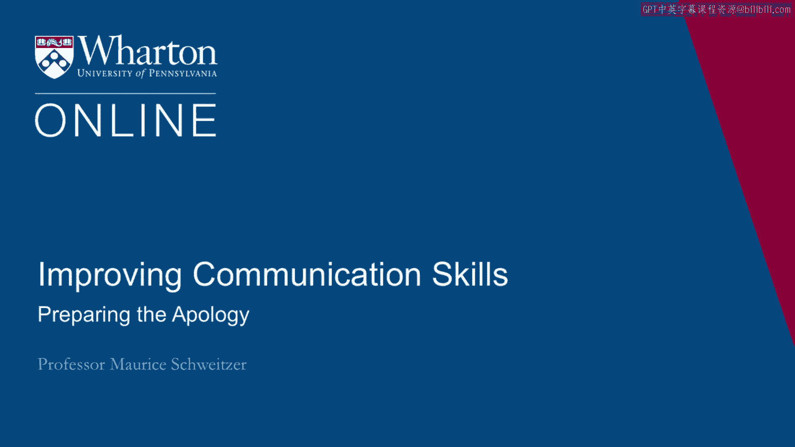
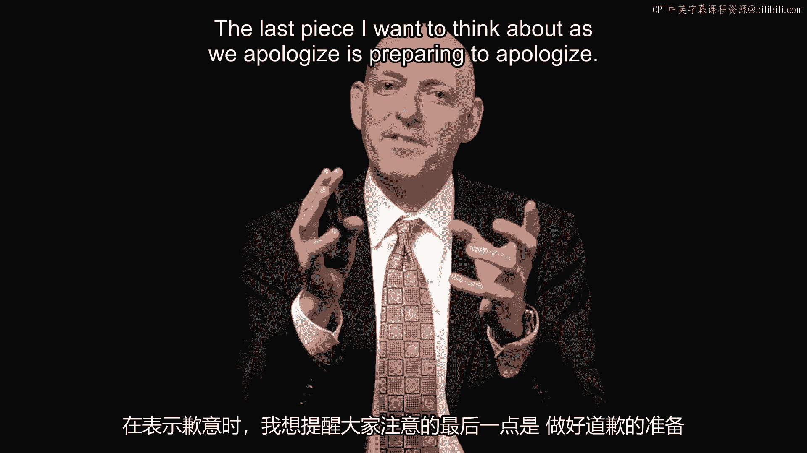
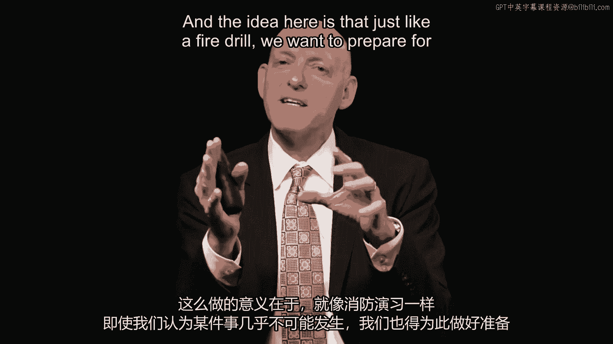
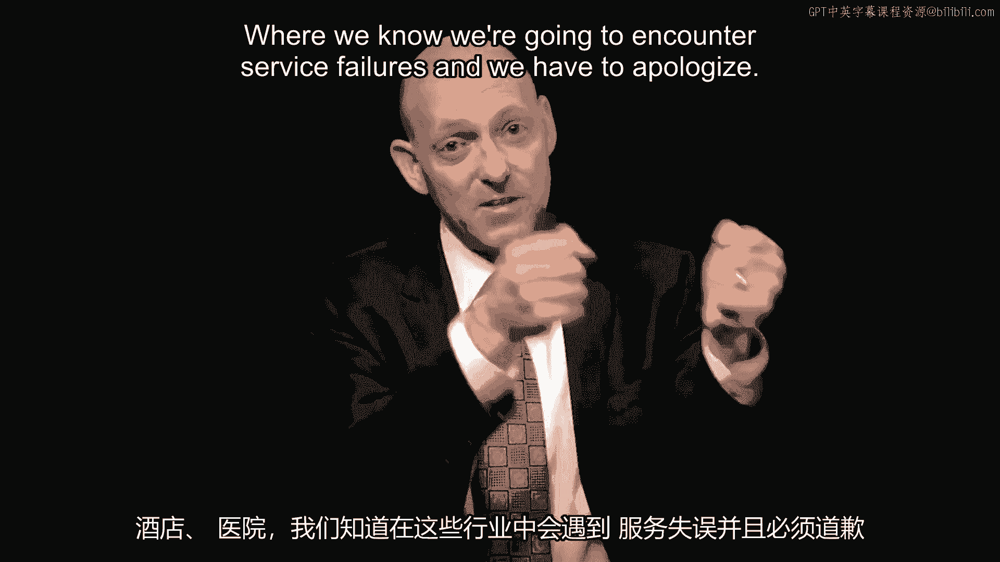
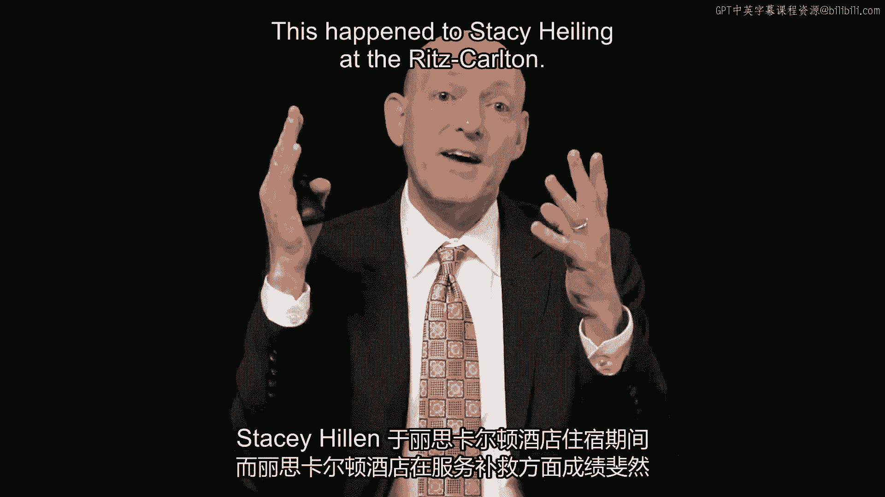
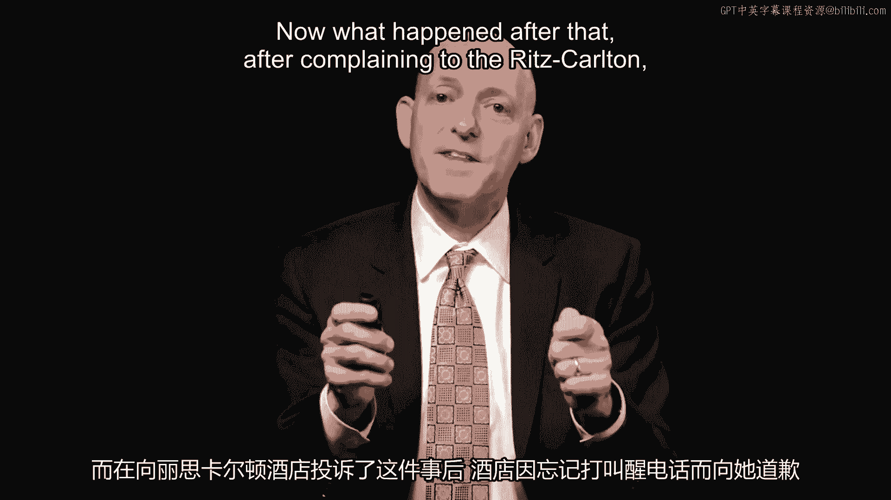
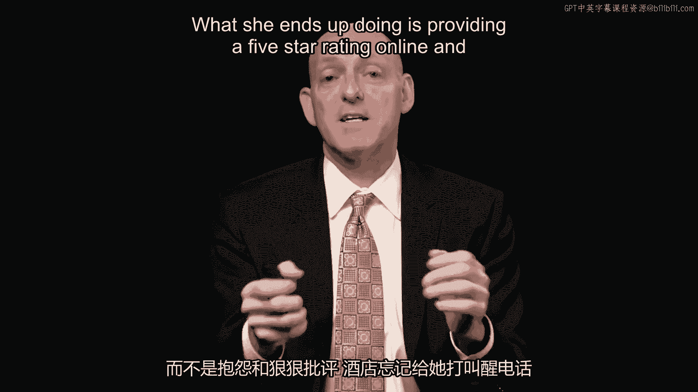
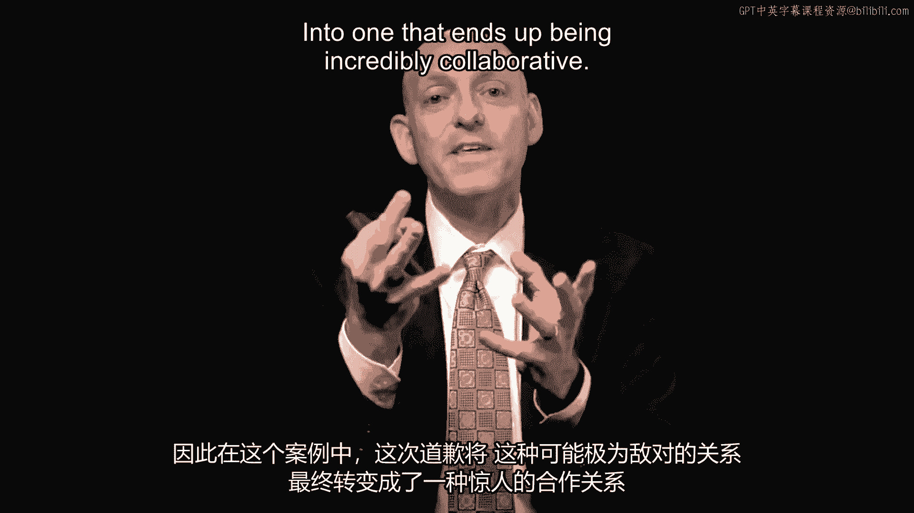
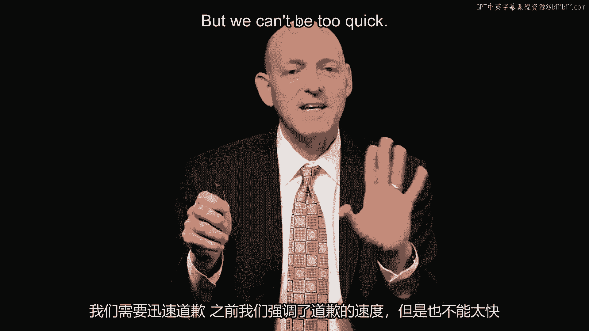
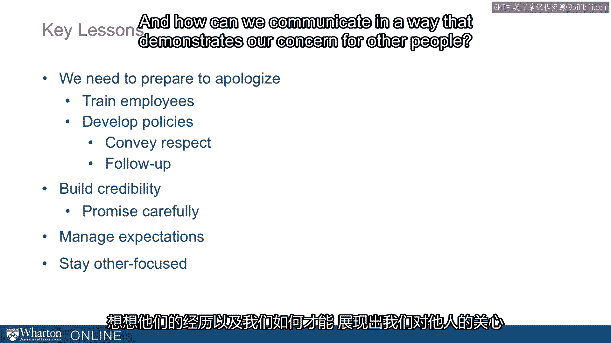

# 沃顿商学院《实现个人和职业成功（成功、沟通能力、影响力）｜Achieving Personal and Professional Success》中英字幕 - P51：23_准备道歉.zh_en - GPT中英字幕课程资源 - BV1VH4y1J7Zk

The last piece I want to think about as we apologize is preparing to apologize。

And the idea here is that just like a fire drill， we want to prepare for something even。

if we think it's unlikely to happen。

And there are some industries where people are readily expecting to apologize， like in。

transportation， hospitality， in hospitals， where we know we're going to encounter service。

failures and we have to apologize。

But there are other industries where people are less prepared and we see that just in。

the differences of the good and bad apology examples that we went through。

Now here's an interesting story。 This happened to Stacy Heiling at the Ritz Carlton and the Ritz Carlton does a magnificent。

job in service recovery。 So the Ritz Carlton she checks in， she requests a wake-up call。

The wake-up call never happens。 She sleeps through and misses a meeting。

Now what happened after that， after complaining to the Ritz Carlton， the Ritz Carlton ends up。

apologizing for the missed wake-up call and they do that with a fruit basket and chocolate。

They have a handwritten note that apologizes and instead of complaining and sort of lambasting。

Ritz Carlton for having missed the wake-up call， what she ends up doing is providing a five-star。

rating online and she raves about the five-star service。

So here this apology transformed the relationship from one that could have been very competitive。

into one that ends up being incredibly collaborative。

Now we need to be quick to apologize and we highlighted the speed before but we can't， be too quick。

And here's an example of being too quick that is we can't automate it。

So here this is Domino's Pizza and here the comment went online， best pizza ever， keep。

up the good work guys。 That was what came out。 Now Domino's quick response was， so sorry about that。

Please share some additional information with us and please mention this reference number。

So it's as if it seemed like there was an automated system， anything that went online。

about Domino's Pizza must have been a complaint， they apologized prematurely here。

So here the speculation is that they had some overzealous bot that just automatically generated。

responses but here they ended up trying to recover that by saying， oh we meant we were。

sorry it took us so long for you know， Jennifer to get that best pizza ever。

So we want to think about quickly apologizing but you don't want to overdo it。

So think about preparation and experience。 So some industries are ready for this but other industries should be and we saw these。

other industries struggle and the advice here is that we need to prepare that is just as。

we would for a fire alarm we need to be prepared for that apology。

We need to figure out how to overcome some barriers。

So we have barriers like the fear of signaling weakness that it might put us in a one down。

position making us look like we're not quite sure of ourselves， sort of the same kind of。

feeling that often we have we're afraid of asking for directions or for help but sometimes。

we can appear more confident we ask for help and the same thing is true about apologies。

There's also this fear of liability or culpability and in fact it used to be the case that medical。

professionals were trained not to apologize for this very reason and it's actually new。

procedures like at Baptist Hospital where professionals are trained to apologize and。

they've actually seen lawsuits decrease。 Now you often think about pride and defensiveness where we often have a hard time with that prospective。

taking idea we talked about before where here when you think about how to break down these。

barriers and institutionally we can create rules or guidelines that can help employees。

get to where they need to be。 So here are the key lessons。

First we should prepare to apologize just as they did at Ritz Carlton and to great effect。

and at Baptist Hospital also to similar effect and we need to train employees and develop。

procedures and policies in place and then we also need to build credibility that is we。

need to make sure that the words that we use are meaningfully heard by the people who get， them。

Like in the Domino's case you can't be too quick and then finally we have to think about。

expectations。 We want to make sure that the expectations that we convey are really the things that。

we're able to follow through and do。 And then finally stay other focused that is we've seen this consistently that is when you。

think about the other side's point of view what's their experience and how can we communicate。

in a way that demonstrates a concern for other people。

[BLANK_AUDIO]。

