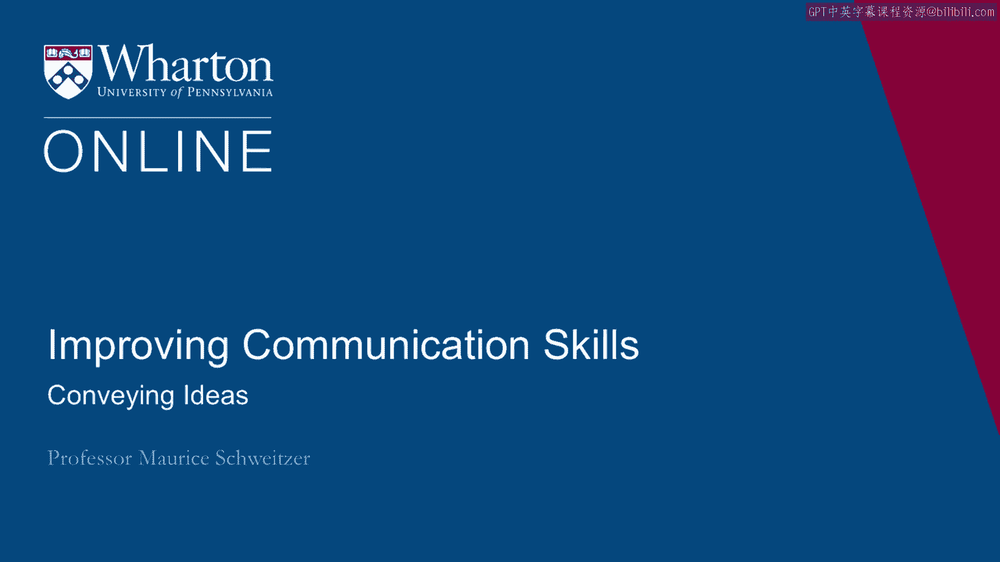
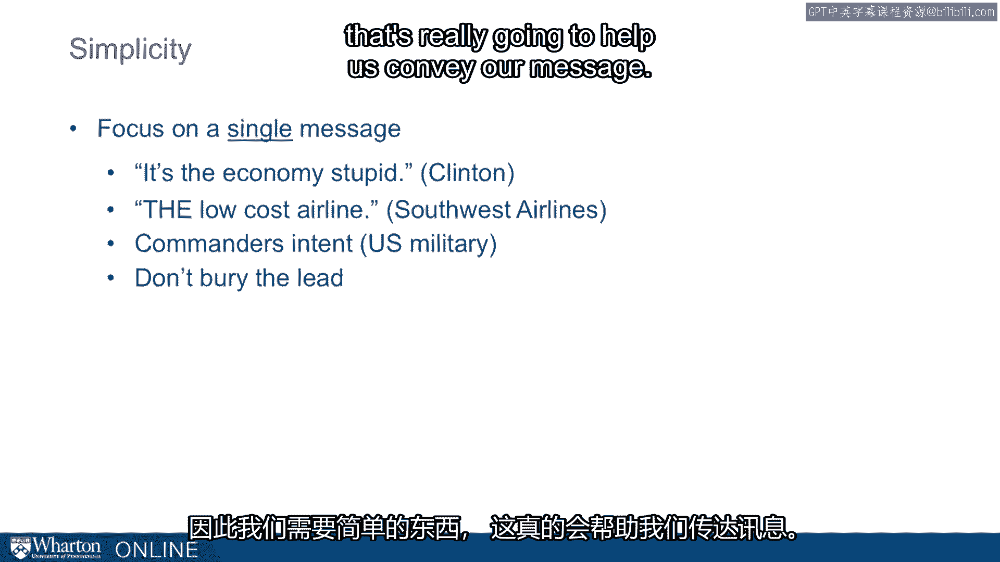

# 沃顿商学院课程笔记 P52：24_传达思想 🧠

在本节课中，我们将学习有效沟通的三个核心目标，并重点探讨如何清晰地传达思想。我们将了解吸引注意力的方法、建立可信度的策略，以及保持信息简洁的重要性。

---

## 有效沟通的三个目标

我们思考如何进行有效沟通时，通常有三个目标。

1.  我们希望传达自己的想法。
2.  我们希望从他人那里收集信息。
3.  我们希望改变人际关系。

首先，让我们思考如何传达思想。

---

## 如何传达思想

当我们试图与他人沟通时，面临的挑战之一是如何将我们脑海中的想法清晰地传达给他人。

我们如何做到这一点呢？

### 第一步：吸引注意力

首先的挑战是抓住对方的注意力。

我们如何获得他人的注意力？当信息**简单、有说服力且令人难忘**时，我们就能做到这一点。

你经常能看到一些广告完美地体现了这一点。例如，这里有一个头盔广告。一只小鸡在传送带上，其他小鸡都已被包装好，但这只小鸡却戴着一个头盔。这很**出人意料**，也**很幽默**，因此抓住了人们的注意力。

以下是能够吸引注意力的元素：

*   **出人意料**：提供某种惊喜或谜题。
*   **激发情感**：通常是个人的故事更能打动我们。

正如特蕾莎修女所说：“如果我看到一个人，我就会行动。”我们常常会想到大众，但这反而容易让我们失去焦点，无法以同样的方式抓住注意力。具有讽刺意味的是，一个关于个人的故事，往往比一个关于许多人的故事更有力量。

例如，奇皮斯描述了一个例子，一位医生从病人的视角制作了一段视频。在展示这段视频时，它确实帮助人们理解了病人的视角。这里有一个抓住了注意力的故事，你从一个未曾预料到的视角看到了事物。

所以，第一步是**抓住注意力**。

---

### 第二步：建立可信度

接下来，一旦我们吸引了某人的注意力，我们就需要**建立可信度**。

为了让信息具有说服力，人们必须知道我们所说的是真实、可信且重要的。

我们可以借助权威人物，例如专家或掌权者，依靠他们的话语来建立可信度。我们也可以依靠自身的经验，或者使用可信的来源。

来自权威人士、有经验的人或我们信任的人的信息，会比我们自己的想法更具可信度。我们需要思考如何利用这些资源，来创造一个具有说服力的信息。

---

### 第三步：保持简洁

**简洁**是另一个关键理念。

为了让信息被理解和记住，我们需要让信息保持简单。

我们可以思考一些例子，比如比尔·克林顿竞选总统时，指导他竞选活动的核心口号是：“笨蛋，问题是经济！”这就是核心思想。在比尔·克林顿的竞选中，一切都回归到经济问题。

或者西南航空公司，作为低成本航空公司，通过使用“低成本”这一指导原则，其简单的信息指导着人们的决策，使所有行动都与这一目标保持一致。

在美国军队中，他们有一种叫做“指挥官意图”的东西。在信息的顶部有一行简短的说明，指明了目标。后面会跟着很多其他细节，但开头只有一个关键思想。

新闻业也是如此，我们不想“埋没导语”，我们希望关键思想放在最前面。

因此，我们需要一些**简单**的东西，来真正帮助我们传达信息。

---

## 总结

本节课中，我们一起学习了有效沟通中“传达思想”这一目标的具体方法。我们了解到，成功的传达需要依次完成三个步骤：首先用**出人意料或激发情感**的方式**抓住注意力**；然后通过**借助权威、经验或可信来源**来**建立可信度**；最后，确保信息**简洁明了**，将核心思想前置，以便于理解和记忆。掌握这些步骤，将帮助你更清晰、更有力地表达自己的想法。