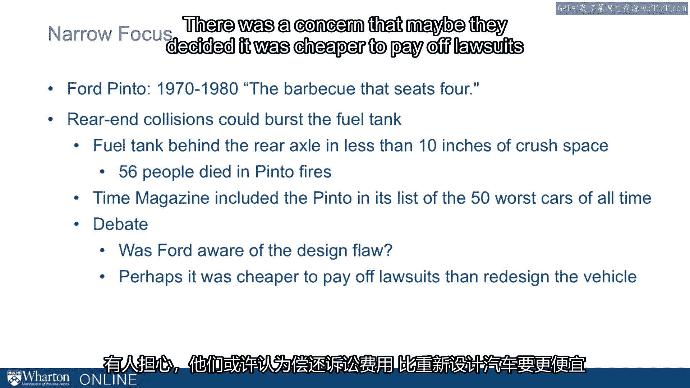

# 课程25：如何使信息令人难忘 📝


在本节课中，我们将探讨如何让你的信息在听众心中留下深刻印象。核心在于运用故事、类比和具体表达等技巧，使抽象概念变得生动、易于理解和记忆。

---

## 如何使信息令人难忘？

上一节我们讨论了信息传递的重要性，本节中我们来看看如何让信息本身更具“粘性”，即令人难忘。

一个关键方法是**讲故事**。故事能赋予信息生命，使其生动、具体，从而更容易被记住。

### 故事的力量：威利·霍顿案例

以下是关于“威利·霍顿”故事如何影响美国大选的例子。

这个故事在老布什与杜卡基斯的总统竞选中起到了决定性作用。当时选情胶着，杜卡基斯一度领先。老布什的竞选经理李·阿特沃特说：“等我们干完，人们会怀疑威利·霍顿是不是杜卡基斯的竞选搭档。”

威利·霍顿因谋杀罪被判终身监禁。马萨诸塞州有一项“休假”计划，允许表现良好的囚犯短期离监，旨在鼓励狱中良好行为。威利·霍顿在一次周末休假期间，强奸了一名妇女并刺伤了其丈夫。

尽管并非杜卡基斯亲自批准其休假，但他曾公开支持并为此计划辩护。最终，“威利·霍顿”的故事在1988年大选中严重打击了杜卡基斯的选情。这个故事的影响力甚至盖过了当时其他重要的经济和社会议题。

李·阿特沃特后来在临终前为此故事的使用向杜卡基斯道了歉。这个故事虽然有效，但手段并不光彩。然而，它清晰地表明：**生动的故事令人难忘**。

### 让信息难忘的原则

为了使信息更易被记忆和传播，我们可以遵循以下几个原则：

1.  **生动具体**：就像提到阿富汗难民时，人们脑海中会立刻浮现出特定的照片。具体的形象比抽象描述更有力。
2.  **简洁明了**：信息需要保持简单。
3.  **时序清晰**：按时间顺序叙述的事件更便于记忆。
4.  **易于联想**：例子越生动、越容易联想到，记忆就越轻松。

一些易于理解和记忆的观念包括：
*   “版权即财产”
*   “木桶的容量取决于最短的木板”


### 运用类比与修辞

类比能帮助我们更好地理解复杂概念。例如，“亡羊补牢”这个类比就形象地说明了事后补救的局限性。

有时，巧妙的修辞也能让观点深入人心。在O·J·辛普森审判中，他的辩护律师有一句名言：
```
“If the glove doesn‘t fit, you must acquit.”
（如果手套不合手，就必须判无罪。）
```
尽管许多电视观众认为辛普森有罪，但这句押韵的话暗示了证据可能存在矛盾，从而成为了一个极具说服力的观点。另一个例子是“**祸从口出**”（Loose lips sink ships），这个押韵的简短表达同样令人过目不忘。

因此，**故事、类比和精炼的表达**是让信息变得难忘的重要工具。


---


## 具体化目标 🎯

上一节我们介绍了用故事和修辞增强记忆点，本节中我们来看看另一个关键方法：**将信息具体化**。

抽象的目标难以把握和落实，而具体的目标能为行动提供清晰的指引，也更容易被记住。

### 具体目标的力量

肯尼迪总统曾设定一个非常具体的目标：
```
“我们要在这个十年内，把人类送上月球并安全返回。”
```
这个具体的目标凝聚了全国的意志和努力。同样，在1960年代，波音公司为727客机设定了具体标准：
```
“必须能搭载131名乘客，从迈阿密直飞纽约，并降落在拉瓜迪亚机场一条不足一英里长的特定跑道上。”
```
他们本可以使用更抽象的术语，但这些具体的属性让团队有了明确的聚焦点。

### 避免模糊的表述

我们应该避免使用模糊的声明或理念，例如：
*   “我们的目标是股东价值最大化。”
*   “我们要持续改进。”

这些想法虽好，但不够具体，无法有效指导具体行动。


### 具体化的风险：福特平托案例

然而，过度聚焦具体目标也可能带来问题。福特汽车公司的总裁李·艾柯卡曾设定一个具体目标：造一款“重量低于2000磅、售价低于2000美元”的汽车。在这个具体目标的指引下，福特于1974年推出了平托汽车。

但这款车有一个生动的绰号——“**移动烧烤架**”。由于其油箱设计缺陷，追尾事故可能导致油箱起火爆炸，最终造成56人死亡。《时代》杂志将福特平托列为史上最差的50款汽车之一。尽管对于福特是否知情仍有争议，但这一案例表明，**具体的目标（低于2000磅/2000美元）能指引行动且令人难忘，但若方向有误，其后果也同样具体而深刻**。



因此，在传达想法时，我们希望人们记住它们。**精炼的表达、具体的目标以及类比的使用**，都是让我们的观点变得难忘的关键载体。

---

## 总结 ✨


本节课我们一起学习了如何使信息令人难忘。我们探讨了两个核心策略：一是通过**讲述生动的故事、运用贴切的类比和精炼的修辞**来增强信息的感染力和记忆点；二是通过**设定具体、明确的目标**来替代模糊的表述，为行动提供清晰指引，同时也要注意避免因目标过于狭隘而导致的潜在风险。掌握这些技巧，能显著提升你沟通的影响力和持久度。