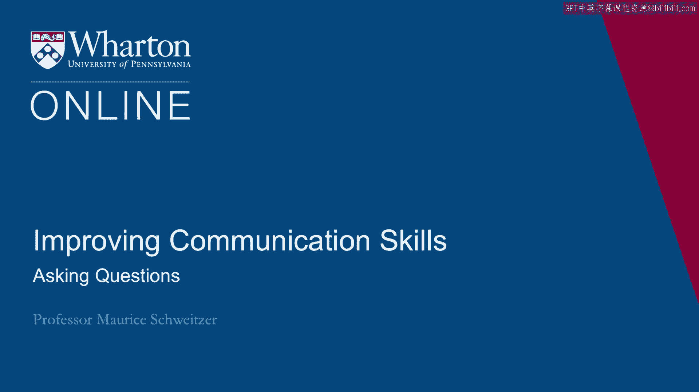

# 沃顿商学院《实现个人和职业成功（成功、沟通能力、影响力）｜Achieving Personal and Professional Success》中英字幕 - P54：26_提问.zh_en - GPT中英字幕课程资源 - BV1VH4y1J7Zk

A second key goal of our communication is to gather information。

And we do that often by asking questions。 And it turns out that sometimes just asking for it。

as Linda Babcock would say， just asking， for it is sometimes the most important step。

So here's a story about the University of Chicago。 They received a million dollar grant from Mrs。

Field from the Marshall Field Department， Store fame。

And administrators at Northwestern were shocked。 After all， Ms。 Field lived in Evanston。

She had been a supporter in the past of Northwestern。 And when they reached out to Mrs。 Field。

they asked， "Oh， why did you give this money， to Chicago？"， And she replied， "Well。

the people of the University of Chicago asked and you didn't。"。

So asking for information or help are often key goals。 And it turns out that when we look at。

for example， skilled versus average negotiators， we see this big divergence in asking questions。

When we think that one of the key goals is to just convey our winning arguments or to。

convey all the great information we have in our own heads。

But it turns out that what's really important often is just asking good questions。

So Neil Rakham did a study with over 100 labor negotiators and he had experts and relative。

novices and he recorded and compared their negotiations。

And one of the most important things he found， and he assessed expertise based on peers and。

kind of brought to assessments， he found that the expert negotiators spent way more time。

asking questions。 So they're doing things like asking questions。

they're testing their understanding， like， "Oh， let me make sure I understand what you're saying。"。

So demonstrating concern for the other party as well。

But they're spending time doing that and the key idea is sort of asking questions。

And they're spending way less time engaging in other behaviors， including just revealing。

information but also engaging things like irritators， like saying things that are a little。

bit annoying to their side or putting down to their side or attacking to their side。

And they're offering fewer justifications for their key ideas。 So when they're saying， "Oh。

here's why we need higher wages or here's why we need better， insurance coverage。

" they're offering one or two reasons。 The less expert negotiators are offering more reasons。

So what's interesting here， the key idea is that experts are asking more questions and。

they're conveying a little bit less information and they're being more effective because of， it。

So one of the key ideas I want to suggest is that sometimes we should be focused on asking。

questions and really listening to those answers rather than focusing on trying to just get。

our ideas out。 [BLANK_AUDIO]。

