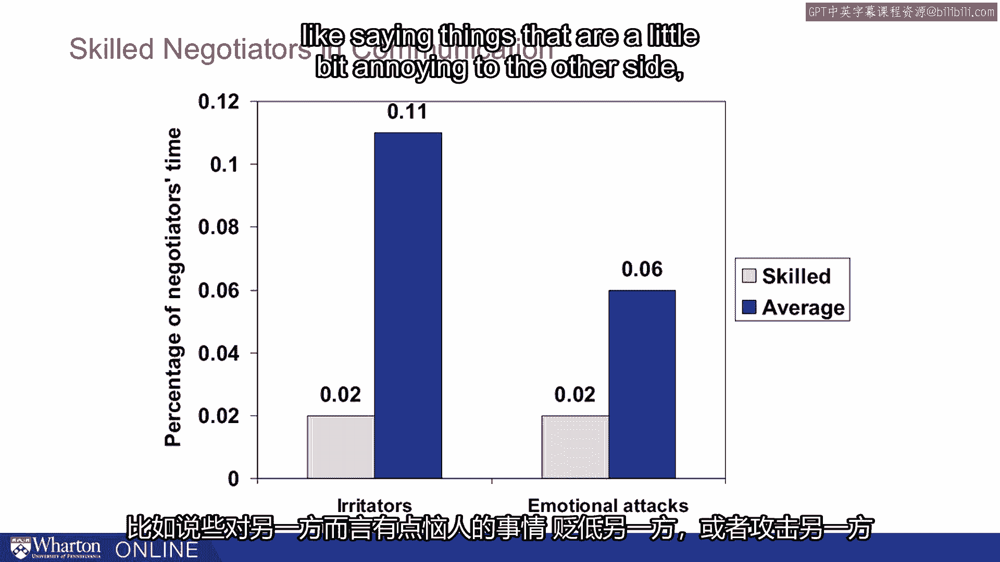
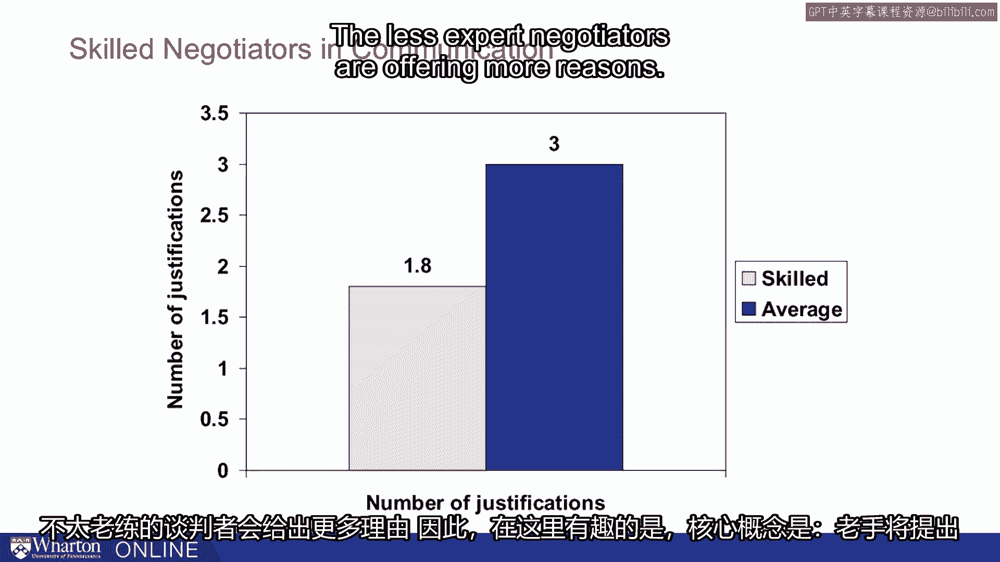

# 课程26：提问的艺术 🎯

在本节课中，我们将探讨沟通的第二个关键目标：**收集信息**。我们将学习如何通过有效提问来达成这一目标，并理解为什么有时“开口询问”本身就是最重要的一步。

---

上一节我们介绍了沟通的目标，本节中我们来看看如何通过**提问**来收集信息。我们常常通过提问来获取所需信息。事实证明，有时正如琳达·巴布科克所说，“开口去要”本身就是最关键的一步。

这里有一个关于芝加哥大学的故事。他们从马歇尔·菲尔德百货公司著名的菲尔德夫人那里获得了一百万美元的赠款。西北大学的管理人员感到震惊。毕竟，菲尔德夫人住在埃文斯顿，过去一直是西北大学的支持者。当他们联系菲尔德夫人时，他们问道：“哦，您为什么把这笔钱给了芝加哥大学？”她回答说：“嗯，芝加哥大学的人开口问了，而你们没有。”

所以，询问信息或寻求帮助常常是关键目标。事实证明，当我们观察，例如，熟练的谈判者与普通谈判者时，我们在提问方面看到了巨大的差异。我们可能认为关键目标之一是传达我们制胜的论点，或者传达我们头脑中所有的绝佳信息。

但事实证明，真正重要的往往只是提出好的问题。尼尔·拉克姆对100多名劳工谈判代表进行了一项研究，他区分了专家和相对新手，记录并比较了他们的谈判过程。

他发现的最重要的事情之一（他根据同行评估和综合评估来判断专业水平）是，**专家谈判者花费了更多的时间提问**。以下是他们的一些行为特点：

*   **测试理解**：他们会做诸如提问、测试自己理解的事情，例如，“哦，让我确认一下我是否理解了您的意思。”
*   **表达关切**：这也展示了对另一方的关心。

他们花时间做这些事，核心思想就是**多提问**。同时，他们花在其他行为上的时间要少得多，包括：

*   **透露信息**：单纯地透露信息。
*   **使用刺激性言语**：说一些让对方有点恼火的话。
*   **贬低或攻击对方**：贬低或攻击对方。

此外，他们为自己关键观点提供的辩解也更少。所以，当他们说“哦，这就是为什么我们需要更高的工资，或者这就是为什么我们需要更好的保险覆盖”时，他们只提供一两个理由。而经验较少的谈判者则会提供更多理由。

这里有趣的是，**核心观点在于：专家提问更多，他们传达的信息略少，但正因如此，他们反而更有效**。

因此，我想提出的一个关键观点是：有时我们应该专注于**提问**，并真正倾听那些答案，而不是只专注于试图把自己的想法说出来。

---

本节课中我们一起学习了**提问在沟通中的核心作用**。我们了解到，主动询问是获取信息和帮助的关键，而专家谈判者通过**多提问、少辩解、避免刺激性言语**来提升沟通效果。记住，有效的沟通不仅是表达，更是通过提问来理解和收集信息。