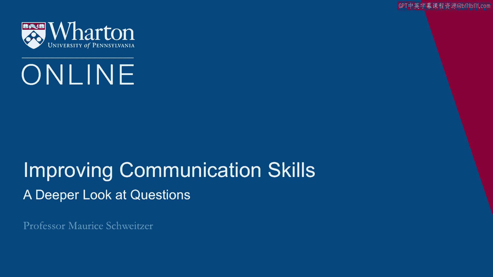
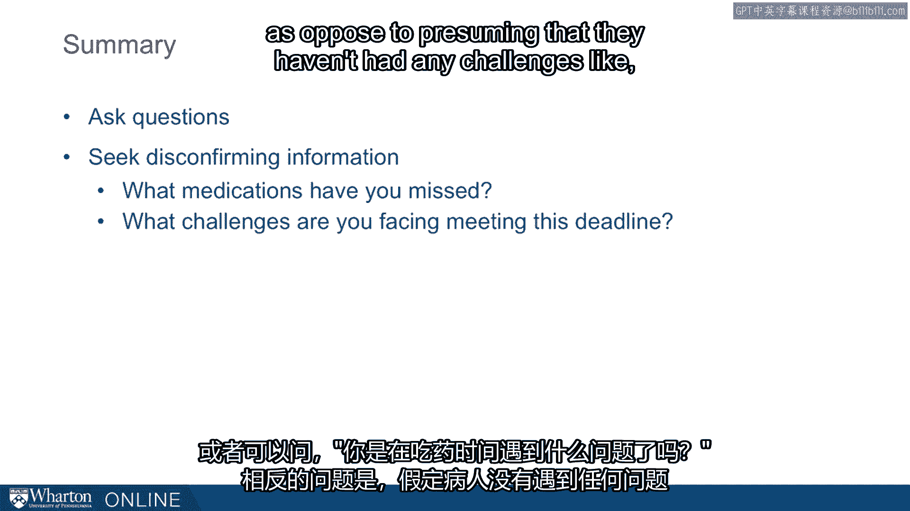

# 沃顿商学院《实现个人和职业成功（成功、沟通能力、影响力）｜Achieving Personal and Professional Success》中英字幕 - P55：27_深入探讨提问.zh_en - GPT中英字幕课程资源 - BV1VH4y1J7Zk

Let's take a deeper look at questions。

I want to think about what questions really do。 And we can look at experts in linguistics that have guided us to think about questions。

They've studied them for a long time。 They structure our conversation。

They focus us on particular topics。 They also move narratives forward。 So what happened next？

Or they pause to ensure understanding。 So do you know what I mean by that？

Or how do you know who is calling？ So these questions are often created to elicit information。

But I also want to suggest that questions do something different as well。

They often not only solicit information， but they often guide our answers and sometimes。

convey information as well。 Now we think of this with leading questions。

And Loftus did some of the most important work in this area。

Loftus had people do things like watch videos of two cars colliding。 So these cars got an accident。

And then Loftus asked questions。 And she asked how fast were the cars going when they smashed into each other？

Or how fast were the cars going when they bumped into each other？

Or how fast were the cars going when they contacted each other？

Now in every case we're asking how fast were the cars going？

But here's what's really interesting is that when people answer these questions， they。

thought the car was going fastest with the smashed wording。

And I thought the cars were going slowest in the contacted wording。 So the other thing。

the car is going almost 41 miles an hour when they're asked how fast。

they were going when they smashed to each other。 But only about 32 miles an hour when they're asked how fast were the cars going when they。

contacted each other。 So that is the questions we ask can guide the answers that we get particularly for questions。

that have kind of vague or uncertain answers。 So here's some other examples。

So do you get headaches frequently and if so how often？

Or do you get headaches occasionally and if so how often？

And again we're getting very different answers。 So frequently people say over to a week when we say occasionally it's less than one a week。

And the idea is that the way we ask questions can guide us to be very different in how we。

answer those questions。 And we think about for example jurors。

We sometimes limit questions lawyers can ask potential jurors。

So potential jurors might be asked could you be impartial if you knew the defendant was。

a member of a gang。 Now it turns out that person may or may not be a member of a gang but we've now just implanted。

an idea by suggesting that they were part of a gang。

Or when we say when do you stop taking the money and we're presuming that you were taking， money。

The idea here is that the way we ask questions can guide people and sort of plant ideas they're。

very difficult for us to really get out of our minds。

Now this is another story that Loftus did that I particularly like。

She had people watch a video of a car going by in a country road。

And again she asked how fast was the car going。 Now a week later she brought people back in and said I'm going to ask you about that。

video and she asked did you see a barn in the video。

Now there was no barn in the video but here's what's interesting so that week before when。

she asked how fast was the car going she asked that question in a few different ways。

So one question was how fast was the white sports car going while traveling along the， country road。

So remember that there was no barn but by asking the question that has the barn phrasing。

What you find is that a week later when people are asked did you see a barn people have been。

asked that question with the barn wording in it。 They reported that they saw the barn and they said that it was a barn。

And they said that it was a barn。 The barn wording in it they reported that they saw the barn about 17% of the time。

In contrast people that never saw a barn there was no mention of a barn when they were。

asked to see a barn less than 3% of them said they saw a barn。

So that is we're seeing a dramatic increase in responses that are completely fabricated。

where traditionally we think of questions as just gathering information but we also know。

that questions are also revealing information and guiding answers。

And so questions can actually play a really important part in the communication process。

So we think about what questions do the traditional ideas that gather information but I'm arguing。

that they actually also reveal information and they reveal a lot of information about。

what the asker knows as well as information about the context or guiding the answer。

So we get different answers as a function of the questions that we ask。

I'm going to explain a short experiment that I ran that reflects a stream of research that。

I've conducted that looks at how different questions can elicit different kinds of information。

And in this experiment I told people that they're selling a used iPod and that it frequently。

crashes。 So there's a problem with crashing on this iPod and they have a lot of other information。

about this used iPod that they're selling。 Now it turns out then we have these Confederates so I paid these research assistants to pretend。

that they were trying to buy the iPod and they reached out to this participant and they asked。

one of three different questions。 One question the general question said well what can you tell me about it？

A second question was this positive assumption it doesn't have any problems does it or a。

negative assumption question what problems does it have。

So here if we think about it the general question doesn't reveal any specific knowledge。

The other two questions suggest there's a problem and the negative assumption question。

in particular suggests that there really is a problem so the what problems does it have。

suggests that there's actually a problem that I want to learn about。

So it's a direct approach and the negative assumption is the most direct the positive。

assumption the general question are less direct and we look at the responses that we get people。

thought that these participants thought the buyer was much more knowledgeable when they。

asked the negative assumption question and least knowledgeable when they asked a general。

question and they thought the buyer was much more assertive with the negative assumption。

followed by the positive assumption and the general question。

But the key idea and the most important idea here is the kind of responses。

So suppose that you are a potential buyer and you want to learn negative information it。

turns out that when people are asked a positive or negative assumption question they're getting。

much more reliable information they're learning a lot more information about the crashes when。

they're asked these positive assumption or negative assumption questions and they're。

learning very little information when they ask the general assumption question。

In fact in the general assumption case they're learning a lot of information about totally。

irrelevant general stuff they're not learning about this problem。

So the key idea and this is just one of several studies that I've run is that when you ask。

these more direct questions you're getting far more reliable answers and the negative。

assumption when you presume a problem you're getting the most voracious。

The greatest veracity of all the most truthful response comes with that negative assumption。

question。 Okay。 And in fact people found when they had independent raters judge the responses they of course。

judged the sound to be most honest when they're asked the negative assumption or positive assumption。

question。 So one of the ideas here is that when we want to ask these questions we should be sure to。

ask questions and listen carefully to the answers we want to seek disconfirming information。

So we want to challenge assumptions that we have。 So if we're asking a patient how compliant they've been with their medication you might。

want to ask what medications have you missed as opposed to a question like oh you haven't。

missed any medications have you or you want to ask what challenges are you facing meaning。

this deadline as opposed to presuming that they haven't had any challenges like oh we're。

right on track aren't we？ So we want to presume a problem and we're then more likely to gather accurate and truthful。

information。 Thank you。 Thanks。 [BLANK_AUDIO]。

