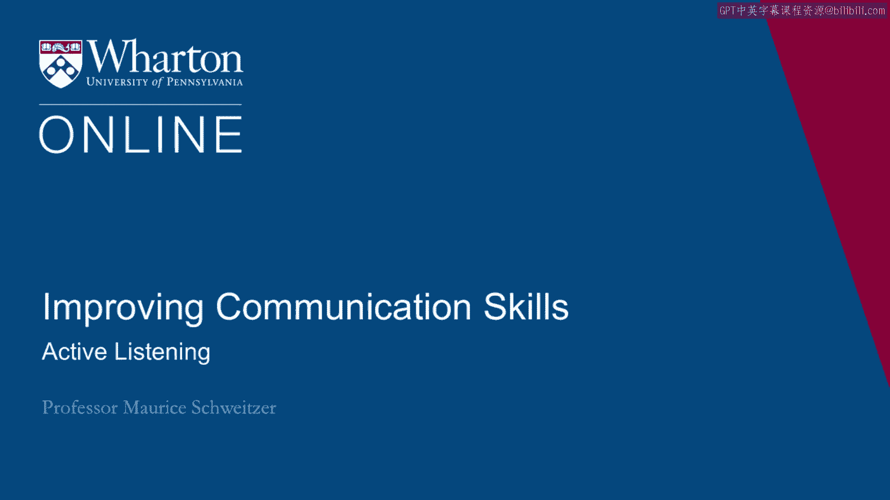
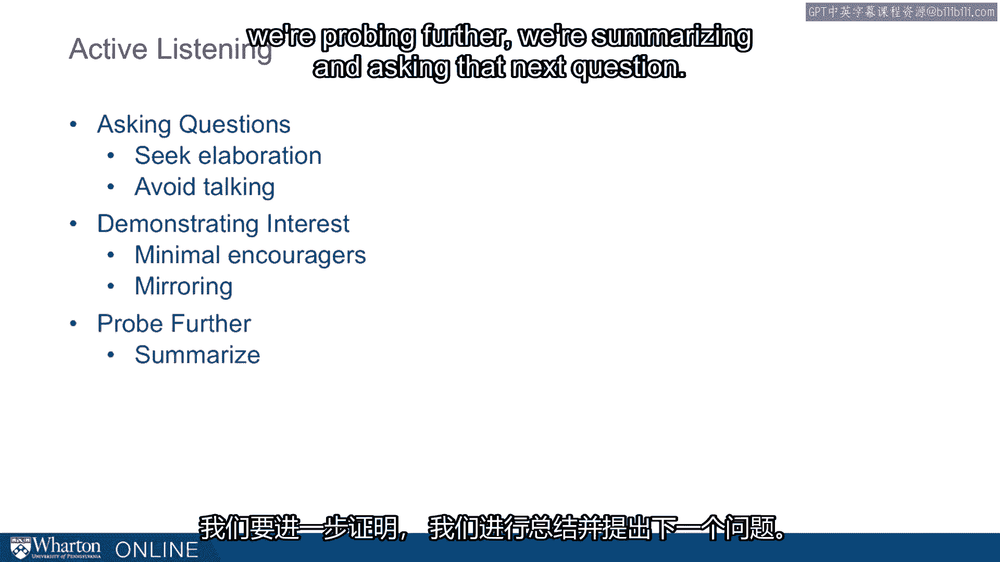

# 沃顿商学院《实现个人和职业成功（成功、沟通能力、影响力）｜Achieving Personal and Professional Success》中英字幕 - P56：28_积极倾听.zh_en - GPT中英字幕课程资源 - BV1VH4y1J7Zk

I want to build on some of the ideas about asking questions and think more broadly about。

active listening。 When thinking about active listening。

we use this to not only learn information but also， build relationships。 With active listening。

we demonstrate concern and we demonstrate interest in other people。

and their ideas and we can actually shift emotions and how people are feeling。

The idea with active listening is we're asking questions， that's a key part of it。

We're also demonstrating interest in our counterpart， that's a key part of it and we're probing。

further。 That is， in concert， we're doing things to really actively engage in hearing other people。

Just the key idea about active listening is we're asking broader open-ended questions。

What happened or what did that happen？ We're asking people to expand on those answers。

Tell me more about it。 The other key idea here is we're speaking less。

I mentioned this before but we often think that our key ideas are the most important things。

to get out。 In many cases， what we really need to do is listen to other people to figure out what。

their needs are， how our ideas interact with their needs。

The active listening part gets a statement from this active part of listening。

We're doing things like demonstrating interest verbally and non-verbally。

We can engage in these things like minimal encouragers。 Like aha， a right， a really。 She said what？

We're nodding in agreement。 We're doing things that demonstrate that we're paying attention。

When you're out with somebody and they say， "Oh， you haven't listened to a thing I've， said。

" what they're saying is you haven't given me any minimal encouragers。 You might be able to say， "Oh。

yeah， I know exactly what you've been saying for the last， 20 minutes。

" and yet they might feel as if they're not being listened to。 These minimal encouragers。

it's an active listening part that actually gives people a， sense that you're paying attention。

Mirroring。 You're demonstrating interest。 We're repeating the last words or the gist of what somebody said。

We might repeat something and that gives people a sense that you're actually engaged， invested。

in what they're saying。 As we do that， we're encouraging people to open up and we're demonstrating that we care。

about other people。 We're building this affiliation， this rapport， that's so important。

We also need to probe further so we can summarize what people have said。

We demonstrate that we're taking their perspective and then we seek additional clarification。

So something like， let me make sure I understand what you're saying。

The depreciation values from last year came from somewhere， but the current values are。

missing or there's no money in the budget this quarter， but next quarter might be different。

So we're summarizing something and then we're pushing for more information。 By doing this。

that is in concert， if we ask questions， so we seek elaboration， we avoid。

talking and this part's quite hard。 The idea is that when we leave space。

we often create some discomfort。 So sometimes if we just pause。

people find that silence uncomfortable， fill it sometimes， with extra information。

So this is a common interview technique。 It's also common in negotiations。

People will just leave space and that awkward pause gets filled in。 Sometimes with information。

people were reticent to reveal。 Then the active part of the listening， the minimal encouragers。

the mirroring， repeating， the gist of what somebody has said and then the follow-up。

So we're probing further， we're summarizing and asking that next question。

This active listening does a couple of things。 One is it gets people engaged， demonstrates concern。

but also to us， it not only helps， us focus on other people， but it helps us gain their perspective。

So we engage in better perspective taking as we're focusing really on active listening。 Thank you。

We'll see you in the next video。 Bye。 [BLANK_AUDIO]。

