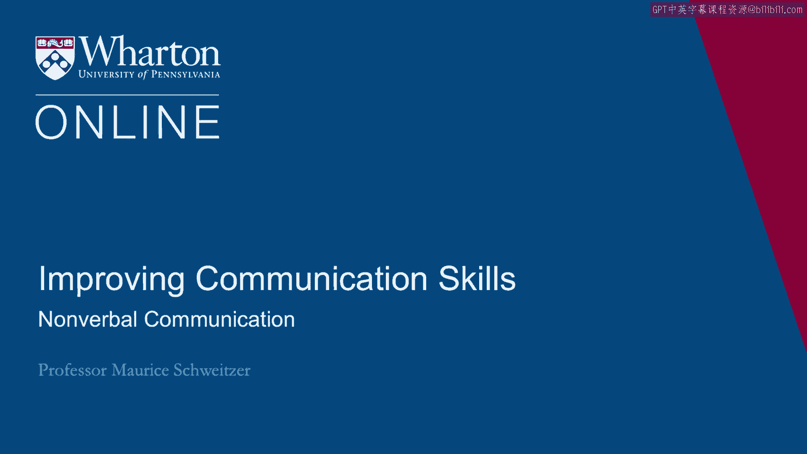
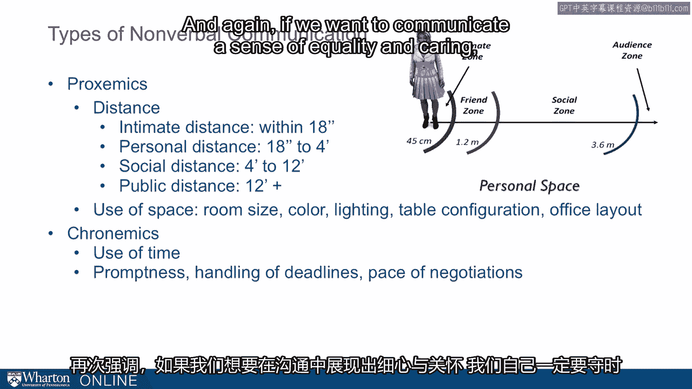

# 沃顿商学院《实现个人和职业成功（成功、沟通能力、影响力）｜Achieving Personal and Professional Success》中英字幕 - P57：29_非语言沟通.zh_en - GPT中英字幕课程资源 - BV1VH4y1J7Zk

A key part of communication is nonverbal。

In fact， most of the message that we get is from the nonverbal cues。

Now sometimes nonverbal cues are pretty funny， so here's President George Bush and Angela。

Merkel at the G8 Summit in 2006 in St。 Petersburg。

And George Bush thought it was going to be appropriate to walk over to Angela Merkel。

and give her a back rub。 And so you see pictures of this。

This was front page news after it happened。 George Bush starts giving Angela Merkel a back rub and her nonverbal cues make it very。

clear she doesn't feel comfortable。 So George Bush is queuing that he wants a close relationship or is presuming a close。

relationship。 Angela Merkel is signaling that he's crossed a boundary and wants to create some distance。

So these nonverbal cues， without any exchange of words， is conveying a great deal of information。

Now this is true in general。 So by some studies， 70 to 90% of the message that we get is nonverbal。

How people are standing， the way they're speaking， or the way they're looking or not。

looking at you。 So nonverbal communication is important when we're communicating with other people。

We can communicate far more effectively with nonverbal cues and we're trying to interpret。

other people。 We can do that far better if we're paying attention carefully to nonverbal cues。

Now there are cross-cultural differences。 There's some cultures where the message really is in how it's being sent。

So these high-context cultures， often in Asia and Latin America， many Middle Eastern cultures。

how the message is being conveyed is almost the entirety of the message。

So somebody in Japan might say that would be difficult。

And what they really mean is there's no way we could ever do that。

And if you'll be paying attention to how it's being said。 In low-context cultures。

we rely more on the content of the text， what is actually being， said。

so in North America and Europe。 But even in low-context cultures。

how things are said dramatically influence the meaning， of what's said。 So far to say， "Oh。

that's no problem。"， The way I say that matters profoundly。 So if I say， "Oh， that's no problem。

" or "Oh， that's no problem，" I'm sending very， different messages。 In fact。

we can flip the meaning of something like， "I'm happy to do that，" or， "I'm happy， to do that。"。

We can send it completely in opposite directions depending on how we say it。 And of course。

cross-culturally， there are different signals when we hold hands or pat， someone ahead。

We're sending messages。 And cross-cultural， we're not going to be sensitive to that。 In some cases。

we can offend people merely by using gestures that we think are pretty， innocuous。

like the okay symbol。 So when we think about number of cues。

here are the dimensions that we should be paying， attention to。 One part are kinesics。

So symbols that we use created by the body。 So gestures， like the okay symbol。

or just articulations。 Facial expressions， eye contact， appearance。

There are a lot of cues around how we look。 There are paralanguage cues。 So the tempo， the emphasis。

So I gave examples with， "I'm happy to do that，" or， "I'm happy to do that。"。

We can emphasize things quite differently。 And in writing。

paralanguage cues are things like writing in all caps。 So I text you a message in all caps。

and you might write back， "Why are you yelling at， me？"， Haptics are involved touching。

Every mammal involves， every male group is very fond of contact。 This tactile contact。

So shaking hands， patting somebody on the back， patting somebody on the head。

These are conveying a lot of information， or like George Bush giving Angela Merkel a backrub。

were engaging in contact in a way that's communicating some important message。 Now。

this is related to proxemics。 How far apart are we？ Again， there are cross-cultural differences。

So in Eastern Europe， distances are much smaller。 In the United States。

we have our sort of personal bubble of about a foot and a half。

So anybody that invades our personal space should be a very close friend or an intimate， partner。

We have public distance that's sort of different spaces。

And we think about where our comfort zone is。 The way we arrange this space can make people more or less comfortable。

And what I'm suggesting is that we can think about this deliberately rather than feeling， like。

"Hey， I'm uncomfortable。 I don't really know why。 I'm suggesting we can figure out why。

We can figure out how the space that we're in can make us more or less comfortable。"。

And that use of space， so the room size， the color， the lighting， the way we've configured。

the office can really change the message that we're conveying。

So if I want to convey a sense of equality， we might have a circular table and we're all。

at seats that are similar。 If I want to convey a sense of inequality。

we can have a table and we can have somebody， on a higher chair than somebody else。

So we can think about this space and the messages that we're conveying implicitly in those cues。

Chronemics， these of time。 So is somebody on time， are they prompt？

Are they delayed or they show up late for meetings？ And again。

if we want to communicate a sense of equality and caring， we're prompt and on。

time。 And again， they're cross-cultural differences。 So Germanic peoples might be very punctual。

Latin peoples might be less punctual and they're not meaning anything by it。

We should be sensitive to those cross-cultural differences。 [BLANK_AUDIO]。

