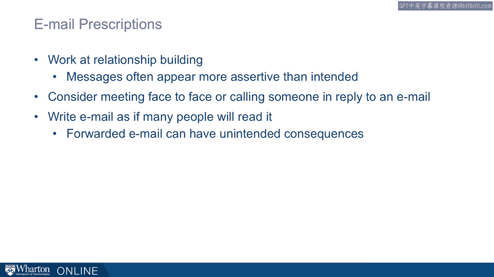

# 沃顿商学院《实现个人和职业成功（成功、沟通能力、影响力）｜Achieving Personal and Professional Success》中英字幕 - P58：30_沟通媒介.zh_en - GPT中英字幕课程资源 - BV1VH4y1J7Zk

Communication media profoundly influence how our messages are not only interpreted， but。

the consequences of those messages。 There's a story about a woman who is negotiating her job offer at Nazareth College。

And what she done after she'd been extended offer， she decided to ask for some clarification。

and ask for some other concessions in an email。 And she wrote， as you know。

I'm very enthusiastic about the possibility of coming to Nazareth。

Granting some of the following provisions would make my decision easier。

So notice that she's not insisting on this。 She's not saying I have to have all these things。

She's saying some of these would make it easier。 And she asked for things like increasing the starting salary consistent with what she thinks。

other people have been getting， a semester of maternity leave， a pre-tenure sabbatical， and so on。

She asked for a few other things here。 And I know that some of these might be easier to grant than others。

Let me know what you think。 Now this is a relatively soft way of approaching things。

I would suggest that had she done this in person， she'd be getting feedback along the way and。

she get a pretty clear sense of how things were going。

The response that she got ended up withdrawing the offer。

So here she had meant to ask for some things。 And I'm going to suggest that because it was an email。

it came across， I think， more forcefully， than she'd intended。

And this electronic medium allowed her email to be shared and probably interpreted in。

different ways。 So you can imagine somebody getting it， forwarding it on。

but forwarding it with a message at， the top like， "Can you believe this？"。

Or "This doesn't look right to me。"， And then building consensus with the department that ended up leading to a withdrawal of the。

offer。 Here， this email exchange ended up in disaster。 Now on a quickly add。

there are many advantages to email and texting。 The asynchronous nature of it means we can send messages and not have to be there at。

exactly the same time。 So we can multitask， we can take more time， we could gather more information。

So the asynchronous characteristic has real advantages。

It tends to be more equal medium of communication。 So if they're high。

if they're strong hierarchies， people communicate more evenly in email。

People can sometimes evade questions in ways that are good or bad， but often more obvious。

when we look through the whole email exchange。 We're revealing different and often less information。

Again， all of those nonverbal cues are often absent。 So humor， for example。

often doesn't go over very well in email。 If it's sarcastic。

it's hard to know if it's delivered in a sarcastic way or not。

But it's also very easy medium to communicate with many people and also to keep a record。

So there are a lot of advantages to using email but some important disadvantages。

And a lot of this relates to the lack of richness in this communication。

There's some media richness theory that suggests that we can order media depending on how rich。

they are。 And face-to-face is really the best。 So in face-to-face media。

we end up communicating with people as completely as we can。

We're most effective in communicating our messages and we're most effective reading other people。

But face-to-face also allows us to do other things like engaging those haptics we talked， about。

So shaking somebody's hand or giving somebody an embrace。

We can do things that allow us to build rapport that we cannot do without it。

Now I'm not saying we shouldn't also use email。 We should。

But we might want to balance face-to-face meetings with email and sometimes replace some other。

meetings， let's say it's through video conference。 If we can， it still pays to get on the airplane。

fly somewhere and meet face-to-face。 That's important for building rapport and our relationships。

It's particularly important when things are complicated。 So if we go down this hierarchy。

there's face-to-face at the top， we can have video conference next。

So video conference doesn't allow us to shake hands but we can still gauge some nonverbal。

cues like facial cues。 Telephone， for example， is less rich than that but again we can still hear the pace and pitch。

and timing of somebody's words。 Writing goes below that。 We have voicemail， email。

instant messaging and those I'd put in a very special category。

because with these electronic messages they're easily replicated and forwarded。

So like that email to Nazareth College， you might end up with a message that gets forwarded。

but sometimes with a preamble that we might not have intended。

And so we want to be careful with these messages and write them or leave them as if we're expecting。

them to be broadcast。 So we want to think about being very careful with those messages。

So here are my prescriptions for email。 So avoid email for sensitive matters。

We want to write email as if things are getting forwarded。

So if we're concerned about being misunderstood， if we're concerned about navigating a tricky。

social relationship like a new relationship with an employer， we want to be very careful。

because we're less likely to get to both communicate and receive feedback as we're communicating。

by email。 So we might miss social conventions or not convey the empathy that we really mean to convey。

when communicating over a text media like email。 So if we're using email。

we have to work at relationship building， we have to recognize。

that emails often appear more aggressive and more serve than they really meant to be。

So we come across differently。 So we have to soften our emails。

We want to think about folding in some face-to-face meetings or getting up， leaving your office。

walking down the hall and talk with somebody as well as emailing with them。 And then finally again。

just to reiterate it because I feel so strongly about it， write。

that email as if many people are going to see it。 [ Silence ]。

