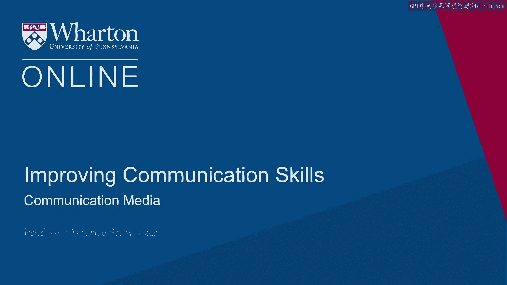
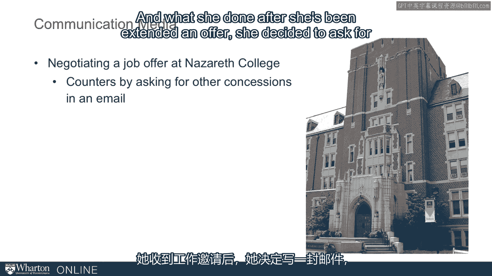

# 课程30：沟通媒介 📡

在本节课中，我们将要学习沟通媒介如何深刻地影响我们信息的传递与接收效果。不同的媒介具有不同的“丰富度”，选择不当可能导致误解，甚至造成严重后果。我们将通过一个真实案例，分析电子邮件等媒介的特点，并学习如何根据情境选择合适的沟通方式。

沟通媒介不仅深刻影响我们信息的被解读方式，也影响着这些信息所带来的后果。

有一个关于一位女性在拿撒勒学院谈判工作邀约的故事。

她在收到录用通知后，决定通过电子邮件要求一些澄清，并争取一些其他让步。

她写道：“如您所知，我对能加入拿撒勒学院的可能性感到非常兴奋。若能满足以下部分条款，将使我更容易做出决定。”

请注意，她并非坚持要求所有条件。她没有说“我必须得到所有这些”。她的意思是“满足其中一些会更容易”。

她提出了一些要求，例如根据她认为其他人所获得的水平提高起薪、一个学期的产假、终身教职前的休假等等。

她在这里还提了其他几项要求。“我知道其中一些可能比另一些更容易满足。请告诉我您的想法。”

这是一种相对温和的沟通方式。

我认为，如果她是当面进行这次沟通，她会在过程中得到反馈，并能相当清楚地感知事情的进展。

而她最终得到的回应是收回了录用通知。

她本意只是提出一些要求。而我认为，因为使用了电子邮件，它传达出的感觉比她本意更具强迫性。

这种电子媒介使得她的邮件可以被分享，并可能被以不同的方式解读。

你可以想象，有人收到这封邮件后，将其转发给别人，但在转发时可能在顶部加上诸如“你能相信这个吗？”或“这在我看来不太对劲”的评论。然后在部门内形成共识，最终导致了录用通知的撤回。

这次电子邮件往来最终以灾难告终。

需要快速补充的是，电子邮件和短信有许多优点。其异步特性意味着我们可以发送信息，而无需双方同时在线。因此我们可以进行多任务处理，可以有更多时间思考，可以收集更多信息。异步特性具有真正的优势。

它往往是一种更平等的沟通媒介。因此，如果存在森严的等级制度，人们在电子邮件中的沟通会更平等。

人们有时可以回避问题，这种方式有好有坏，但当我们通览整个邮件往来时，回避往往更明显。

我们透露的信息不同，且通常更少。同样，所有那些非语言线索通常都缺失了。例如，幽默在电子邮件中通常效果不佳。如果是讽刺，很难知道它是否是以讽刺的方式表达的。

但它也是一种非常容易与多人沟通并保存记录的媒介。

因此，使用电子邮件有很多优点，但也有一些重要的缺点。

这很大程度上与这种沟通方式缺乏“丰富度”有关。

有一种“媒介丰富度理论”认为，我们可以根据媒介的丰富程度对其进行排序。

面对面交流确实是最好的方式。在面对面媒介中，我们能够尽可能全面地进行沟通。我们在传达信息时最有效，在解读他人时也最有效。

但面对面交流也允许我们做其他事情，比如运用我们之前谈到的触觉交流，例如握手或拥抱。我们可以做一些有助于建立融洽关系的事情，而这些是其他方式无法做到的。

我并不是说我们不应该使用电子邮件。我们应该使用。

但我们可能希望平衡面对面会议和电子邮件，有时用其他方式替代一些会议，比如视频会议。如果可能，仍然值得乘坐飞机，飞往某地面对面交流。这对于建立融洽关系和人际关系非常重要。

当事情复杂时，这一点尤其重要。

如果我们顺着这个层次结构往下看，最顶端是面对面交流，接下来可以是视频会议。

视频会议不允许我们握手，但我们仍然可以观察一些非语言线索，如面部表情。

例如，电话的丰富度低于视频会议，但我们仍然能听到对方说话的节奏、音调和时机。

书面交流的丰富度更低。我们有语音邮件、电子邮件、即时消息等，这些我将其归入一个非常特殊的类别，因为这些电子信息很容易被复制和转发。

就像那封发给拿撒勒学院的邮件，你发出的信息可能被转发，但有时会附带我们可能不希望出现的“前言”。

因此，我们需要谨慎对待这些信息，在撰写或留言时，要假设它们会被公开传播。所以我们需要非常小心地处理这些信息。

以下是我对使用电子邮件的建议。

避免使用电子邮件处理敏感事务。

撰写电子邮件时要假设内容会被转发。

如果我们担心被误解，或者需要处理棘手的社会关系，例如与雇主的新关系，我们需要非常小心，因为通过电子邮件沟通时，我们既不容易充分传达信息，也不容易在沟通时获得反馈。

我们可能会忽略社交惯例，或者无法通过电子邮件这类文本媒介传达我们真正想表达的共情。

因此，如果使用电子邮件，我们必须努力建立关系，必须认识到电子邮件通常看起来比实际意图更具攻击性和更严肃。我们的表达会显得不同。

所以我们必须软化我们的电子邮件。

我们需要考虑穿插一些面对面会议，或者起身离开办公室，走到大厅与某人交谈，而不仅仅是发邮件。

最后，再次重申这一点，因为我对此感受强烈：撰写那封电子邮件时，要假设会有很多人看到它。