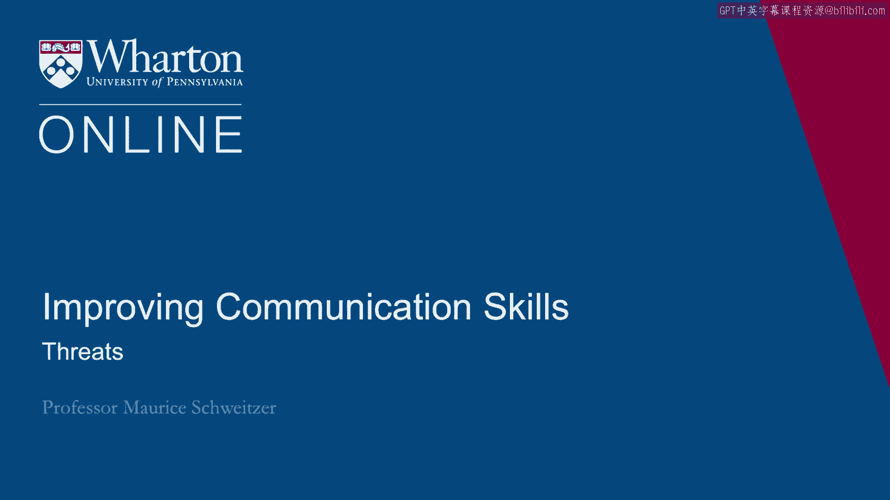

# 课程名称：沃顿商学院《实现个人和职业成功》第31课：威胁的运用与应对 🚨

在本节课中，我们将要学习谈判与沟通中一个极具威力的工具——威胁。我们将探讨威胁的本质、何时以及如何使用威胁，更重要的是，当别人对我们发出威胁时，应如何有效应对。通过分析真实的历史案例，我们将理解威胁背后的心理学原理和战略考量。

---

## 什么是威胁？

上一节我们介绍了课程的主题，本节中我们来看看威胁的基本定义。威胁是一种明确的声明，表明如果对方不采取或不停止某种行动，你将实施某种对其不利的后果。其核心公式可以概括为：

**如果 [对方行为]，那么 [负面后果]。**

威胁的目的是改变对方的行为，迫使其遵从你的要求。然而，威胁是一把双刃剑，使用不当会严重损害关系和个人信誉。

---

## 何时使用威胁？📅

理解了威胁的定义后，我们自然要问：在什么情况下应该使用威胁呢？以下是几个关键的适用场景：

*   **吸引注意力**：当对方没有认真对待你或当前局势时，威胁能迅速引起他们的重视。
*   **表明现状不可接受**：威胁可以传递一个强烈信号，即当前的事态发展必须改变。
*   **树立先例与建立信誉**：通过执行威胁，你可以向外界展示你言出必行，从而在未来互动中建立可信度。

---

## 威胁的案例分析：成功与失败

以下是几个历史上著名的威胁案例，它们揭示了威胁成功或失败的关键因素。

**案例一：里根与空中交通管制员罢工（1981年）**
美国总统里根对罢工的管制员发出解雇威胁，并在48小时后果断执行，解雇了超过1.1万人。这一行动虽然短期成本高昂，但为他建立了强大的信誉，被视为其总统任期的决定性时刻。

**案例二：加拿大汽车工人罢工（1984年） vs. 荷美尔肉类包装工人罢工（1985年）**
汽车工人的罢工威胁对通用汽车造成了巨大损失，迫使公司答应了关键要求。而肉类包装工人的罢工威胁则被公司通过雇佣替代工人化解，导致罢工失败，大部分员工失业。这两个案例对比说明，威胁的有效性取决于你实际拥有的**权力**和给对方造成的**成本**。

**案例三：人质危机中的威胁（2004年）**
在伊拉克，武装分子通过斩首人质的残酷威胁，迫使菲律宾政府撤军，但未能迫使韩国撤军。这揭示了威胁的另一个维度：**要求的合理性**。韩国被要求24小时内撤军，这几乎不可能；而菲律宾被给予一个月时间撤走51人，则相对可行。

---

## 如何发出有效的威胁？⚡️

从上述案例中，我们可以总结出有效发出威胁的几个核心原则：

1.  **意愿与可信度**：你必须愿意并能够执行威胁。空洞的威胁（虚张声势）会严重损害你的信誉。
2.  **成本计算**：确保威胁给对方造成的成本远高于给你自己造成的成本。最有效的威胁是让对方“疼”，而自己“不太疼”。
3.  **要求合理**：你的要求必须是对方有能力做到的。不可能完成的要求只会导致对抗升级。
4.  **基于利益，而非惩罚**：威胁的目的应是促使合作、实现目标，而不是为了惩罚或欺凌对方。后者会激起反抗和报复。
5.  **为对方保留颜面**：以尊重的方式提出威胁，让对方更容易接受要求，而不是感到被羞辱。
6.  **表述精确**：明确说明触发条件、具体后果和最后期限。模糊的威胁效果不佳。

---

## 如何应对他人发出的威胁？🛡️

当威胁指向我们时，我们的本能反应往往是愤怒和想要报复。但我们必须管理这种反应。以下是应对威胁的步骤：

首先，**识别并管理情绪**。威胁会触发我们的神经按钮，渴望立即反击。但此时应避免冲突升级，不要轻易让步（那会鼓励对方故技重施），也不要冲动反击。

其次，**探究威胁背后的动机**。对方发出威胁，通常出于以下三种原因之一：
*   **寻求关注**：感到被忽视、沮丧，希望被倾听。
*   **务实策略**：拥有强大的替代方案（BATNA），试图以此获得杠杆。
*   **虚张声势**：这只是一种惯用的谈判伎俩，并非真心要执行。

最后，**根据动机采取针对性回应**：
*   对于**寻求关注者**：表达理解，认真倾听其诉求，安抚其情绪。
*   对于**务实策略者**：探讨创造性的解决方案，满足双方核心利益。
*   对于**虚张声势者**：可以明确指出这种行为（“标注”），或者直接忽略。
*   在必要时**发出反制威胁**：如果别无选择，可以发出对等的反制威胁以建立可信度，但应立即尝试将对话拉回解决问题的轨道，例如说：“如果我们都采取这种行动，结果将是两败俱伤。让我们看看能否找到更好的双赢方案。”

---

## 总结

本节课中我们一起学习了威胁这一复杂的沟通工具。我们了解到，威胁在吸引注意力、改变现状和建立信誉方面可能有效，但其成功取决于可信度、成本计算和要求的合理性。更重要的是，我们学习了如何冷静应对他人发出的威胁：先管理自身情绪，再分析对方动机，最后选择是理解、破解还是反制。记住，长期的关系和信誉远比一次威胁的胜负更为重要。明智地使用威胁，更要智慧地化解威胁。