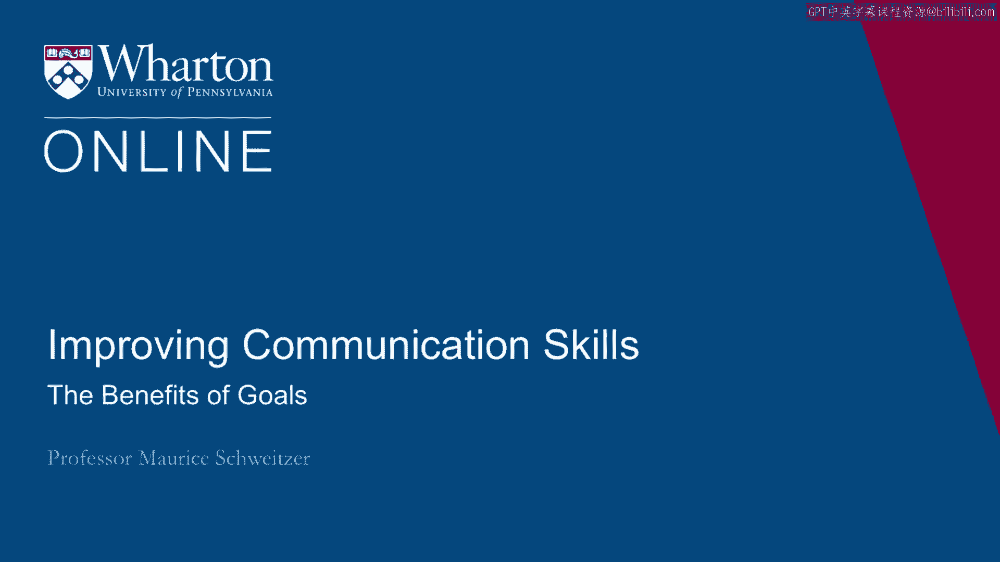
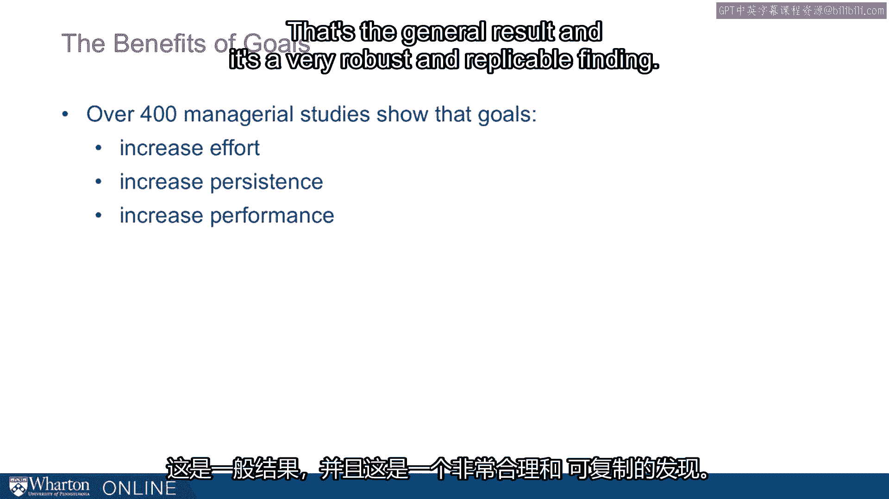
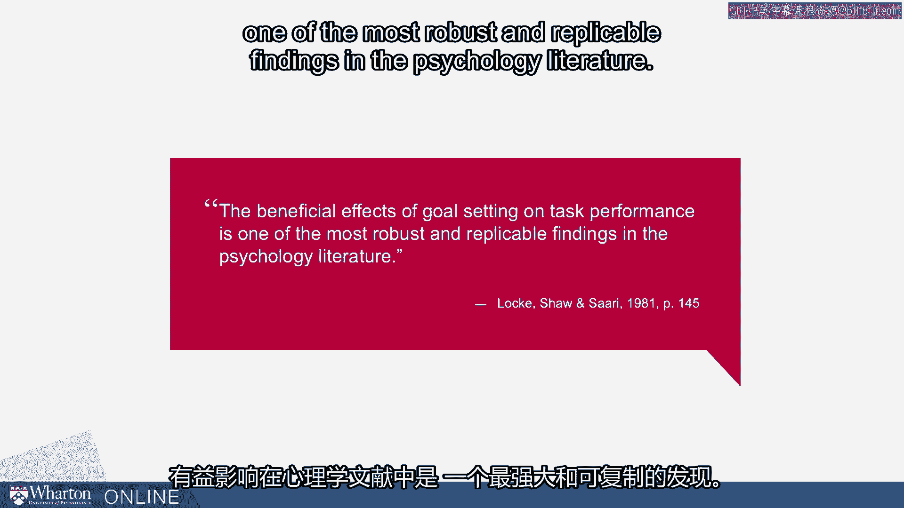
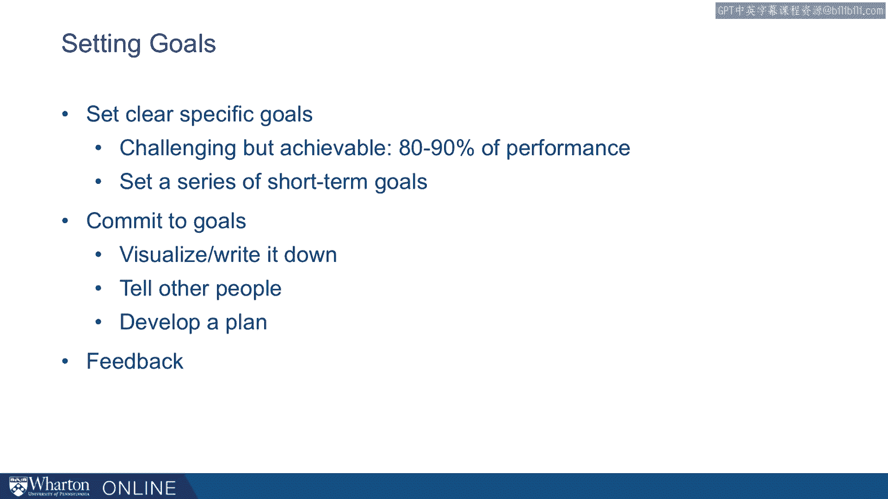

# 沃顿商学院课程《实现个人和职业成功》第32课：目标的益处 🎯

在本节课中，我们将要学习目标设定这一强大工具。我们将探讨目标设定如何影响我们的动机和行为，并了解如何通过科学的方法设定有效目标，以提升个人和职业表现。

---

目标设定被证明是一个极其强大的工具。它是动机的基本组成部分。目标设定可以驱使我们成就伟大的事业。目标设定也可能驱使我们做出非常糟糕的事情。但首先，我们需要思考目标设定的益处。

已有超过400项管理学研究探讨了目标设定。此外，还有数十项研究关注行为与目标设定的关系，无论是邮件投递、焊接、缝纫还是体育运动。

研究发现，当人们拥有具体且具有挑战性的目标时，他们会增加努力、增强毅力，并提升表现。这是一个普遍且非常稳健、可重复的发现。

事实上，一些目标设定领域最基础的学者曾指出，目标设定对任务表现的积极影响，是心理学文献中最稳健、可重复的发现之一。从心理学角度看，仅仅是设定一个挑战性目标就能提升表现。

在很大范围内，目标难度与任务表现之间的关系几乎是线性的。这意味着**目标越困难，表现就越高**。这一点在基于努力的任务上尤其明显。对于只需要人们更努力一点的任务，更高的目标会提升动力，并常常提升表现。

---

上一节我们介绍了目标设定的普遍益处，本节中我们来看看目标设定的具体机制。

我们知道目标的临近性很重要。因此，当人们接近达成目标时，你需要将目标分解成更小的部分。例如，在月底，当我们几乎要达成目标时，人们的动机会特别强。接近目标时，人们会格外努力。

你可以观察马拉松比赛。在接近整数时间点（如3小时、4小时）时，会出现巨大的冲刺高峰。人们为了在特定时间内完赛而奋力奔跑。

目标通过集中我们的注意力、增加我们的努力和增强我们的毅力来发挥作用。

---

为了让大家能有效利用目标设定的益处，以下是设定有效目标的具体步骤：

**设定清晰具体的目标**
目标应具有挑战性，但也应现实可行。如果我们有过去的表现数据，例如之前跑步的速度、工厂生产线的产能或基于过去业绩的销售目标，我们应该将目标设定在表现的前**80%到90%** 的范围内。这样既具挑战性，又可信。

**设定短期目标序列**
与设定全年目标相比，设定一系列短期目标（如每月目标）可能会带来更大的益处。

**承诺于目标**
这是目标必须现实的原因之一。人们必须相信自己能够达成目标。他们可以通过想象、写下来或告诉他人来强化承诺。有时，告诉他人会带来一种“如果达不成会很尴尬”的压力，从而增强我们达成目标的决心。

**制定行动计划**
思考“我如何达成那个目标？”以及“我需要采取哪些步骤？”。一个具体的行动计划将帮助我们实现目标。

**获取清晰反馈**
确保我们在过程中获得反馈。请记住，当我们特别接近目标时，反馈对提升表现的作用最大。

---

本节课中我们一起学习了目标设定的强大力量及其益处。我们了解到，具体且具有挑战性的目标能有效提升努力、毅力和最终表现。关键在于设定**清晰、具体、现实且具有挑战性**的目标，将其分解为短期步骤，并辅以坚定的承诺、明确的行动计划和持续的反馈。掌握这些原则，你就能更好地利用目标设定来驱动个人与职业的成功。