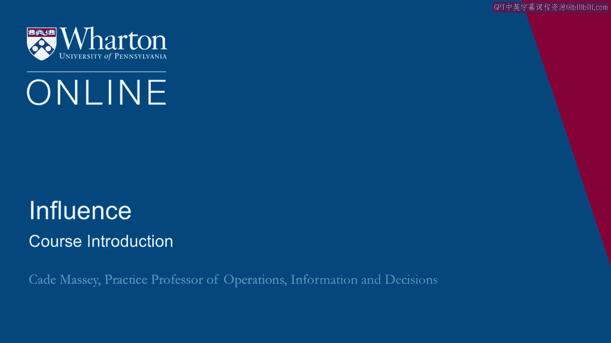

# 沃顿商学院《实现个人和职业成功（成功、沟通能力、影响力）｜Achieving Personal and Professional Success》中英字幕 - P65：0_课程简介.zh_en - GPT中英字幕课程资源 - BV1VH4y1J7Zk

Welcome to Influence。 My name is Kate Massey。 I am a practice professor here at the Wharton。

School in the Operations， Information， and Decisions group。 This is a course that I've。

been teaching with executive MBAs and MBAs for 10 years now， first at Yale School of。

Management and more recently here at Wharton。 I teach other things。 I teach negotiation。

decision-making， people analytics。 This is a course that's very close to my heart。 I've。

poured a lot into it over the last 10 years。 I've learned a lot from the students I've。

been working with and from the literature on power and influence。 One of the reasons。

I like it is that like negotiation， it's about more than just work。 It's as important in your。

personal life and your family and your relationships as it is at work。 I also like it because it's。

this nice intersection of it's almost social science and clinical psychology。 This is a。

very personal class。 If you're signing up for it， I hope you're ready to do some introspection。

and some stretching because that's the motivation here is that we think we can make a difference。

in your life by encouraging you and motivating you and giving you new tools for becoming a。

more influential person。 The initial motivation for this course was to arm our MBAs as they。

left our program and they begin navigating their way through organizations。 In fact。

the initial title， the first version was called "Navigating Organizations。" The idea was that。

so much of the business school curriculum is about running an entire organization。 How。

do you design an organization for example？ Not enough about what happens when you leave。

business school when you're a middle manager， while you're still traversing your way。 These。

tools are intended to help you traverse your way， navigate your way through organizations。

So that's where I'm coming from。 That's what the course is intended to do。 I'll give you。

a little bit of a roadmap for the first week。 We have a couple of topics for this first week。

The first is an introduction to lay out a few basic ideas on power and influence to give。

you some basic frameworks to introduce an example or two that we'll draw on for the rest of。

the course。 And then in the second half of the week， we're going to talk about we're。

going to move from the kind of individual perspective to more organizational perspective。

So much happens in power and influence that focuses on individuals。 It's important up。

top to emphasize the power of the situation and the context。 And so in the second half， of week one。

we're going to look more at context and organization。 So that's where we're going。 Week one。 Enjoy。

Thank you。 [BLANK_AUDIO]。

