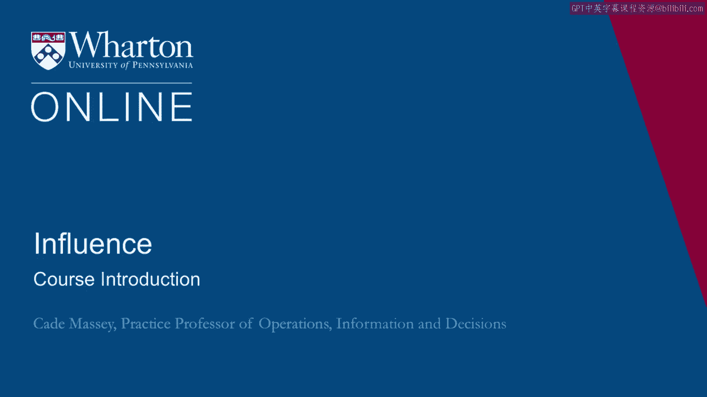
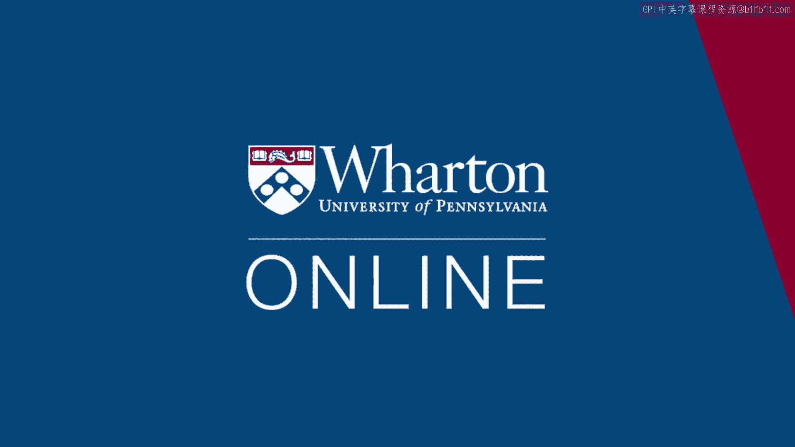

# 沃顿商学院课程《实现个人和职业成功》第65讲：课程简介 🎓

在本节课中，我们将学习《影响力》这门课程的总体介绍。课程教授凯特·梅西将阐述课程的核心目标、内容框架以及学习方法，帮助我们理解如何通过提升影响力来促进个人与职业的成功。

欢迎来到《影响力》课程。我是凯特·梅西。我是沃顿商学院运营、信息与决策系的实践教授。

这门课程我已经教授了10年，最初在耶鲁大学管理学院，最近在沃顿商学院，教学对象包括高级管理人员工商管理硕士和工商管理硕士。我也教授其他课程，例如谈判、决策制定和人员分析。这门课程对我而言意义非凡。在过去的10年里，我投入了大量心血。我从合作的学生们以及关于权力与影响力的文献中学到了很多。

我喜欢这门课程的原因之一是，就像谈判一样，它不仅仅关乎工作。它在你的个人生活、家庭和人际关系中与在工作中同等重要。我也喜欢它，因为它处于一个很好的交叉点，几乎是社会科学和临床心理学的结合。这是一门非常个人化的课程。如果你报名参加，我希望你准备好进行一些内省和拓展，因为这里的动机是，我们相信通过鼓励你、激励你并为你提供新工具，可以帮助你成为一个更具影响力的人，从而改变你的生活。

这门课程最初的动机是为我们的工商管理硕士毕业生提供装备，当他们离开我们的项目并开始在组织中前行时。事实上，最初的版本标题是“驾驭组织”。其理念是，商学院的课程大多是关于如何运营整个组织，例如，你如何设计一个组织？但对于你离开商学院后，当你成为一名中层管理者，仍在摸索前行时会发生什么，关注得还不够。这些工具旨在帮助你穿越、驾驭组织中的道路。

这就是我的出发点，也是这门课程旨在实现的目标。我将为你概述第一周的学习路线图。第一周我们有几个主题。首先是一个介绍，阐述关于权力和影响力的一些基本概念，为你提供一些基本框架，并引入一两个我们将在后续课程中借鉴的例子。

上一节我们介绍了课程的整体目标和第一周的前半部分内容。本节中，我们来看看第一周后半部分的安排。

然后，在本周的后半部分，我们将从个人视角转向更偏向组织的视角。许多关于权力和影响力的讨论都聚焦于个人。但在一开始，强调情境和背景的力量非常重要。因此，在第一周的后半部分，我们将更多地关注背景和组织。

这就是我们第一周的学习方向。祝你学习愉快。谢谢。

本节课中我们一起学习了《影响力》课程的简介。我们了解了这门课程的目标是帮助个人在工作和生活中提升影响力，其内容结合了社会科学与心理学，并强调实践与内省。课程第一周将首先建立关于权力与影响力的基本框架，然后探讨组织情境的重要性，为我们后续的深入学习奠定了基础。