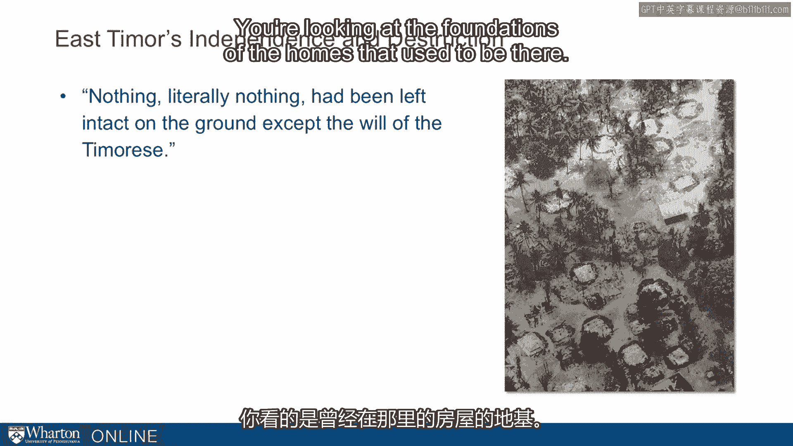

# 沃顿商学院《实现个人和职业成功（成功、沟通能力、影响力）｜Achieving Personal and Professional Success》中英字幕 - P67：3_塞尔吉奥·德梅洛案例.zh_en - GPT中英字幕课程资源 - BV1VH4y1J7Zk

Previously， we've talked about the example of NOA， a student who left top B school and。

had trouble in the new work environment。 And we can come up with many of these examples。

not just business school， but for the same， kinds of examples from doctors and lawyers。

But before we go too far， I want to give you a counter example。

Someone pretty much at the top of their game navigating a difficult situation。

We think we can learn something from watching people like Sergio de Mello when they're really。

challenged。 So， in this next section， I want to talk about a book， a couple chapters from a book。

by Samantha Power。 Power most recently was the US ambassador to the United Nations。

Before she had that position， she wrote a book about Sergio de Mello， who she had run。

across in the Balkans during the Balkan conflict of the 90s。 De Mello was a lifetime diplomat。

He went to work for the United Nations straight out of college。 And originally from Brazil。

he rose to be one of the top diplomats in the world。 Most folks considered him the best candidate。

the most likely candidate to become secretary， general。 He was eventually killed in Iraq。

He was the UN ambassador to Iraq in 2003， when one of the first bombings of a civil institution。

there led to his being killed。 One of his last postings before Iraq was in a small country。

formerly in Indonesia， called， East Timor。 And in 1999。

the United Nations negotiated a piece of sorts between Indonesia， which had。

occupied East Timor and East Timor。 They negotiated the right for the East Timorries to have a referendum on independence from Indonesia。

Indonesia had occupied the country since 1975。 There had been a long resistance。

including guerrilla military resistance， from the East， Timorries。 They held the election in '99。

the locals voted overwhelmingly on the side of independence。

The local militia backed by Indonesian military then ransacked the country。 Before leaving。

they basically destroyed 75% of all property。 They killed another thousand people。

They essentially wanted to destroy the chances of East Timor had of being successfully independent。

of Indonesia。 The UN had to take this over。 The UN had brokered the independence。

The UN was responsible。 And the UN basically took the country over for two years。

They chose Sergio de Melo to go there and help build the country again。

They chose de Melo because one， he was from Brazil， so he spoke Portuguese。

East Timor used to be a Portuguese colony。 That's the language many of them are trained in。

He was also seen as a person with the skills to pull this off。

And he was heavily backed by the US who was a big supporter of the UN effort there。

So de Melo at that time had been almost 30 years in diplomacy and had been all over the， world。

And we can learn from watching what he did in this environment， which was such a challenging， one。

So when he got there， there was "nothing。"， Literally nothing had been left intact on the ground except the will of the teamorees。

This picture is one of a small village that had almost every home in the village had been。

destroyed。 There were foundations of the homes that used to be there。

What they needed to do， they needed to do everything essentially。 Power rights。

Airports and ports had to be opened。 Clean water procured。 Health care provided。

Schools resuscitated。 A currency created。 Relations with Indonesia normalized。

a constitution drafted， an official language chosen and tax， customs and banking systems devised。

Policies that normally evolved over hundreds of years would all have to be decided within。

months of arrival。 So consider yourself in this situation。

Consider what you would do as you landed in East Timor。 How would you take up these challenges？

What are your inclinations？ What would be the first actions that you took？ So DeMello。

Here are his early efforts， which you might consider to be phase one。

First he put together an advisory board。 The advisory board included UN representatives but also multiple political parties。

the leading， political parties and also the smaller political parties as well as the Catholic Church。

East Timor is a country that's something like 80% Catholic。

He recruited and trained an entire new judicial system。

So there was something like 60 lawyers in the entire country。

They had to bring more people into the legal system。 They put。

they commissioned judges almost straight away to start rebuilding the legal， institutions。

I say DeMello did。 He just initiated this。 Of course he had a big team there helping out。

DeMello was acutely sensitive to symbolism and to national self-esteem。

So he took many actions to indicate that he did not consider himself above the people， there。

that he didn't consider himself a king in some way。

He was very sensitive to the way he and the staff treated the locals。

One example was he also studied the local language。

He was fluent in Portuguese but the local language， Teddam， was something that he decided。

he wanted to be able to use。 And so in his off hours he was always trying to sneak in some extra language instruction。

And then he worked his tail off。 He was famous。 He was famously a hard worker but there he was known for working something like 19 hour。

days。 And of course when the leader is working 19 hour days the staff is doing the same。

So these are all his inclinations out of the box。 This is the first stage and this is only the early days。

This is like six weeks or so。 They didn't have much of a honeymoon period。

This is what they did with it。 Okay。 Phase two。 The crisis worsens。 Remember is they were in crisis。

There was nothing working in this country when they took it over because it had been raised。

by the militia and the Indonesian military。 So things got worse。

80% unemployment they weren't making a dent in the unemployment。 The UN didn't have the expertise。

It turns out to do many of the things that they needed to do to rebuild this country。

As one staff member put it， staff UN staff is good at diplomatic cables not laying electrical。

cable。 The main thing could be said basically everywhere you turn they just didn't have the skills to。

physically rebuild a country。 There were multiple missteps with some very important issues。

So for example the guerrilla army， the army that had resisted Indonesians for 24 years。

the army that had essentially provided leadership for the country for 24 years had to be honored。

in some way while at the same time they had to protect in other UN situations those kinds。

of armies had been sources of problems。 So D'Mella was very reluctant to give them any leeway。

tried to keep them very tightly， leashed and that was a real issue for them especially given the role they had played in。

the resistance。 And then the whole effort was hampered by UN regulations that were highly restrictive。

and many cases inappropriate。 So for example there were restrictions on what funds could be used。

what funds could， be used on。 So the UN staff had a huge budget。

600 million or something like that while the budget couldn't。

be spent directly on the T-Mores though， the whole East Timor budget was something like。

60 million dollars。 So all these funds were flowing into the UN staff。

couldn't spill over into the real， needs in the country。

So for example there were 500 UN cars in East Timor and D'Mella had to work to get even。

10 of those allocated to the T-Mores leader。 So you can imagine how this goes over with the local populace when all these new cars。

are coming in flooding the country and yet none of the non-UN staffers have access to， it。

As spring 2000 rolled around and remember they just got there in November， this is just。

a few months later they were really on the brink of failure。 Physical security was breaking down。

There was more and more threats from the militia that hadn't quite melted away as much as they。

thought。 The economy was still in ruins and the T-Mores began viewing the UN as "a second occupation"。

which is about as big an insult as you could give given it was the UN that negotiated the。

end of the first occupation， the 24-year occupation。

So this is the situation D'Mella finds himself in after his best efforts and about six months。

of work there which leads us to phase three where D'Mella really had to reset his priorities。

and double his efforts。 In this case his highest priority was emphasizing security。

He revised the peacekeepers rules of engagement。 The peacekeepers are the UN military people there who were intended initially to be merely。

passive。 They didn't initiate engagements。 In fact they had to fire a warning shots before they fired anybody but in order to tighten。

up military security， safety of the people he allowed them to initiate。

He allowed them to be more actively involved。 A couple of large police and military sweeps to drive out the militia and then some important。

strategic decisions like they had a repatriation office in West Timor and they had to shut that。

down because it was threatened people's lives were threatened out there。

It meant they couldn't bring people back from West Timor。

East Timorry citizens who wanted to come back they had to let that go and leave it there。

because it was too much of a security threat。 So really emphasizing security was his number one priority and not his inclination。

He is a man who had spent his career advocating for humanitarian efforts。

It wasn't his inclination but he considered it the priority here。

Number two he created a co-government。 So for the first time in the mission high paid foreigners would work directly under the。

team reese in particular he had eight secretary said department heads essentially。

He made four of them internationals as the initial plan was but then four were East， Timorries。

He literally allocated half of the government to East Timorries。

This was before the government was formed。 This was before elections that happened。

This was before the Constitution was created all of which was against the rules。

The UN officials hated this that was not the mandate。

He was supposed to be running the country for two years but he recognized it wasn't going。

to work if he ran the country。 He had to give these guys more power and it had to be substantive power。

Couldn't be superficial power。 He gave literally half the cabinet to the team reese。

Some of the folks didn't like this even local staffers。 UN staffers didn't like it。

They said we came to work for the secretary general not this department head from the local， folks。

In this critical moment DeMello called a gathering all 700 UN staffers。

He put those four department heads the East Timorries department heads and says these。

four are your new bosses。 I assume for responsibility you either obey them or you can leave。

Took a real stand with these guys。 Another wrinkle and there were lots of variations on this but he figured out ways to navigate。

the UN bureaucracy to get more resources to the local folks and more money and to the， economy。

For example he was able to use some of his budget on road repairs because the logic was。

the road the damage the roads are so bad they're hurting the UN vehicles。 This is how crazy it was。

He couldn't repair the roads directly because that didn't fall within the UN mandate but。

if the roads were bad and damaged the vehicles he could do it。

He found wrinkles like that as a ways of giving the locals more and pouring more money into。

the economy。 Finally in 2001 this is you can see about nine months worth of effort here。

He laid out a clear timeline to full independence。

To address this question the East Timorries were so concerned about when do we have independence。

The vague a year from now two years from now wasn't enough。

He laid out a clear plan that said elections in the summer write a constitution then decide。

how to do the presidency and then we'll hand things over。 These were the steps he took。

These were the rules that he bent and broke in order to do it and eventually he was able。

to satisfy these guys and get things going in the right direction。

As Ramos Horta one of the leaders of the guerrilla effort and then basically the secretary of。

state for decades for these guys said people remember him。

He came here in the worst of times and led them out of these horrendous times when nothing。

existed nothing worked until the restoration of independence。 [BLANK_AUDIO]。

