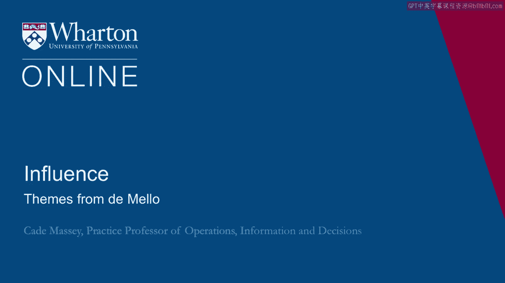
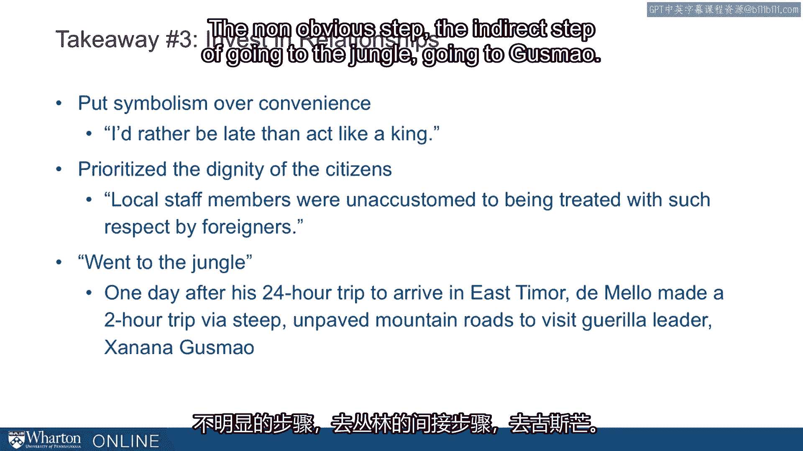

# 沃顿商学院《实现个人和职业成功（成功、沟通能力、影响力）｜Achieving Personal and Professional Success》中英字幕 - P68：4_从德梅洛获取的启示.zh_en - GPT中英字幕课程资源 - BV1VH4y1J7Zk

What can we learn about power and influence from watching D'Mello in East Team War？

So really， we can learn everything about the course。 This is a man who was good at everything。

but three things in particular I want to point， out flexibility， intentionality， and relationships。

So number one， be multiple。 There are examples throughout the case， the chapters from power。

but a few。 Here， D'Mello was buscular within the Ninesians。

but he was participative with the East Team， Waries。 In other words。

he forced the Indonesians out and was strong with those guys while pulled。

the East Team Waries in and gave away his power to those guys。 The whole notion of team-orization。

which was this building of a co-government， was his。

being coercive with the UN basically breaking their rules in order to seed power to local。

officials。 Other examples， he was able to use direct pressure。

He negotiated directly with the UN in order to pay some families， some reparations， but。

he was also able to negotiate in a very challenging way， but indirectly when he was negotiating。

with Australian government about oil rights off the shore。

These are all examples of his being multiple， being flexible， being able to exert power and。

influence in very different ways。 Samantha Power refers to this as a ruthless pragmatism。

He would do whatever was necessary in order to accomplish his course。 A second takeaway。

recognizing the need for trade-offs。 This example of his prioritizing security over human rights was so against his nature。

so against his career。 Rainbow Sorta quoted in the chapter saying， "Human rights， human rights。

That is Alice in Wonderland。 We have to deal with reality here。 D'Mello agreed with that assessment。

D'Mello traded away essentially the priority on human rights in order to emphasize security。"。

Samantha Power puts it this way。 Sergio started out as a humanitarian。

but by 2003 he had become a diplomat and politician， comfortable weighing lesser evils。

Such a powerful phrase。 What does that phrase mean to you？ Comfortable weighing lesser evils。

This is going to be an important theme in all of our work on power and influence。

The ability to do that and the downsides of doing that and being honest with ourselves。

about when we are doing that。 And then the intentionality that this captures。

you're not really committed to a goal if you're， not making trade-offs。

This is something we see in D'Mello。 His commitment to the goal meant that he had to sacrifice some of his lesser trade-offs。

This is a good illustration of what true intentionality is。 Takeaway number three。

investing in relationships。 So D'Mello put symbolism over convenience consistently。

He was quoted after not letting his driver use a siren when he was stuck in traffic。

I'd rather be late than act like a king。 He prioritized the dignity of the citizens。

Samantha Power says that local staff members were unaccustomed to being treated with such。

respect by foreigners。 And then he in one famous case， quote。

went to the jungle on a second day in country。 He'd spent 24 hours flying into East Timor。

On a second day in the country， he made a visit to the leader of the guerrillas， the。

longtime leader of the resistance， a man who had been imprisoned by the Indonesians from。

1992 until the election in 1999。 Genana Guzman。 He was headquartered in two hours away。

steep mountain roads， unpaved roads。 And on the very second day he was there。

D'Mello got in the jeep， went out there。 He didn't wait for Guzman to come to him。

Many people would have thought， "Well， I'm the king now。 I'm the dictator。

Let the local leaders come to me。"， He realized the importance of that relationship。

a relationship that was going to be vital for， the next two years。 And he took the step。

the non-obvious step， the indirect step of going to the jungle， going。

to Guzman。 So those are three examples， as I said， we could illustrate the entire course that way。

But we also see examples that illustrate a very important construct for us， French and。

Raven sources of power。 So in the next section， we'll unpack French and Raven。 [BLANK_AUDIO]。

